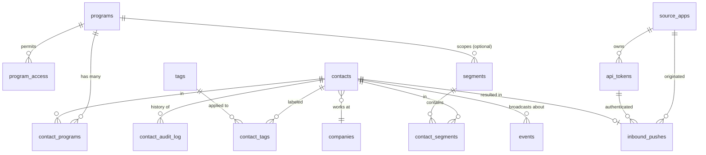

# Quietly CRM (QCM) ... Phase 0 Design Proposal

**Date:** 2026-05-14 (revised 2026-05-15 with 5 amendments + 8 open-Q locks)
**Status:** APPROVED by TIG 2026-05-15 with amendments A1 through A5 + locks 1 through 8 + programs seed expansion
**Predecessor:** [Brainstorm Prompts/qcm-phase-0-design-brainstorm.md](Brainstorm%20Prompts/qcm-phase-0-design-brainstorm.md)
**Locked decisions:** D-001 through D-005 in [Decisions.md](Decisions.md). D-006 through D-013 resolved in §7 below.
**Bar:** Zero TIG UI clicks for any configuration. Every feature passes "can the agent do this with no human in the configuration loop?"

### Revision log

| Rev | Date | What changed | Why |
|---|---|---|---|
| 1 | 2026-05-14 | Initial draft for TIG review | Phase 0 design brainstorm complete |
| 2 | 2026-05-15 | Amendments A1 through A5 applied; 8 open questions locked; programs seed list expanded from 10 to 15 | TIG approval pass against Lead Advisor session |
| 3 | 2026-05-15 | Programs seed corrected: WHELHO added as 16th distinct program (`whl`, youth_protected=true); WOH parenthetical "(WHELHO app)" removed since WOH (War On Hopelessness) and WHELHO (Work Hard, Enjoy Life, Help Others) are separate programs; ACOFH name corrected to "America's Children of Fallen Heroes" per CLAUDE.md | TIG corrected during commit-prep review |

---

## 1. Executive Summary

QCM Phase 0 is the smallest CRM that absorbs QNT Catch's 13-field push as its first dogfood payload. The data model uses person-scoped contacts joined many-to-many to programs (`contact_programs`), so one human can sit in QNT today and L4G or ACOFH tomorrow without a schema rewrite. The public API exposes a single inbound push endpoint (`POST /v1/inbound/contacts`) plus full token CRUD so the agent mints, rotates, and revokes credentials without TIG clicking a UI. Real-time fan-out fires through twin channels off one `events` audit table ... `pg_notify` for server consumers and Supabase Realtime for UI consumers. Soft-deletes, Pacific-anchored timestamps, and a per-row contact audit log are baked in from migration 001, because retrofitting either pattern is painful.

---

## 2. Phase 0 Scope Statement

### 2.1 In scope

| Capability | Detail |
|---|---|
| Programs registry | `programs` lookup table (16 rows: `qwr`, `qqt`, `qnt`, `qkn`, `qsp`, `qtr`, `qst`, `qcr`, `qwb`, `qwc`, `mp`, `l4g`, `acofh`, `woh`, `whl`, `iysr`) with `youth_protected` flag |
| Source-app registry | `source_apps` lookup (`qnt-catch` first; supporter inbound shapes ready) |
| Contacts + Companies | Person-scoped contacts; companies deduped by `name_normalized` UNIQUE index |
| Many-to-many program membership | `contact_programs` carries program-scoped state (drip status, joined-via, primary contact method) |
| Tags + Segments | Tags = lightweight labels. Segments = `suppression` / `static` / `dynamic` kinds. `contact_segments` join. |
| Public API ... inbound | `POST /v1/inbound/contacts` source-agnostic (token's `source_app` is discriminator) |
| Public API ... uploads | `POST /v1/uploads/sign` returns presigned URL keyed by `external_id`, not `contact_id` |
| Public API ... token CRUD | `POST /v1/api-tokens`, `POST /v1/api-tokens/{key_id}/rotate`, `POST /v1/api-tokens/{key_id}/revoke`, `GET /v1/api-tokens` |
| Public API ... contact reads | `GET /v1/contacts/{id}` and `GET /v1/contacts` for verification + agent inspection |
| Auth | API tokens (Stripe-shape: `qcm_live_{key_id}_{secret}`), bcrypt-hashed secrets, scoped per source × program |
| Idempotency | `UNIQUE(source_app, external_id)` on `inbound_pushes`. UUIDv5 correlation id derived from external id. |
| Audit | Every push lands in `inbound_pushes`. Every contact mutation lands in `contact_audit_log` via trigger. Every cross-cutting event in `events`. |
| Real-time | Postgres trigger fires `pg_notify('qcm.events', payload)` AND inserts into `events` (Realtime broadcasts). |
| Soft-delete | `deleted_at`, `deleted_by` on every supporter-data-touching table. 30-day default recovery window. No hard-deletes. |
| Timestamps | All `timestamptz`, all written via canonical `src/lib/utils/timezone.ts` Pacific helpers. Never raw `new Date()`. |
| RLS | Single schema, `auth.uid()`-based row filters via `program_access` join. Service-role-only for inbound endpoints. |
| Landing page | `quietlycrm.org` ... one-scroll mission framing per D-005. No signup, no pricing, no product-pitch. Links to `status.quietlyworking.org`. Dark mode default. |

### 2.2 Out of scope

| Capability | Defer to | Why deferred |
|---|---|---|
| Workflows engine | Phase 1+ | Not blocking Catch dogfood |
| Automations engine | Phase 1+ | Not blocking Catch dogfood |
| Invoicing | Phase 1+ (D-009) | SuiteDash continues invoicing role until QCM Phase 2+ |
| Vault sync rewrite | Phase 1+ (D-010) | `vault_to_suitedash.py` keeps running until decommission |
| SuiteDash decommission | Phase 2+ (D-011) | Phase 0 does not retire SuiteDash; it adds QCM beside it |
| QSP / QOP integration | Phase 1+ (D-012) | Read-consumer pattern via public API; not blocking Phase 0 |
| Dynamic segment criteria engine | Phase 1+ | `segments.criteria_jsonb` ships nullable; rows only have static membership in Phase 0 |
| Domain-based / LinkedIn-based company merge | Phase 1+ | Phase 0 dedupes by `name_normalized` only |
| Contact-merge endpoint | Phase 1+ | Phase 0 lets duplicate emails coexist; agent can merge via Phase 1 API |
| Rate limiting enforcement (per-token throttle) | Phase 1+ | `rate_limit_per_minute` column exists; enforcement logic defers |
| Multi-tenant features (NEVER per D-005) | Never | Single-tenant by intent |
| Customer onboarding flow (NEVER per D-005) | Never | QCM is internal QWF use only |
| Billing UI / plan tiers (NEVER per D-005) | Never | Internal QWF use only |

### 2.3 Why this scope

The brainstorm prompt's constraint is load-bearing: the smallest QCM that absorbs Catch. Every addition above that minimum is Phase 1+ unless it makes Phase 1+ painful to bolt on. Three additions cross that bar:

- `contact_programs` join table (not a `program_id` column) ... avoids a schema rewrite when one person joins a second program
- `contact_audit_log` trigger ... per-row history is brutal to retrofit; cheap to bake in
- Soft-delete pattern ... data-safety standard requires it, retrofitting nulls into existing FK constraints is painful

Everything else holds the Phase 0 line.

---

## 3. Data Model

### 3.1 ER diagram



### 3.2 System tables

#### `programs`

```sql
create table programs (
  id              text primary key,                  -- 'qnt', 'mp', 'l4g', ...
  name            text not null,                     -- 'Quietly Networking', 'Missing Pixel', ...
  youth_protected boolean not null default false,
  description     text,
  created_at      timestamptz not null default now()
);
```

Lookup table. No soft-delete. Mutations rare; programs are part of QWF identity.

**Migration 001 seed list** (16 rows, full QWF roster per `qwf_program_framing.md`). Cheap rows; avoids a migration every time a program enters QCM awareness:

| id | name | youth_protected |
|---|---|---|
| `qwr` | Quietly Writing | false |
| `qqt` | Quietly Quoting | false |
| `qnt` | Quietly Networking | false |
| `qkn` | Quietly Knocking | false |
| `qsp` | Quietly Spotting | false |
| `qtr` | Quietly Tracking | false |
| `qst` | Quietly Storing | false |
| `qcr` | Quietly Curating | false |
| `qwb` | Quietly Webbing | false |
| `qwc` | Quietly Working Creative | false |
| `mp` | Missing Pixel | **true** |
| `l4g` | Locals 4 Good | **true** |
| `acofh` | America's Children of Fallen Heroes | **true** |
| `woh` | War On Hopelessness | **true** |
| `whl` | WHELHO (Work Hard, Enjoy Life, Help Others) | **true** |
| `iysr` | International Youth Service Registry | **true** |

Youth-protected flags per `qwf_youth_protection_standard.md`. False positives add minor RLS friction; false negatives risk under-protection. Bias is toward flagging.

#### `source_apps`

```sql
create table source_apps (
  id          text primary key,                      -- 'qnt-catch', 'external_hubspot', 'vault_sync', ...
  name        text not null,
  owner       text not null check (owner in ('internal', 'external')),
  description text,
  created_at  timestamptz not null default now()
);
```

Lookup table. `owner='internal'` for QWF apps (QNT Catch, future vault sync). `owner='external'` for supporter systems (Phase 1+).

**Migration 001 seed list** (2 rows; more added as agents/integrations come online):

| id | name | owner |
|---|---|---|
| `qcm-agent` | QCM Agent (orchestrator + admin) | internal |
| `qnt-catch` | QNT Catch contact capture | internal |

`qcm-agent` exists so the bootstrap token (per §4.2.1) has a valid `source_app` FK target. `qnt-catch` exists so Catch's push can validate at write time.

#### `api_tokens`

```sql
create table api_tokens (
  id                  uuid primary key default gen_random_uuid(),
  key_id              text not null unique,         -- public; appears in token: qcm_live_{key_id}_{secret}
  secret_hash         text not null,                -- bcrypt(secret); secret never stored plaintext
  source_app          text not null references source_apps(id),
  scope_program_ids   text[] null,                  -- null = all programs allowed
  status              text not null default 'active' check (status in ('active', 'revoked')),
  rate_limit_per_min  int not null default 60,
  last_used_at        timestamptz null,
  created_at          timestamptz not null default now(),
  created_by          uuid null references auth.users(id),
  revoked_at          timestamptz null
);

create index api_tokens_source_app_idx on api_tokens(source_app);
create index api_tokens_status_idx on api_tokens(status) where status = 'active';
```

Token mint returns full token ONCE; thereafter only `key_id` is recoverable. Rotation creates a new token and revokes the old one in the same transaction. Hashed at rest per the never-secrets-in-chat HARD RULE.

#### `program_access`

```sql
create table program_access (
  user_id     uuid not null references auth.users(id),
  program_id  text not null references programs(id),
  role        text not null check (role in ('read', 'write', 'admin')),
  granted_by  uuid not null references auth.users(id),
  granted_at  timestamptz not null default now(),
  revoked_at  timestamptz null,
  primary key (user_id, program_id)
);
```

QWF staff/contractor permissions table. Foundational for RLS. Youth-protection programs (`youth_protected = true`) can layer additional consent_scope columns in Phase 1+ without schema break.

### 3.3 Core data tables

#### `companies`

```sql
create table companies (
  id                       uuid primary key default gen_random_uuid(),
  name                     text not null,
  name_normalized          text not null,           -- lowercase + trimmed + punctuation stripped; UNIQUE
  website                  text null,
  domain                   text null,               -- Phase 1+ enrichment
  linkedin_url             text null,               -- Phase 1+ enrichment
  created_at               timestamptz not null default now(),
  updated_at               timestamptz not null default now(),
  deleted_at               timestamptz null,
  deleted_by               uuid null references auth.users(id),

  constraint companies_name_normalized_unique unique (name_normalized)
);

create index companies_name_normalized_idx on companies(name_normalized) where deleted_at is null;
```

`name_normalized` algorithm (Phase 0): `lower(trim(regexp_replace(name, '[^a-z0-9 ]', '', 'gi')))`. Punctuation stripped, whitespace collapsed. "Acme Co.", "Acme co", and "ACME  CO" all normalize to `acme co`. Open question (§8) on whether to also strip common suffixes (`inc`, `llc`, `ltd`).

#### `contacts`

```sql
create table contacts (
  id                  uuid primary key default gen_random_uuid(),
  name                text not null,
  email               citext null,                  -- not unique; same email can recur across captures
  phone               text null,
  title               text null,
  address             text null,
  linkedin_url        text null,
  website             text null,
  company_id          uuid null references companies(id),
  enrichment_summary  text null,                    -- longtext; Claude-synthesized intelligence
  capture_context     text null,                    -- longtext; where/when/how + voice memo TL;DR
  created_at          timestamptz not null default now(),
  updated_at          timestamptz not null default now(),
  deleted_at          timestamptz null,
  deleted_by          uuid null references auth.users(id)
);

create index contacts_email_idx on contacts(email) where deleted_at is null;
create index contacts_company_id_idx on contacts(company_id) where deleted_at is null;
create index contacts_linkedin_idx on contacts(linkedin_url) where deleted_at is null;
```

**No `program_id` column.** Program membership lives in `contact_programs` (per TIG addition A). One human, many programs.

**No `UNIQUE` on email.** Different external_ids (different captures) → different contacts even if email matches. Contact-merge is a Phase 1+ deliberate operation, not a Phase 0 implicit one.

#### `contact_programs`

```sql
create table contact_programs (
  contact_id              uuid not null references contacts(id),
  program_id              text not null references programs(id),
  joined_at               timestamptz not null default now(),
  joined_via              text not null,           -- 'qnt-catch', 'manual', 'external_hubspot', ...
  primary_contact_method  text null check (primary_contact_method in ('email', 'phone', 'linkedin', 'in-person', null)),
  drip_status             text not null default 'none' check (drip_status in ('none', 'consented', 'active', 'completed', 'opted_out')),
  drip_started_at         timestamptz null,
  notes                   text null,
  created_at              timestamptz not null default now(),
  updated_at              timestamptz not null default now(),
  deleted_at              timestamptz null,
  deleted_by              uuid null references auth.users(id),

  primary key (contact_id, program_id)
);

create index contact_programs_program_idx on contact_programs(program_id) where deleted_at is null;
create index contact_programs_drip_status_idx on contact_programs(program_id, drip_status) where deleted_at is null;
```

This is where the 13-field push lands its program-scoped state. `drip_status` and `drip_started_at` were in the brainstorm field list under contacts; they belong here because the same person in two programs will likely have different drip cadences.

#### `tags` + `contact_tags`

```sql
create table tags (
  id          uuid primary key default gen_random_uuid(),
  slug        text not null unique,                 -- 'bni-aim-high', 'captured-via-catch', ...
  label       text not null,
  color       text null,
  created_at  timestamptz not null default now()
);

create table contact_tags (
  contact_id  uuid not null references contacts(id),
  tag_id      uuid not null references tags(id),
  created_at  timestamptz not null default now(),
  created_by  uuid null references auth.users(id),
  primary key (contact_id, tag_id)
);
```

Tags are lightweight, ad-hoc, no soft-delete. If a tag is removed in error, recreate. Tag definitions (rows in `tags`) survive contact deletion.

#### `segments` + `contact_segments`

```sql
create table segments (
  id              uuid primary key default gen_random_uuid(),
  slug            text not null unique,             -- 'qnt-suppression-do-not-call', 'q1-newsletter-batch', ...
  name            text not null,
  segment_kind    text not null check (segment_kind in ('suppression', 'static', 'dynamic')),
  program_id      text null references programs(id), -- null = cross-program (e.g., global suppression)
  description     text null,
  criteria_jsonb  jsonb null,                       -- Phase 1+ for dynamic; null in Phase 0
  created_at      timestamptz not null default now(),
  updated_at      timestamptz not null default now(),
  deleted_at      timestamptz null,
  deleted_by      uuid null references auth.users(id)
);

create table contact_segments (
  contact_id   uuid not null references contacts(id),
  segment_id   uuid not null references segments(id),
  added_at     timestamptz not null default now(),
  added_via    text not null,                       -- 'qnt-catch', 'manual', 'opt-out-link', ...
  removed_at   timestamptz null,                    -- preserves suppression history
  removed_via  text null,
  primary key (contact_id, segment_id)
);

create index contact_segments_segment_idx on contact_segments(segment_id);
create index contact_segments_active_idx on contact_segments(contact_id) where removed_at is null;
```

**Why segments not lists or circles:** "lists" is overloaded in CRM tools (Mailchimp lists, contact lists). "Circles" is SuiteDash baggage and conflates suppression with segmentation. "Segments" is the industry-standard noun, and `segment_kind` (`suppression | static | dynamic`) makes the distinction explicit. Suppression is preserved by setting `removed_at`, not deleting the row, so opt-out history survives forever.

### 3.4 Audit + observability tables

#### `inbound_pushes`

```sql
create table inbound_pushes (
  id                  uuid primary key default gen_random_uuid(),
  source_app          text not null references source_apps(id),
  external_id         text not null,
  payload_hash        text not null,                -- sha256(canonical_json(payload))
  raw_payload         jsonb not null,               -- retained forever in Phase 0; rotation Phase 1+
  api_token_id        uuid not null references api_tokens(id),
  result_contact_id   uuid null references contacts(id),
  result_status       text not null check (result_status in ('created', 'idempotent_replay', 'validation_failed', 'permission_denied', 'server_error')),
  error_code          text null,
  error_message       text null,
  correlation_id      uuid not null,                -- uuid_generate_v5(qcm_uuid_namespace(), source_app || ':' || external_id)
  attempt_count       int not null default 1,
  first_seen_at       timestamptz not null default now(),
  last_seen_at        timestamptz not null default now(),

  constraint inbound_pushes_external_id_unique unique (source_app, external_id)
);

create index inbound_pushes_correlation_idx on inbound_pushes(correlation_id);
create index inbound_pushes_result_contact_idx on inbound_pushes(result_contact_id);
create index inbound_pushes_status_idx on inbound_pushes(result_status, last_seen_at);
```

`UNIQUE(source_app, external_id)` enforces idempotency at the database level. Retry semantics:

- First push with `external_id = X` → `INSERT ... ON CONFLICT (source_app, external_id) DO NOTHING`. New row, `attempt_count = 1`.
- Retry with same `external_id` → ON CONFLICT path triggers `UPDATE attempt_count = attempt_count + 1, last_seen_at = now()`. Same `result_contact_id` returned.
- Retry with same `external_id` but **different `payload_hash`** → log warning, fire `events` row of type `inbound.payload_drift`, still return original `result_contact_id`. Surface for human review. Do not silently mutate the contact.

#### `events`

```sql
create table events (
  id           uuid primary key default gen_random_uuid(),
  event_type   text not null,                      -- 'contact.created', 'contact.updated', 'inbound.payload_drift', ...
  entity_type  text not null,                      -- 'contact', 'contact_program', 'inbound_push', ...
  entity_id    uuid not null,
  program_id   text null references programs(id),  -- denormalized for RLS + Realtime filtering
  payload      jsonb not null,
  created_at   timestamptz not null default now(),
  created_by   uuid null references auth.users(id)
);

create index events_entity_idx on events(entity_type, entity_id, created_at desc);
create index events_program_idx on events(program_id, created_at desc) where program_id is not null;
create index events_type_idx on events(event_type, created_at desc);
```

Append-only. Supabase Realtime subscribes here; pg_notify fires from the same trigger that inserts here. Two channels, one source-of-truth row.

#### `contact_audit_log`

```sql
create table contact_audit_log (
  id          uuid primary key default gen_random_uuid(),
  contact_id  uuid not null references contacts(id),
  action      text not null check (action in ('insert', 'update', 'soft_delete', 'restore')),
  changes     jsonb not null,                      -- {field: {old: ..., new: ...}, ...} for updates; full row for insert
  changed_by  uuid null references auth.users(id), -- null for trigger-driven inserts from API token writes
  changed_via text not null,                       -- 'qnt-catch', 'manual', 'service-role', ...
  changed_at  timestamptz not null default now()
);

create index contact_audit_log_contact_idx on contact_audit_log(contact_id, changed_at desc);
create index contact_audit_log_changed_by_idx on contact_audit_log(changed_by, changed_at desc) where changed_by is not null;
```

Trigger-driven. Captures per-row mutation history. Distinct from `events` ... `events` is cross-cutting; `contact_audit_log` is per-row.

Trigger sketch (per amendment A3, all `current_setting` reads are wrapped in `nullif(..., '')` before casting to non-text types; empty-string returns from unset GUCs crash `::uuid` casts):

```sql
create or replace function fn_contact_audit() returns trigger as $$
declare
  changes jsonb := '{}'::jsonb;
  k text;
  by_user uuid := nullif(current_setting('qcm.user_id', true), '')::uuid;
  via_app text := coalesce(nullif(current_setting('qcm.changed_via', true), ''), 'service-role');
begin
  if tg_op = 'INSERT' then
    insert into contact_audit_log (contact_id, action, changes, changed_by, changed_via)
    values (new.id, 'insert', to_jsonb(new), by_user, via_app);
    return new;
  elsif tg_op = 'UPDATE' then
    for k in select jsonb_object_keys(to_jsonb(new)) loop
      if to_jsonb(new) -> k is distinct from to_jsonb(old) -> k then
        changes := changes || jsonb_build_object(k, jsonb_build_object('old', to_jsonb(old) -> k, 'new', to_jsonb(new) -> k));
      end if;
    end loop;
    if changes != '{}'::jsonb then
      insert into contact_audit_log (contact_id, action, changes, changed_by, changed_via)
      values (
        new.id,
        case
          when new.deleted_at is not null and old.deleted_at is null then 'soft_delete'
          when new.deleted_at is null and old.deleted_at is not null then 'restore'
          else 'update'
        end,
        changes,
        by_user,
        via_app
      );
    end if;
    return new;
  end if;
  return null;
end;
$$ language plpgsql;

create trigger trg_contact_audit
  after insert or update on contacts
  for each row execute function fn_contact_audit();
```

Edge functions set both GUCs at transaction start via `SET LOCAL qcm.changed_via = 'qnt-catch'` and `SET LOCAL qcm.user_id = '<uuid>'`. UI writes set `'manual'` + authenticated user uuid. Service-role writes (e.g., inbound push handler when no authenticated user is the originator) leave `qcm.user_id` unset, and the `nullif` keeps `by_user = NULL` cleanly.

**Shared edge-function middleware pattern** (locked per amendment A3):

```typescript
// Every QCM edge function uses this helper before any DB write
async function setQcmContext(supabase, { userId, changedVia }) {
  if (userId) {
    await supabase.rpc('set_qcm_user_id', { uid: userId });
  }
  await supabase.rpc('set_qcm_changed_via', { via: changedVia });
}
```

Two helper SQL functions (created in migration 001) wrap `SET LOCAL` per request so the GUC scope is correct for the transaction.

### 3.5 RLS policies

Phase 0 RLS rules:

| Table | Authenticated user (auth.uid()) | service_role |
|---|---|---|
| `programs`, `source_apps`, `tags` | SELECT all | full |
| `api_tokens` | SELECT/INSERT/UPDATE only if `created_by = auth.uid()` OR user has `program_access.role = 'admin'` on any program | full |
| `program_access` | SELECT own rows; UPDATE only via service role | full |
| `contacts` | SELECT if user has `program_access` on any program in `contact_programs` (via subquery) | full |
| `companies` | SELECT all (companies are not program-partitioned) | full |
| `contact_programs` | SELECT if user has `program_access` on `contact_programs.program_id` | full |
| `contact_tags` | SELECT if user can SELECT the contact (inherits) | full |
| `segments` | SELECT if `program_id IS NULL` OR user has `program_access` on `segments.program_id` | full |
| `contact_segments` | SELECT if user can SELECT both the contact and the segment | full |
| `inbound_pushes` | service_role only (Phase 0) | full |
| `events` | SELECT if `program_id IS NULL` OR user has `program_access` on `events.program_id` | full |
| `contact_audit_log` | SELECT if user can SELECT the contact (inherits) | full |

Example RLS policy on `contacts`:

```sql
alter table contacts enable row level security;

create policy contacts_select on contacts
  for select
  using (
    deleted_at is null
    and exists (
      select 1
      from contact_programs cp
      join program_access pa on pa.program_id = cp.program_id
      where cp.contact_id = contacts.id
        and pa.user_id = auth.uid()
        and pa.revoked_at is null
    )
  );

create policy contacts_select_deleted on contacts
  for select
  using (
    deleted_at is not null
    and exists (
      select 1
      from contact_programs cp
      join program_access pa on pa.program_id = cp.program_id
      where cp.contact_id = contacts.id
        and pa.user_id = auth.uid()
        and pa.role in ('admin', 'write')
        and pa.revoked_at is null
    )
  );
```

Soft-deleted rows visible only to admin/write roles ... read-only users see live data only.

### 3.6 Justification ... D-006 partitioning

**Row-level via `program_id` (single schema) wins.** TIG confirmed.

Three reasons:
1. Schema-per-program multiplies operational cost (migrations × N programs, RLS still configured per schema, harder cross-program reads for future QSP/QOP federation) and buys isolation we don't need ... programs are internal partitions of one nonprofit, not adversarial tenants.
2. Youth-protection programs (`youth_protected = true`) tighten RLS by layering additional predicates on top, not by splitting schemas. Phase 0 plumbing supports this without a refactor.
3. Future QSP/QOP read-consumer pattern (per D-012) becomes a single SQL view scoped by program access, not a federated query across N schemas.

### 3.7 Justification ... D-007 suppression naming

**`segments` with `segment_kind: suppression | static | dynamic` wins.** TIG confirmed.

- "Lists" is overloaded in CRM (Mailchimp, MailerLite, contact lists, audience lists). Cognitive collision.
- "Circles" is SuiteDash-specific and conflates suppression with segmentation.
- "Segments" is the industry-standard noun. `segment_kind` discriminator makes the structural difference explicit.
- Join table `contact_segments` reads cleanly.

---

## 4. Public API

### 4.1 Endpoint inventory

| Method | Path | Purpose | Auth | Phase 0? |
|---|---|---|---|---|
| POST | `/v1/inbound/contacts` | Source-agnostic inbound push (Catch + future supporters) | API token | yes |
| POST | `/v1/uploads/sign` | Mint presigned upload URL for binary | API token | yes |
| GET | `/v1/contacts/{id}` | Read contact | API token or auth | yes |
| GET | `/v1/contacts` | List contacts (paginated, filterable) | API token or auth | yes |
| POST | `/v1/api-tokens` | Mint new token | auth (admin) | yes |
| POST | `/v1/api-tokens/{key_id}/rotate` | Rotate token (creates new, revokes old in same tx) | auth (admin) | yes |
| POST | `/v1/api-tokens/{key_id}/revoke` | Revoke token | auth (admin) | yes |
| GET | `/v1/api-tokens` | List tokens (no secrets returned) | auth (admin) | yes |
| GET | `/v1/health` | Healthcheck for Betterstack | none | yes |

Phase 0 ships 9 endpoints. No webhooks-out (deliveries). No segment CRUD endpoints (segments created via direct DB inserts for Phase 0; agent CRUD endpoints in Phase 1+).

### 4.2 Auth model (D-008 resolution)

**API tokens, Stripe-shape, hashed at rest, scoped per source × program. Token CRUD via API.**

Token shape: `qcm_live_{key_id}_{secret}`. Example: `qcm_live_3xY7m2_4f8a9b...32chars`.

- `key_id` ... 12 chars, opaque, public, used to look up the token row
- `secret` ... 32+ chars high-entropy, bcrypt-hashed at rest, never stored plaintext
- Returned in full ONCE at mint or rotate. Caller stores; QCM never echoes.

Validation path on inbound push:
1. Extract `Authorization: Bearer qcm_live_{key_id}_{secret}` header
2. Look up `api_tokens` row by `key_id`
3. `bcrypt.verify(secret, row.secret_hash)` → false ⇒ 401
4. `row.status != 'active'` ⇒ 401
5. Read `row.scope_program_ids` (NULL = all)
6. Read `program_id` from payload (REQUIRED ⇒ 400 if missing)
7. If `scope_program_ids IS NOT NULL AND payload.program_id NOT IN scope_program_ids` ⇒ 403
8. Update `last_used_at = now()` on token row
9. Proceed

#### 4.2.1 Bootstrap admin token (amendment A2)

`POST /v1/api-tokens` requires `auth (admin)` ... but the agent is not a Supabase user session. Chicken-and-egg.

Resolution: **migration 001 seeds a single `agent-bootstrap` API token by direct INSERT** of a bcrypt-hashed secret into `api_tokens`. The plaintext lives in `.env` as `QCM_BOOTSTRAP_TOKEN`.

```sql
-- migration 001 (end of file, after api_tokens table created)
-- Seeded by the Python bootstrap helper, not raw SQL; this is the shape it writes.
insert into api_tokens (key_id, secret_hash, source_app, scope_program_ids, status, rate_limit_per_min, created_at)
values (
  'bootstrap',                                  -- public key_id, fixed string
  '<bcrypt hash of QCM_BOOTSTRAP_TOKEN secret>',
  'qcm-agent',                                  -- source_apps row seeded same migration
  null,                                         -- null = all programs allowed
  'active',
  300,                                          -- generous rate limit for first-run agent work
  now()
);
```

**Why a Python bootstrap script** (`005 Operations/Execution/qcm_bootstrap_token.py`) writes the row rather than inline SQL: bcrypt hashing happens outside Postgres so the plaintext secret never enters the migration file, never enters CI logs, and never gets committed. The script:

1. Generates a 40-char URL-safe random secret
2. Computes bcrypt hash
3. INSERTs (or UPDATEs on key_id conflict) the bootstrap row
4. Writes `QCM_BOOTSTRAP_TOKEN=qcm_live_bootstrap_{secret}` to `.env`
5. Outputs only the key_id and a confirmation; never echoes the plaintext to stdout

**Rotation procedure** (Stripe-restricted-key pattern):

1. Agent boots, reads `QCM_BOOTSTRAP_TOKEN` from `.env`
2. Agent calls `POST /v1/api-tokens` with the bootstrap token in Authorization header → mints a working admin token (`source_app='qcm-agent'`, scope as needed)
3. Agent stores the new admin token in `.env` as `QCM_ADMIN_TOKEN`
4. Agent calls `POST /v1/api-tokens/bootstrap/rotate` to retire the bootstrap (creates a new bootstrap row + revokes old) OR `POST /v1/api-tokens/bootstrap/revoke` to retire entirely
5. From this point forward, all agent operations use `QCM_ADMIN_TOKEN`; bootstrap is dormant

The bootstrap token's only job is to mint the first working credential. After rotation, it can sit revoked forever; re-bootstrapping (rare) re-runs the bootstrap script with a fresh secret.

`auth (admin)` semantically means "any active token with `source_app='qcm-agent'` OR an authenticated user with `program_access.role='admin'`". Both paths use the same endpoint.

#### 4.2.2 Payload program_id validation

This resolves TIG addition B: **payload carries `program_id`, validated against token's `scope_program_ids`**. Why this direction:

- Token can be scoped to multiple programs ("write to qnt OR mp")
- The push must declare WHICH program right now
- Cleaner separation: tokens grant a permission surface; payloads declare intent
- Alternative ("token's scope_program_ids has length 1, the only allowed program") bakes a 1:1 token:program assumption that doesn't scale

### 4.3 Inbound push schema for Catch (D-013 resolution)

`POST /v1/inbound/contacts`

Request body:

```json
{
  "external_id": "550e8400-e29b-41d4-a716-446655440000",
  "program_id": "qnt",
  "person": {
    "name": "Jane Doe",
    "email": "jane@example.com",
    "phone": "+15551234567",
    "title": "VP of Engineering",
    "address": "123 Main St, Costa Mesa, CA 92626",
    "linkedin_url": "https://linkedin.com/in/janedoe",
    "website": "https://janedoe.com"
  },
  "company": {
    "name": "Acme Co"
  },
  "enrichment_summary": "VP Eng at Acme Co, 12 years industry...",
  "capture_context": "Met at BNI Aim High 2026-05-14, voice memo TL;DR...",
  "program_state": {
    "joined_via": "qnt-catch",
    "primary_contact_method": "email",
    "drip_status": "consented",
    "drip_started_at": "2026-05-14T10:30:00-07:00"
  },
  "tags": ["bni-aim-high", "captured-via-catch"],
  "card_images": {
    "front_path": "qnt-catch/550e8400-e29b-41d4-a716-446655440000/front.jpg",
    "back_path": "qnt-catch/550e8400-e29b-41d4-a716-446655440000/back.jpg"
  }
}
```

Required fields: `external_id`, `program_id`, `person.name`, `person.email` OR `person.phone` (at least one).

Optional fields: everything else.

Response 201 (created):

```json
{
  "contact_id": "11111111-2222-3333-4444-555555555555",
  "external_id": "550e8400-e29b-41d4-a716-446655440000",
  "correlation_id": "uuid-v5-derived",
  "result_status": "created",
  "company_id": "aaaaaaaa-bbbb-cccc-dddd-eeeeeeeeeeee",
  "links": {
    "self": "/v1/contacts/11111111-2222-3333-4444-555555555555",
    "inbound_push": "/v1/inbound-pushes/uuid-of-audit-row"
  }
}
```

Response 200 (idempotent replay):

```json
{
  "contact_id": "11111111-2222-3333-4444-555555555555",
  "external_id": "550e8400-e29b-41d4-a716-446655440000",
  "correlation_id": "uuid-v5-derived",
  "result_status": "idempotent_replay",
  "attempt_count": 2
}
```

### 4.4 Presigned upload endpoint

`POST /v1/uploads/sign`

Request body:

```json
{
  "source_app": "qnt-catch",
  "external_id": "550e8400-e29b-41d4-a716-446655440000",
  "kind": "card_front",
  "content_type": "image/jpeg"
}
```

Response 200:

```json
{
  "upload_url": "https://<storage-host>/storage/v1/object/upload/sign/...",
  "storage_path": "qnt-catch/550e8400-e29b-41d4-a716-446655440000/front.jpg",
  "expires_at": "2026-05-14T11:00:00-07:00"
}
```

**Critical refinement per TIG:** storage path keyed by `external_id`, NOT `contact_id`. The upload precedes contact creation; the idempotency anchor is the same in both directions. If the inbound push fails, the upload survives and re-push hits the same path. If the upload partially succeeds (front uploaded, back fails), re-push references the same `front_path` and only retries `back_path`.

Path shape: `{source_app}/{external_id}/{kind}.{ext}`.

`kind` enum: `card_front`, `card_back`, `face_photo` (Phase 1+ Track B-gated). Validated server-side against an allowlist.

### 4.5 Idempotency model

- **Key:** `(source_app, external_id)` UNIQUE on `inbound_pushes`.
- **Correlation id:** `UUIDv5(namespace = QCM_UUID_NAMESPACE, name = source_app || ':' || external_id)`. Same external_id → same correlation_id forever. Forensic chains query in one call.
- **`QCM_UUID_NAMESPACE`** (locked per amendment A1): **`a4643c11-1540-4564-bf08-a3c26cf9c1f7`**. Freshly generated for QCM, NOT the RFC 4122 standard URL namespace. Baked as an `IMMUTABLE` Postgres constant in migration 001 with a comment marking it locked-and-immutable. Per [[feedback_uuidv5_correlation_pattern_for_non_uuid_external_ids]], this namespace MUST NEVER rotate or every existing correlation chain breaks.

Migration 001 sketch:

```sql
-- LOCKED. DO NOT EDIT. Rotating this UUID breaks every existing correlation chain in inbound_pushes.
create or replace function qcm_uuid_namespace() returns uuid as $$
  select 'a4643c11-1540-4564-bf08-a3c26cf9c1f7'::uuid;
$$ language sql immutable;

comment on function qcm_uuid_namespace() is
  'QCM UUIDv5 namespace ... locked at migration 001. Never rotate. See QCM-Phase-0-Design-Proposal.md §4.5 + [[feedback_uuidv5_correlation_pattern_for_non_uuid_external_ids]].';
```

All `correlation_id` derivations call `uuid_generate_v5(qcm_uuid_namespace(), source_app || ':' || external_id)`. The `uuid-ossp` extension provides `uuid_generate_v5`.
- **First push:** new `inbound_pushes` row, `result_status = 'created'`, `result_contact_id = new_contact_id`.
- **Retry with identical payload:** ON CONFLICT path, `attempt_count++`, `last_seen_at = now()`. Response 200, `result_status = 'idempotent_replay'`.
- **Retry with different payload hash for same external_id:** ON CONFLICT path, attempt_count++, but ALSO fire `events` row of type `inbound.payload_drift` for human review. Response 200, original contact_id, with `payload_drift_detected: true` in response.

### 4.6 Error shape

```json
{
  "error_code": "VALIDATION_FAILED",
  "message": "Field 'person.email' is invalid: not a valid email format",
  "field": "person.email",
  "request_id": "uuid-correlates-to-inbound_pushes-row",
  "retryable": false
}
```

Error codes:

| Code | HTTP | retryable | When |
|---|---|---|---|
| `MISSING_AUTH` | 401 | false | Authorization header missing or malformed |
| `INVALID_TOKEN` | 401 | false | Token not found or hash mismatch |
| `REVOKED_TOKEN` | 401 | false | Token status != 'active' |
| `PROGRAM_SCOPE_DENIED` | 403 | false | Token's scope_program_ids does not include payload.program_id |
| `MISSING_FIELD` | 400 | false | Required field missing |
| `VALIDATION_FAILED` | 400 | false | Field present but malformed |
| `RATE_LIMITED` | 429 | true | (Phase 1+ enforcement; column ready in Phase 0) |
| `SERVER_ERROR` | 500 | true | Unhandled exception |
| `DATABASE_ERROR` | 503 | true | Postgres connection failure |

### 4.7 Justification ... D-008 auth

API tokens chosen over OAuth because the only Phase 0 consumer is QNT Catch (trusted internal app pushing to QCM). OAuth implies end-user delegation we don't have. Stripe-shape tokens are familiar to anyone building integrations and well-supported by every HTTP client.

Token CRUD ships in Phase 0 (rather than deferring to a UI later) because the bar is zero TIG UI clicks. The agent provisions tokens via API; TIG never logs into a dashboard to mint one.

### 4.8 Justification ... D-013 push endpoint

- **Source-agnostic path:** `POST /v1/inbound/contacts` (not `/v1/inbound/qnt-catch/contacts`). Token's `source_app` is the discriminator. Future supporter systems (HubSpot push, etc.) use the same endpoint with their own tokens. No URL versioning by source.
- **Presigned URLs for image upload:** decouples binary transfer from JSON push, doesn't blow edge-function memory budgets, supports retry without re-uploading.
- **external_id as storage path key:** ties uploads to the eventual contact via the same idempotency anchor.
- **Structured error response:** `retryable` flag makes retry semantics unambiguous.

---

## 5. Inbound Push Handler Design

### 5.1 Catch happy path (sequence diagram)

```mermaid
sequenceDiagram
    participant Catch as QNT Catch
    participant Edge as QCM Edge Fn
    participant Auth as Auth Middleware
    participant DB as Postgres
    participant Storage as Supabase Storage
    participant Notify as pg_notify + Realtime

    Catch->>Edge: POST /v1/uploads/sign (front)
    Edge->>Auth: validate token
    Auth-->>Edge: ok, source=qnt-catch
    Edge->>Storage: generate signed URL (qnt-catch/{ext_id}/front.jpg)
    Storage-->>Edge: signed URL
    Edge-->>Catch: {upload_url, storage_path}

    Catch->>Storage: PUT binary
    Storage-->>Catch: 200

    Catch->>Edge: POST /v1/inbound/contacts (full payload)
    Edge->>Auth: validate token
    Auth-->>Edge: ok, source=qnt-catch, scope=[qnt]
    Edge->>Auth: validate program scope (payload.program_id=qnt in [qnt])
    Auth-->>Edge: ok
    Edge->>DB: BEGIN; SET LOCAL qcm.changed_via='qnt-catch'; SET LOCAL qcm.user_id=...
    Edge->>DB: INSERT inbound_pushes ON CONFLICT (source_app, external_id) DO UPDATE attempt_count++
    DB-->>Edge: row (existing or new)
    alt new push
        Edge->>DB: UPSERT companies (name_normalized) RETURNING id
        Edge->>DB: INSERT contacts (...company_id) RETURNING id
        Edge->>DB: INSERT contact_programs (contact_id, program_id, drip_status, ...)
        Edge->>DB: INSERT contact_tags (...)
        DB->>DB: trigger fn_contact_audit → INSERT contact_audit_log (with changed_by, changed_via)
        DB->>DB: trigger fn_emit_event → INSERT events (full row) + pg_notify('qcm.events', ENVELOPE only)
        Edge->>DB: UPDATE inbound_pushes SET result_contact_id=..., result_status='created'
    else idempotent replay
        Edge->>DB: read existing result_contact_id from inbound_pushes
    end
    Edge->>DB: COMMIT
    Edge-->>Catch: 201 {contact_id, correlation_id, ...} or 200 {idempotent_replay}
    Notify->>Notify: Realtime broadcasts FULL events row to UI subscribers
    Notify->>Notify: pg_notify delivers MINIMAL ENVELOPE to server consumers; they query events table by event_id for full payload
```

### 5.2 Edge cases

| Case | Behavior |
|---|---|
| Duplicate push (same external_id, identical payload) | Idempotent replay. Response 200 with `idempotent_replay`. attempt_count incremented. |
| Duplicate push (same external_id, **different payload_hash**) | Original contact_id returned. `events` row of type `inbound.payload_drift` fired. Response 200 with `payload_drift_detected: true`. Surface for human review. Do NOT silently mutate. |
| Missing required field (no name, no email/phone) | 400 with `error_code: MISSING_FIELD`. No DB write. Push NOT logged to `inbound_pushes` (rejected at validation). |
| Image upload failed but push includes `card_images.front_path` | Push succeeds. Contact created with the path reference unverified (amendment A5: no HEAD-verify in Phase 0; trust client). When a downstream consumer (e.g., card-rendering pipeline, HITL UI) tries to read the path and gets 404, it fires `inbound.upload_referenced_but_missing` event lazily. Catch (or any agent) retries the upload using the same `external_id`-keyed path; no push retry needed because the contact row already references the path. Cost moves from every-push to only-when-needed. |
| Token revoked mid-push | 401 with `error_code: REVOKED_TOKEN`. No DB write. |
| Token scope_program_ids does not include payload.program_id | 403 with `error_code: PROGRAM_SCOPE_DENIED`. No DB write. |
| `company.name` provided, exists in `companies` table (name_normalized match) | Existing company_id reused. No new company row. |
| `company.name` provided, does not exist | New company row inserted. company_id linked to contact. |
| `company` block omitted | `contact.company_id = NULL`. No company row touched. |
| Two captures of same person (different external_ids, matching email) | TWO contacts created. No automatic merge in Phase 0. `events` row of type `contact.possible_duplicate` fired (matches on email; for human review). Merge endpoint is Phase 1+. |
| Tags reference unknown slugs | Tag auto-created on first reference (Phase 0 design choice; reconsider in Phase 1+ if tag sprawl emerges). |
| Database connection lost mid-transaction | Transaction rolls back. inbound_pushes row not written. Catch retries; idempotency holds because the previous attempt was never persisted. |
| Postgres trigger fails (e.g., events insert) | Whole transaction rolls back. Inbound endpoint returns 500 `error_code: SERVER_ERROR`, `retryable: true`. |

---

## 6. Real-Time Event Model

### 6.1 Two channels off one source-of-truth row

Single trigger fires on every cross-cutting state change. Per amendment A4, `pg_notify` carries a **minimal envelope only** (event_id, event_type, entity_type, entity_id, program_id). The full payload lives in the `events` table; server consumers query by `event_id` for full detail. The 8000-byte NOTIFY ceiling never gets hit, so the parent transaction never rolls back from oversized payloads.

Per amendment A3, the `qcm.user_id` GUC read is wrapped in `nullif(..., '')::uuid` to handle the empty-string return from unset GUCs.

```sql
create or replace function fn_emit_event() returns trigger as $$
declare
  full_payload jsonb;
  envelope    jsonb;
  new_event_id uuid := gen_random_uuid();
  prog_id     text := case when tg_argv[1] = 'contact_program' then new.program_id else null end;
begin
  -- Full payload lives in the events table row
  full_payload := jsonb_build_object(
    'event_type', tg_argv[0],
    'entity_type', tg_argv[1],
    'entity_id', new.id,
    'program_id', prog_id,
    'row_snapshot', to_jsonb(new),
    'created_at', now()
  );

  insert into events (id, event_type, entity_type, entity_id, program_id, payload, created_by)
  values (
    new_event_id,
    tg_argv[0],
    tg_argv[1],
    new.id,
    prog_id,
    full_payload,
    nullif(current_setting('qcm.user_id', true), '')::uuid
  );

  -- Minimal envelope only for pg_notify. Stays well under the 8000-byte ceiling.
  envelope := jsonb_build_object(
    'event_id',    new_event_id,
    'event_type',  tg_argv[0],
    'entity_type', tg_argv[1],
    'entity_id',   new.id,
    'program_id',  prog_id
  );
  perform pg_notify('qcm.events', envelope::text);

  return new;
end;
$$ language plpgsql;

-- attach to contacts on INSERT
create trigger trg_contact_created
  after insert on contacts
  for each row execute function fn_emit_event('contact.created', 'contact');

-- attach to contact_programs on INSERT (drip state changes etc.)
create trigger trg_contact_program_joined
  after insert on contact_programs
  for each row execute function fn_emit_event('contact_program.joined', 'contact_program');
```

**Server consumers** (n8n, python workers, edge functions) connect via PostgreSQL `LISTEN qcm.events` and receive the **envelope** as a NOTIFY message. They then `SELECT payload FROM events WHERE id = $1` for full detail. The two-step hop costs one round-trip per event but eliminates the 8000-byte payload-size foot-gun entirely and lets the consumer decide whether it even needs the full row (some consumers just route by `event_type`).

**UI consumers** (SvelteKit dashboards, future QSP/QOP) subscribe via Supabase Realtime channel on the `events` table and receive the **full row** in the postgres_changes payload (Realtime is not subject to the pg_notify ceiling):

```typescript
supabase
  .channel('qcm-events')
  .on('postgres_changes', { event: 'INSERT', schema: 'public', table: 'events' }, (row) => {
    // dispatch by row.event_type
  })
  .subscribe();
```

RLS on `events` filters what each authenticated user sees (per program access).

### 6.2 Event payload shapes (Phase 0)

| `event_type` | `entity_type` | When | Payload extras |
|---|---|---|---|
| `contact.created` | `contact` | After INSERT on contacts | `{program_ids: [...], source_app: ...}` |
| `contact.updated` | `contact` | After UPDATE on contacts (non-soft-delete) | `{changed_fields: [...]}` |
| `contact.soft_deleted` | `contact` | After UPDATE setting deleted_at | `{deleted_by: ...}` |
| `contact_program.joined` | `contact_program` | After INSERT on contact_programs | `{program_id, joined_via, drip_status}` |
| `contact_program.drip_state_changed` | `contact_program` | After UPDATE on contact_programs.drip_status | `{old, new, program_id}` |
| `inbound.received` | `inbound_push` | After INSERT on inbound_pushes (any result_status) | `{source_app, external_id, result_status}` |
| `inbound.payload_drift` | `inbound_push` | On retry with different payload_hash | `{source_app, external_id, attempt_count, hash_old, hash_new}` |
| `inbound.upload_referenced_but_missing` | `inbound_push` | When push references storage path that doesn't exist | `{source_app, external_id, missing_paths}` |
| `contact.possible_duplicate` | `contact` | When new contact shares email with existing | `{new_contact_id, candidate_contact_ids}` |

### 6.3 Future-consumer interface

Phase 1+ consumers attach without any schema change:

- QSP (executive dashboard) ... subscribe to `contact.created`, `contact_program.joined`, `inbound.payload_drift` for real-time activity feed
- QOP (journey intelligence) ... subscribe to `contact_program.drip_state_changed` to update journey progress
- n8n workflows ... LISTEN on `qcm.events`, filter by `event_type`, route to downstream actions (Slack ping on drift, email on opt-out, etc.)
- Vault sync (future-direction unknown per D-010) ... subscribes to `contact.updated` to write back to local markdown

---

## 7. Resolved Design Questions

| # | Question | Resolution | Why |
|---|---|---|---|
| D-006 | Per-program partitioning | Row-level via `program_id` + RLS (single schema) | Programs are internal partitions of one nonprofit, not adversarial tenants. Schema-per-program multiplies cost without buying needed isolation. |
| D-007 | Suppression model naming | `segments` table + `segment_kind` enum (`suppression`/`static`/`dynamic`). Join table `contact_segments`. | Industry-standard noun, semantic clarity via kind discriminator, avoids "lists" overload and "circles" SuiteDash baggage. |
| D-008 | Public API auth | API tokens (`qcm_live_{key_id}_{secret}`), bcrypt-hashed, scoped per source × program. Token CRUD via API endpoints. | OAuth overkill for trusted internal pushes. CRUD via API preserves zero-UI-clicks bar. |
| D-013a | Endpoint path shape | `POST /v1/inbound/contacts` source-agnostic. Token's `source_app` is discriminator. | Future supporter pushes use same endpoint, different token. No URL versioning by source. |
| D-013b | Idempotency model | `UNIQUE(source_app, external_id)` on `inbound_pushes`. UUIDv5 correlation_id. Payload-drift surfaced via event, not silent mutation. | Database-enforced. Retry-safe. Forensic chains query in one call. |
| D-013c | Image upload approach | Presigned URLs via `POST /v1/uploads/sign`. Storage path keyed by `external_id`, not `contact_id`. | Decouples binary from JSON. Path key matches dedupe anchor. Survives partial-success retry. |
| D-013d | Error shape | Structured JSON with `error_code`, `message`, `field`, `request_id`, `retryable: bool`. | Retry semantics unambiguous. `request_id` correlates to audit row. |
| D-013e | Real-time fan-out | Both `pg_notify('qcm.events', ...)` AND Supabase Realtime broadcast off `events` table. One trigger, two channels. | Server consumers prefer pg_notify (server-to-server low-latency); UI consumers prefer Realtime (auth-aware). |

### Phase 1+ deferrals (NOT resolved in Phase 0)

- **D-009 invoicing path** ... deferred. SuiteDash continues invoicing role. Phase 1+ likely Stripe direct + thin admin page.
- **D-010 vault sync direction** ... deferred. `vault_to_suitedash.py` keeps running until decommission. Direction (bidirectional / vault-as-thin-client / read-only views) decided when migration plan firms up.
- **D-011 SuiteDash decommission gate** ... deferred but design accommodates. Data that must eventually replicate: contacts, companies, suppression circles, custom field history, invoice records, notes. All have native QCM tables or can be added in Phase 1+.
- **D-012 QSP/QOP integration model** ... deferred. Read-consumer pattern via public API + Realtime subscriptions is the working assumption. Schema does not preclude direct read-only Postgres roles in Phase 1+.

### Post-review refinements (2026-05-15 amendments)

TIG approval pass surfaced five refinements applied throughout the proposal. Each tightens a load-bearing piece of plumbing:

| Amendment | Where applied | What changed |
|---|---|---|
| A1 ... QCM-specific UUIDv5 namespace | §4.5 + migration 001 sketch | Replaced the standard RFC 4122 URL namespace with fresh `a4643c11-1540-4564-bf08-a3c26cf9c1f7`. Baked as `IMMUTABLE` Postgres function with locked-and-immutable comment. |
| A2 ... Bootstrap admin token | §4.2.1 (new subsection) + §3.2.2 source_apps seed | Migration 001 seeds an `agent-bootstrap` API token via Python helper script. Plaintext lives in `.env` as `QCM_BOOTSTRAP_TOKEN`. Stripe-restricted-key rotation pattern documented. |
| A3 ... `nullif` wrapper on every `current_setting` cast | §3.4 fn_contact_audit + §6.1 fn_emit_event + shared edge-fn middleware | Empty-string GUC returns no longer crash `::uuid` casts. Pattern baked as shared middleware standard. |
| A4 ... pg_notify envelope-only | §6.1 trigger function | `pg_notify` carries minimal envelope (event_id, event_type, entity_type, entity_id, program_id) ... never exceeds 8000-byte ceiling. Server consumers query `events` table by event_id for full payload. Realtime broadcasts unchanged. |
| A5 ... Drop HEAD-verify on upload | §5.2 edge case row | No per-push HEAD-check on Storage. Trust client; fire `inbound.upload_referenced_but_missing` lazily when downstream consumer finds 404. Defers cost to where it is needed. |

---

## 8. Open Questions ... Locked Decisions

Eight open questions surfaced during design. All locked by TIG 2026-05-15. No Phase 0 questions remain open.

| # | Question | Locked decision | Where implemented |
|---|---|---|---|
| 1 | Company name normalization aggressiveness | **Do NOT strip suffixes (`Inc`, `LLC`, `Ltd`, `Co`) in Phase 0.** Lowercase + trim + strip non-alphanumerics + collapse whitespace only. False-merge risk outweighs dedup gain. Revisit Phase 1+ with empirical data. | §3.2 companies.name_normalized + helper function in migration 002 |
| 2 | `inbound_pushes.raw_payload` retention | **Forever in Phase 0.** Storage is cheap; forensic value is high. Rotation policy is Phase 1+ work. | §3.4 inbound_pushes ... no expiry column needed |
| 3 | Soft-delete recovery window | **30 days, flagged for admin review at expiry. No auto-purge.** Cron job at expiry surfaces candidates; admin approves each permanent delete manually. | §9 build sequence step (cron job is Phase 0; review UI deferred Phase 1+) |
| 4 | Token rate-limiting enforcement | **Defer enforcement to Phase 1+. `rate_limit_per_min` column ships in Phase 0.** Enforcement logic deferred until we have empirical token traffic to size against. | §3.2 api_tokens column present; no enforcement middleware |
| 5 | Tag auto-creation on first reference | **Auto-create.** Unknown slug in push payload creates a `tags` row inline. Reconsider Phase 1+ if tag sprawl emerges. | §5.2 edge case row + push handler logic |
| 6 | `qcm.user_id` session variable for audit | **Confirmed. Pattern is `SET LOCAL qcm.user_id = '<uuid>'` per transaction with `nullif`-wrapped read in triggers** (amendment A3). | §3.4 fn_contact_audit + §6.1 fn_emit_event |
| 7 | Landing page transparency link | **Yes. Link approved version only.** Once this proposal is approved (Status: APPROVED ✅), `quietlycrm.org` links to the published-to-transparency version. Pre-approval drafts not linked. | §9 build sequence step 15 + transparency site sync after approval commit |
| 8 | `UUIDv5` namespace for correlation_id | **Locked at `a4643c11-1540-4564-bf08-a3c26cf9c1f7` per amendment A1.** Baked as IMMUTABLE Postgres function in migration 001 with locked-and-immutable comment. Never rotate. | §4.5 + migration 001 sketch |

---

## 9. Phase 0 Build Sequence

Rough order. Not code. Each step is roughly one PR.

| # | Step | Outputs |
|---|---|---|
| 1 | Provision Supabase project (`qcm-prod`) + CF Pages site (`quietlycrm.org`) + DNS + GitHub repo | Supabase project ref, deploy keys, GitHub repo `quietly-crm`, CF Pages project, DNS CNAME |
| 2 | Migration 001 ... system tables + extensions + namespace | `pgcrypto` + `uuid-ossp` extensions enabled. `programs` (16-row seed), `source_apps` (2-row seed: `qcm-agent`, `qnt-catch`), `api_tokens`, `program_access`. `qcm_uuid_namespace()` IMMUTABLE function (locked at `a4643c11-1540-4564-bf08-a3c26cf9c1f7`). Helper SQL functions `set_qcm_user_id(uuid)` and `set_qcm_changed_via(text)` for shared edge-fn middleware. |
| 3 | Bootstrap admin token | `005 Operations/Execution/qcm_bootstrap_token.py` runs once: generates 40-char secret, computes bcrypt, INSERTs `agent-bootstrap` row, writes `QCM_BOOTSTRAP_TOKEN=qcm_live_bootstrap_...` to `.env`. Output: confirmation, no plaintext echo. |
| 4 | Migration 002 ... core data tables | `companies` (with `name_normalized` UNIQUE + helper function `qcm_normalize_company_name(text)`), `contacts`, `contact_programs`. |
| 5 | Migration 003 ... classification tables | `tags`, `contact_tags`, `segments`, `contact_segments`. |
| 6 | Migration 004 ... audit + observability tables + triggers | `inbound_pushes`, `events`, `contact_audit_log`, `fn_contact_audit` (with nullif-wrapped GUC reads), `fn_emit_event` (envelope-only `pg_notify`), all triggers attached. |
| 7 | Migration 005 ... RLS policies | All policies from §3.5. |
| 8 | Edge function: token validation middleware | Shared TypeScript module. Implements 9-step validation path from §4.2. Sets `SET LOCAL qcm.changed_via` + `qcm.user_id` GUCs via the helper functions before any DB write. |
| 9 | Edge function: `POST /v1/api-tokens` (mint) | Returns full token ONCE. Accepts bootstrap-token auth as well as authenticated admin user. |
| 10 | Edge function: `POST /v1/api-tokens/{key_id}/rotate` and `/revoke` | Transactional rotate. Bootstrap-key rotation tested. |
| 11 | Edge function: `GET /v1/api-tokens` | Lists with secrets redacted; secret_hash never returned. |
| 12 | Edge function: `POST /v1/uploads/sign` | Presigned URL generation, kind+ext validation (`card_front` / `card_back` only in Phase 0; `face_photo` rejected per Track B legal hold). Path key uses `external_id`. |
| 13 | Edge function: `POST /v1/inbound/contacts` (push handler) | Idempotent INSERT ON CONFLICT, UPSERT company by `name_normalized`, transaction with audit triggers, GUC-driven changed_by/changed_via. |
| 14 | Edge function: `GET /v1/contacts/{id}` and `GET /v1/contacts` | RLS-aware reads with pagination. |
| 15 | Edge function: `GET /v1/health` | For Betterstack monitor. |
| 16 | SvelteKit landing page at `quietlycrm.org` | One scroll, mission framing per D-005, ecosystem section per `qwf_ecosystem_landing_section.md`, footer with `status.quietlyworking.org` link, dark mode default, Pacific `timezone.ts` utility wired in. Transparency link to the approved proposal (per lock #7). |
| 17 | Betterstack monitor + Discord #system-status webhook | Healthcheck every 60s, ping on failure. |
| 18 | Soft-delete review cron | Daily cron flags rows where `deleted_at < now() - interval '30 days'` for admin review (no auto-purge per lock #3). |
| 19 | QNT Catch directive update: replace SuiteDash push code path with QCM target | Update `005 Operations/Directives/quietly_networking.md` §Catch SuiteDash Setup banner with reverse note. Phase 6 push code kickoff lands in `_Quietly Networking/Kickoff Prompts/`. |
| 20 | End-to-end test: real Catch push from QNT dev | Verifies idempotency, audit row, event fire (envelope on pg_notify + full row on Realtime), RLS, error shapes, bootstrap→admin rotation. |

Steps 1 through 7 are infra and migrations. Step 3 is the only Python-script step (bootstrap). Steps 8 through 15 are edge functions. Step 16 is the landing page. Steps 17 through 20 are observability + Catch integration.

---

## 10. Definition of Done

Phase 0 ships when ALL of the following are true:

- [ ] Supabase project `qcm-prod` exists and is reachable via Management API
- [ ] CF Pages site at `quietlycrm.org` is live with dark mode default and Pacific timezone utility wired
- [ ] `quietlycrm.org` links to `status.quietlyworking.org` in the footer
- [ ] All migrations 001-005 deployed; schema verifiable via `pg_dump --schema-only` matches design
- [ ] `pgcrypto` and `uuid-ossp` extensions enabled
- [ ] `qcm_uuid_namespace()` returns exactly `a4643c11-1540-4564-bf08-a3c26cf9c1f7` and is marked IMMUTABLE
- [ ] `programs` table has all 16 seed rows with correct `youth_protected` flags (6 true: mp, l4g, acofh, woh, whl, iysr)
- [ ] `source_apps` table has `qcm-agent` and `qnt-catch` seed rows
- [ ] All Phase 0 RLS policies active and verified via test queries from anon/auth/service roles
- [ ] All triggers (`fn_contact_audit`, `fn_emit_event`) fire on contacts and contact_programs mutations
- [ ] `fn_contact_audit` correctly captures `changed_by` (from `qcm.user_id` GUC) and `changed_via` (from `qcm.changed_via` GUC) when both are set; unset GUCs yield NULL `changed_by` and `'service-role'` `changed_via` (verifies amendment A3 nullif fix)
- [ ] `pg_notify('qcm.events', ...)` reaches a test LISTENer on the same Postgres instance carrying ENVELOPE only (event_id, event_type, entity_type, entity_id, program_id); payload < 1KB (verifies amendment A4)
- [ ] LISTENer can query `events` table by `event_id` returned in envelope and receive the full row payload
- [ ] Supabase Realtime broadcasts INSERT events on `events` table to a test SvelteKit subscriber with FULL row payload (not envelope)
- [ ] **Bootstrap token mint:** `005 Operations/Execution/qcm_bootstrap_token.py` ran exactly once; row exists in `api_tokens` with `key_id='bootstrap'`, `source_app='qcm-agent'`, `status='active'`; plaintext stored in `.env` as `QCM_BOOTSTRAP_TOKEN`; plaintext never echoed to stdout or logs
- [ ] **Bootstrap → admin rotation tested:** Used `QCM_BOOTSTRAP_TOKEN` to call `POST /v1/api-tokens`, minted a working admin token, stored as `QCM_ADMIN_TOKEN` in `.env`; then called `POST /v1/api-tokens/bootstrap/revoke`; subsequent calls with bootstrap return 401 `REVOKED_TOKEN`; admin token continues to work
- [ ] `POST /v1/api-tokens` mints a token; full token returned ONCE; secret bcrypt-hashed in DB
- [ ] `POST /v1/api-tokens/{key_id}/rotate` creates new token, revokes old, both in single transaction
- [ ] `POST /v1/api-tokens/{key_id}/revoke` sets status='revoked'; subsequent push with that token returns 401
- [ ] `GET /v1/api-tokens` returns rows with secrets redacted
- [ ] `POST /v1/uploads/sign` returns valid Supabase signed URL; uploaded file lands at expected path
- [ ] Real Catch push lands a real contact: `result_status = 'created'`, `result_contact_id` populated
- [ ] Catch push retry with same `external_id`, same payload: returns 200 `idempotent_replay`, attempt_count = 2
- [ ] Catch push retry with same `external_id`, different payload: returns 200 with payload_drift_detected, `events` row of type `inbound.payload_drift` exists
- [ ] Catch push with missing required field: returns 400 `MISSING_FIELD`, no DB write
- [ ] Catch push with valid token but `program_id` not in scope: returns 403 `PROGRAM_SCOPE_DENIED`
- [ ] Catch push with revoked token: returns 401 `REVOKED_TOKEN`
- [ ] `contact_audit_log` row exists for the test contact's INSERT with `changed_via = 'qnt-catch'`
- [ ] Subsequent UPDATE to test contact (manual via SQL with `SET LOCAL qcm.changed_via = 'manual'`) creates new `contact_audit_log` row with `action = 'update'`, `changes` jsonb populated
- [ ] Soft-delete on test contact (set `deleted_at`) creates `contact_audit_log` row with `action = 'soft_delete'`
- [ ] Soft-delete review cron is scheduled and surfaces (does NOT auto-purge) rows past 30-day window
- [ ] RLS verification: authenticated user with `program_access` to 'qnt' sees test contact; user without access does not
- [ ] Many-to-many sanity: a single contact can have two `contact_programs` rows (one for `qnt`, one for `mp`) with independent `drip_status` values
- [ ] Companies dedup: pushing the same `company.name` twice (with different casing/whitespace) produces ONE `companies` row
- [ ] Transparency: this approved proposal is published to `transparency.quietlyworking.org` and linked from `quietlycrm.org`
- [ ] Betterstack monitor for `/v1/health` returns green
- [ ] QNT Catch directive Phase 6 push code design referenced as next kickoff (kickoff prompt written in `_Quietly Networking/Kickoff Prompts/`)
- [ ] App Registry row added to `CLAUDE.md`
- [ ] System Status file `QCM-System-Status.md` written in this project folder per CLAUDE.md §Project System Status Files

---

## Closing

Phase 0 is small by design. The contact model is person-scoped many-to-many programs; the API is one push endpoint plus token CRUD; the real-time fan-out is one trigger driving two channels off one audit row. Everything else holds the Phase 1+ line.

Quality over speed. Drive to ground truth. Build for the use case we have ... QNT Catch as first dogfood payload ... not the use case we imagine.

Always in your corner ...

Claude (orchestrator, session 642eff9e), for TIG