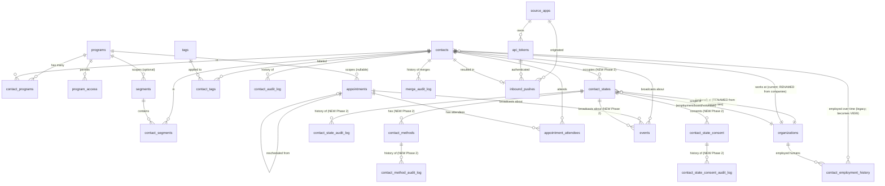

# Quietly CRM (QCM) ... Phase 2 Design Proposal

**Date:** 2026-05-19 (initial draft 2026-05-19; verdict pass complete 2026-05-19)
**Status:** **LOCKED** ... 8 open Qs (Q3.1 through Q3.8) verdicted by TIG; locked as D-024 through D-031 in [Decisions.md](Decisions.md). Phase 2.0 Migration 021 authoring unblocked.
**Predecessor:** [QCM-Phase-1-Design-Proposal.md](QCM-Phase-1-Design-Proposal.md) (Phase 1 SHIPPED 2026-05-17 at architectural level; operational rollout in-flight)
**Brainstorm:** [Brainstorm Prompts/Contact-Methods-Multi-Context-Brainstorm.md](Brainstorm%20Prompts/Contact-Methods-Multi-Context-Brainstorm.md) (B1-B6 verdicts locked Session 363)
**Locked decisions:** D-001 through D-031 in [Decisions.md](Decisions.md). D-017 → D-022 (Phase 2 architecture from Session 363 brainstorm) + D-023 (Organizations vocabulary; locked mid-pass on 2026-05-19) + D-024 → D-031 (Phase 2 verdict pass on 2026-05-19; this proposal's 8 open Qs).
**Bar (unchanged from Phase 0 + Phase 1):** Zero TIG UI clicks for configuration. Every feature passes "can the agent do this with no human in the configuration loop?"

### Revision log

| Rev | Date | What changed | Why |
|---|---|---|---|
| 0 | 2026-05-19 | Initial scaffold; all 17 sections drafted at Phase 1 depth | Lead Advisor Session 364 ... section-by-section authoring with TIG iteration |

---

## 1. Executive Summary

QCM Phase 2 expands the canonical relationship model from "contacts have flat methods" to "contacts occupy STATES, each state has methods + consent + lifecycle + audit." Phase 1 proved the multi-source spine; Phase 2 proves the multi-context human. The Sian-Jones canonical example drives every design decision: one contact, three states (Personal + QWF Board Member + Senior Consultant at Whitetree), each state with its own methods + per-state consent + temporal lifecycle. The state IS the entity in the contact's mental model; methods are children of states; consent attaches to states; transparency exports surface the full state-centric record.

One Migration (Migration 021) ships the whole Phase 2.0 schema substrate atomically: three new tables (`contact_states` + `contact_methods` + `contact_state_consent`) plus the D-023 atomic rename (`companies` → `organizations` + `company_id` → `organization_id` everywhere) plus supporting indexes + CHECK constraints + RLS policies + audit triggers + the `fn_emit_event` extension for the new entity types. The public API grows from ~24 endpoints to ~39 ... state CRUD (5 endpoints), method CRUD (5 endpoints), consent CRUD (4 endpoints), transparency export (1 synchronous + 1 async email trigger), with field-level portal-readiness classification baked into every contract. The source-app integrations evolve from flat-field push to state-centric push: QNT visitor + L4G donor + Catch + 121 calendar sync all write state + method shape instead of single email/phone/linkedin fields. Backfill operates as opportunistic Python scripts that synthesize "personal" + "employment" + "from-merge" states from the legacy single-column fields + the `contacts.additional_methods` JSONB stop-gap (Migration 019). The QNT enrichment script rebuild (Phase 1+ Backlog item 9) outputs the new state-centric shape and unblocks the cross-program organization data path that left Phase 1.4 Predicate 4 in DEFERRED-VERIFIED state.

The HQ Command Center QCM module evolution lands as five new Lovable prompts (state-aware contact detail; state CRUD; method CRUD; consent management; transparency export trigger), each with explicit portal-readiness specs per D-019. The contact portal ships Phase 2.5 as a separate auth surface ... operator-first sequencing protects against shipping operator features that can't be exposed to contacts in a values-aligned way. Per-state consent semantics replace the email-string-keyed legacy `check_send_permission(email, product)` over the Phase 2.2 retrofit window with a transitional view that maps email → contact_state → consent during the deprecation window; the 10 existing email-sending scripts migrate one at a time. The transparency export endpoint at `POST /v1/contacts/{id}/export` ships Phase 2.0 as a values-aligned admin-trigger surface, with the Phase 2.5 portal adding contact-self-service.

The strategic stance underneath Phase 2 is **D-021 entity-design discipline**: every new entity carries its own pk + lifecycle + audit + consent + soft-delete + ownership semantics. Building entities from day 1 + serving them through multi-perspective views later is the QOS-aligned path that doesn't require a rebuild. Phase 3+ multi-perspective view layers (operator-perspective HQ + contact-perspective portal + supporter-perspective dashboards) compose these entity-shaped sources without touching the data model. Pace IS mission per D-016 (carried forward from Phase 1); the long-game compounding lives in the bulletproof schema shape Phase 2.0 commits to.

---

## 2. Phase 2 Scope Statement

### 2.1 In scope

| Capability | Detail |
|---|---|
| Migration 021 ... state-centric schema substrate | `contact_states` table with state_type enum + organization_id polymorphic FK + state_label free-text + lifecycle dates + soft-delete + audit columns; `contact_methods` table with FK to `contact_states` (methods are children of states); `contact_state_consent` table with per-state per-product consent rows; CHECK constraints enforcing organization_id presence rules per state_type; full RLS policies on all 3 new tables |
| Migration 021 ... D-023 atomic rename | `companies` table → `organizations`; `contacts.company_id` → `contacts.organization_id`; `contact_employment_history.company_id` → `contact_employment_history.organization_id`; `qcm_normalize_company_name()` → `qcm_normalize_organization_name()`; `company_appointment_aggregate_stats` view → `organization_appointment_aggregate_stats`; all 9 `qcm_*` RPCs that reference `company_id` updated atomically; `api_tokens` source_app rows preserved; `Organization` everywhere in UI / API / code |
| Migration 021 ... audit trigger extensions | `fn_contact_state_audit` + `fn_contact_method_audit` + `fn_contact_state_consent_audit` triggers (pattern decision per Open Q 1); `fn_emit_event` extended to handle new entity types via `to_jsonb(new) ->> 'program_id'` pattern (already established Phase 1.1) |
| State CRUD API surface | POST `/v1/contact_states`, GET `/v1/contact_states?contact_id=`, GET `/v1/contact_states/{id}`, PATCH `/v1/contact_states/{id}`, DELETE `/v1/contact_states/{id}` (soft-delete) |
| Method CRUD API surface | POST `/v1/contact_methods`, GET `/v1/contact_methods?contact_state_id=`, PATCH `/v1/contact_methods/{id}`, DELETE `/v1/contact_methods/{id}`, POST `/v1/contact_methods/{id}/verify` |
| Consent CRUD API surface | POST `/v1/contact_state_consent`, GET `/v1/contact_state_consent?contact_state_id=`, PATCH `/v1/contact_state_consent/{id}`, DELETE `/v1/contact_state_consent/{id}` (revoke + audit) |
| Transparency export endpoint | POST `/v1/contacts/{id}/export` (synchronous JSON bundle return); POST `/v1/contacts/{id}/export/email` (async email with attached bundle + values-aligned cover note) |
| Per-state consent helper retrofit | `check_send_permission_v2(contact_state_id, product, fail_open)` helper; transitional view `legacy_preference_center_emails` maps email-string → contact_state_id during Phase 2.2 deprecation window |
| Backfill scripts | `qcm_backfill_states_from_legacy_fields.py` (synthesizes personal state from contacts.email/phone/linkedin_url; synthesizes employment state from contacts.organization_id + contact_employment_history rows); `qcm_backfill_methods_from_additional_methods.py` (extracts contacts.additional_methods JSONB into contact_methods rows attached to synthesized "from-merge" states); `qcm_backfill_organizations_rename_aftercare.py` (post-rename sanity sweep) |
| Operator-first sequencing | Phase 2.0/2.1 ship HQ operator surfaces FIRST; portal ships Phase 2.5 (per D-019) |
| HQ Command Center QCM module Phase 2 evolution | 5 new Lovable prompts (state-aware contact detail with state-grouped methods; state CRUD UI; method CRUD UI; consent management; transparency export trigger); each prompt with explicit portal-readiness counterpart specs (per D-019); top-level `/qcm/organizations` browse + detail page (D-023 Phase 2 design surface candidate) |
| Preference center retrofit (Phase 2.2) | Update 10 existing email-sending scripts to read per-state consent via `check_send_permission_v2`; legacy `check_send_permission(email, product, fail_open)` keeps working through transitional view during deprecation; deprecation timeline documented |
| Contact portal Phase 2.5 | Separate auth surface (magic-link OR OAuth per Open Q 6); state self-management UI; method self-management UI; consent self-management UI; transparency export self-trigger; "forget me" + "verify my method" + "update my role" flows |
| Operational observability | Discord notifications for state-change events; Betterstack monitoring for new endpoints; audit log explorer extends to UNION contact_state_audit_log + contact_method_audit_log + contact_state_consent_audit_log alongside Phase 1's contact_audit_log + appointment_audit_log |
| D-023 lands | Organizations vocabulary + full rename scope entered in `Decisions.md` (already locked 2026-05-19) |

### 2.2 Out of scope

| Capability | Defer to | Why deferred |
|---|---|---|
| Per-method consent overrides | Phase 2.2+ (separate trigger) | Per-state granularity is the right starting place; per-method overrides require additional UX work; ship per-state-only at 2.0 |
| Phase 3 multi-perspective view layers (operator-view / portal-view / supporter-view composed from canonical data) | Phase 3 | Phase 2 ships the entity-shaped data layer; view composition is its own design surface |
| QOS-as-entity-OS runtime (separate from data model) | Phase 3+ | D-021 ships entity-shaped DATA MODELS at Phase 2; the runtime is wider architectural surface, Phase 3+ work |
| Relationship graph (`contact_relationships` table for recommendations + mutual connections + recommended_by) | Phase 3+ | Not in brainstorm scope; surfaces as Phase 3+ via LinkedIn-shape contact-detail mapping |
| Contact notes (`contact_notes` table for pinned content per LinkedIn "Featured" analog) | Phase 2+ as separate task | Not in brainstorm scope; Phase 2+ when HQ surfaces pinned-content UX need |
| State-state nesting (e.g., "Board Member which is itself a kind of Employment") | Phase 3+ | Flat state_type enum is sufficient for Phase 2.0; hierarchical states are a Phase 3+ design surface if patterns emerge |
| State_types lookup table (so operators can extend without Migration) | Phase 2.x+ trigger-gated | Phase 2.0 ships tight CHECK enum; if a new state_type is needed during Phase 2.0+ bake, surface Open Q 5 trigger evaluation |
| Bulk historical migration of LinkedIn `relationship_intelligence.db` 3352-row records | Phase 3+ | Phase 2 backfills active QCM contacts; LinkedIn historical bulk is a dedicated sweep |
| Bulk vault Person file 816-row backfill to contact_state shape | Phase 3+ | Opportunistic linkage during Phase 2 source captures continues; bulk backfill is dedicated sweep |
| Un-merge endpoint (`POST /v1/merges/{id}/undo`) | Phase 3+ unless merge surface usage proves need | `pre_merge_snapshots` enables manual SQL recovery per Phase 1.3 |
| Optimistic locking for edit conflicts | Phase 3+ if real conflicts surface | Last-write-wins continues from Phase 1 |
| Scoped-read auth on `/v1/contacts` widening | Phase 3+ when audience widens beyond TIG | Admin-only during Phase 2 bake |
| QOS / Brain integration retrofit (5 surfaces per D-014) | Phase 3+ locked-trigger | D-014 deferral inherited; trigger: QOS `workspace.v1` reaches Production stability per QOS dev map → QCM-QOS retrofit kickoff fires |
| Betterstack → Discord translation relay | Phase 3+ (per D-015) | Shared QWU fleet infrastructure; not QCM-specific |
| Full Meeting Type system | Phase 3+ (per D-016 inheritance) | Phase 1.9 deferred per TIG; Phase 2 inherits same deferral |
| Dormant-contact alert system | Phase 3+ (per Phase 1+ Backlog item 6) | Needs dedicated design cycle; not rushed scope |

### 2.3 Why this scope

The Phase 2 brainstorm's constraint is load-bearing: take QCM from a flat-method model to a state-centric model that represents real human relationships faithfully + commits to the QOS values promises at the data layer. Every addition above the in-scope bar is Phase 3+ unless it makes Phase 3+ painful to bolt on. Five additions cross that bar:

- **The state-centric two-table model (Migration 021)** ... ships ONCE because backfill cost compounds if states + methods + consent ship separately. The Sian-Jones example surfaces as daily reality once 5+ sources push; deferring the model multiplies merge complexity.
- **Per-state consent semantics (D-020 bundled at 2.0)** ... the QOS values promise is half-built if states ship without consent. Shipping consent semantics later means the email-sending scripts need a two-phase retrofit instead of one; the tech-debt window is too long.
- **D-023 atomic rename (companies → organizations)** ... Phase 2.0 is the once-in-the-system opportunity to align DB ↔ API ↔ UI ↔ TIG vocabulary. Riding the same Migration window costs marginal incremental work; deferring pays compounding cost forever as new code references accrete. The QOS-level standard at `qwu_naming_conventions.md` v1.2.0 binds future schemas already; the in-DB rename closes the loop.
- **Transparency export endpoint (D-022 at 2.0)** ... shipping the endpoint Phase 2.0 signals the values commitment publicly + immediately. The endpoint also shapes Phase 2.0 data-model decisions ("can this be exported cleanly?") ... any field that can't be exported flags a design issue at design time, not after deploy.
- **Operator-first sequencing with portal-readiness discipline (D-019)** ... lets QCM LEARN what the data actually needs in real operator use before committing to portal UX. Shipping portal-first risks empty-box for weeks. Portal-readiness discipline prevents the "we'll add the portal later" trap where operator-shaped features can't be retrofitted.

Everything else holds the Phase 3+ line. Per `[[feedback_vapor_configs_are_phase_entry_gates]]`, every deferral has an explicit trigger criterion in §16 Backlog ... no item lives in a vague "later" bucket.

---

## 3. Data Model

### 3.1 ER Diagram Update (Phase 0 + Phase 1 + Phase 2 Additions; renamed Organizations)



**Phase 2 additions (over Phase 1's diagram):**

- **`contact_states` table** ... a state/role/identity context that the contact occupies (Personal / QWF Board Member / Senior Consultant at Whitetree / Volunteer / etc.). Each state carries `state_type` enum + `state_label` free-form + `organization_id` polymorphic FK + `role_title` + `started_at` / `ended_at` lifecycle dates + `is_primary` flag + standard audit/soft-delete columns.
- **`contact_methods` table** ... method (email/phone/address/linkedin/website) attached as CHILD of state via `contact_state_id` FK (NOT directly to contact). Each method has `value` + `method_type` + `is_primary_for_state` flag + `verified_at` timestamp + standard audit/soft-delete columns.
- **`contact_state_consent` table** ... per-state per-product consent row. Each row has `contact_state_id` FK + `product_code` + `consent_state` enum ('opted_in' / 'opted_out' / 'never_set') + `consent_source` (where the consent came from) + `consented_at` + `revoked_at` + standard audit columns.
- **`contact_state_audit_log`, `contact_method_audit_log`, `contact_state_consent_audit_log` tables** (pattern decision per Open Q 1; default: per-entity audit tables mirroring Phase 1 `appointment_audit_log` pattern) ... each captures action + changes jsonb + changed_via + changed_by + changed_at.
- **`organizations` table** (RENAMED atomically from `companies` per D-023) ... same shape; just renamed.
- **`contact_employment_history` becomes a VIEW** for one release (Phase 2.0+2.1), pointing at `contact_states WHERE state_type='employment'`; dropped at Phase 2.2 or 3.0 when no callers remain. Backfill writes employment state rows from existing CEH rows 1:1.

**Phase 0 + Phase 1 + Phase 2 relational invariants:**

- Person-scoped: one human can be in N programs via `contact_programs` AND occupy N states via `contact_states` (independent dimensions)
- Soft-delete everywhere: `deleted_at` + `deleted_by` on every supporter-data-touching table including all 3 new Phase 2 entities
- Audit-on-mutation: contacts via `fn_contact_audit`; appointments via `fn_appointment_audit`; states via `fn_contact_state_audit`; methods via `fn_contact_method_audit`; consent via `fn_contact_state_consent_audit`
- All timestamps `timestamptz`; all writes anchored Pacific via `timezone.ts`
- Single namespace UUIDv5 for all correlation_id derivations: `a4643c11-1540-4564-bf08-a3c26cf9c1f7` per Phase 0 lock A1 (NEVER rotate, per `[[feedback_uuidv5_correlation_pattern_for_non_uuid_external_ids]]`)
- Phase 2 entity ownership: every entity has `added_by` (uuid) + `added_via` (text); `owned_by` optional column on contact_states only (rare; defaults to NULL meaning ownership inherits from contact)

### 3.2 Migration 021 Full DDL ... state-centric schema substrate + D-023 atomic rename

The migration file lands at `supabase/migrations/021_phase2_state_centric_schema.sql`, wrapped in `BEGIN; ... COMMIT;`. Each block below is one logical change in deploy order. Blocks 3.2.1-3.2.4 are the D-023 atomic rename (must come FIRST so subsequent blocks reference the renamed entities). Blocks 3.2.5-3.2.10 are the state-centric substrate.

#### 3.2.1 Atomic rename: companies → organizations (table + constraint + index)

```sql
-- D-023 atomic rename: companies → organizations
-- Per qwu_naming_conventions.md v1.2.0 §"Entity Vocabulary: Organizations (Not Companies)"

alter table companies rename to organizations;
alter table organizations rename constraint companies_pkey to organizations_pkey;
alter index companies_normalized_name_idx rename to organizations_normalized_name_idx;
alter table organizations rename constraint companies_normalized_name_unique to organizations_normalized_name_unique;

-- Comment updates to reflect new vocabulary
comment on table organizations is
  'Organizations ... single entity term covering for-profit + nonprofit per D-023 (locked 2026-05-19). Renamed from `companies` at Phase 2.0 Migration 021. Includes employers, donor-partner orgs, supporter orgs, partner programs, youth-serving organizations, and vendor relationships. The vocabulary lock is a QOS-level standard documented in `qwu_naming_conventions.md` v1.2.0 ... new QWF schemas use Organizations from day 1.';

comment on column organizations.name is
  'Display/conversational name. "GreenCal" ... what a person would use in a sentence.';
```

#### 3.2.2 Atomic rename: company_id → organization_id (3 referencing tables)

```sql
-- contacts.company_id → contacts.organization_id
alter table contacts rename column company_id to organization_id;
-- FK constraint name preserved (Postgres updates the FK definition automatically on table rename above;
-- explicit rename of FK constraint name if it was named contacts_company_id_fkey:
alter table contacts rename constraint contacts_company_id_fkey to contacts_organization_id_fkey;

-- contact_employment_history.company_id → contact_employment_history.organization_id
alter table contact_employment_history rename column company_id to organization_id;
alter table contact_employment_history rename constraint contact_employment_history_company_id_fkey to contact_employment_history_organization_id_fkey;

-- Rename indexes that reference the old column name
alter index contact_employment_history_company_idx rename to contact_employment_history_organization_idx;
alter index contact_employment_history_current_idx rename to contact_employment_history_current_organization_idx;
```

#### 3.2.3 Atomic rename: qcm_normalize_company_name → qcm_normalize_organization_name

```sql
-- CREATE OR REPLACE the renamed function with new name (preserves the implementation; drops the old name)
create or replace function qcm_normalize_organization_name(p_name text) returns text as $$
  select lower(trim(regexp_replace(regexp_replace(coalesce(p_name, ''), '[^a-zA-Z0-9 ]', '', 'gi'), '\s+', ' ', 'g')));
$$ language sql immutable;

comment on function qcm_normalize_organization_name(text) is
  'Normalize organization name to lowercase trimmed alphanumeric-and-space form. Used for dedup on organizations.normalized_name. RENAMED from qcm_normalize_company_name at Phase 2.0 Migration 021 per D-023.';

-- Drop the old function name; existing callers updated in the same migration via CREATE OR REPLACE of RPCs below
drop function if exists qcm_normalize_company_name(text);
```

#### 3.2.4 Atomic rename: view + dependent RPCs

```sql
-- Rename the aggregate stats view
drop view if exists company_appointment_aggregate_stats;

create view organization_appointment_aggregate_stats as
select
  org.id as organization_id,
  count(distinct ce.contact_id) filter (where ce.is_current) as current_employee_contact_count,
  count(distinct ce.contact_id) as total_known_employee_count,
  count(distinct a.id) as total_appointments,
  count(distinct a.id) filter (where a.status = 'completed') as completed_count,
  count(distinct a.id) filter (where a.status = 'rescheduled') as rescheduled_count,
  count(distinct a.id) filter (where a.status = 'canceled') as canceled_count,
  count(distinct a.id) filter (where a.status = 'no_show') as no_show_count,
  round(100.0 * count(distinct a.id) filter (where a.status = 'rescheduled') / nullif(count(distinct a.id), 0), 1) as reschedule_rate_pct,
  round(100.0 * count(distinct a.id) filter (where a.status = 'canceled') / nullif(count(distinct a.id), 0), 1) as cancel_rate_pct,
  max(a.scheduled_at) filter (where a.status = 'completed') as last_meeting_with_anyone_at,
  min(ce.start_date) as earliest_known_employment_start
from organizations org
left join contact_employment_history ce on ce.organization_id = org.id and ce.deleted_at is null
left join appointment_attendees aa on aa.contact_id = ce.contact_id and aa.deleted_at is null
left join appointments a on a.id = aa.appointment_id and a.deleted_at is null
where org.deleted_at is null
group by org.id;

comment on view organization_appointment_aggregate_stats is
  'Aggregate appointment patterns by organization. RENAMED from company_appointment_aggregate_stats at Phase 2.0 Migration 021 per D-023. Foundation for organizations-as-relational-containers framing per `[[feedback_orgs_as_relational_containers]]`.';

-- The 5 RPCs that reference company_id internally get atomic CREATE OR REPLACE:
-- qcm_inbound_contact_create, qcm_contact_patch, qcm_company_patch → renamed to qcm_organization_patch,
-- qcm_contact_merge, qcm_merge_candidates.
-- Each updated to reference organization_id; full RPC bodies remain inside the same Migration 021
-- (omitted here for brevity; see §3.6 RPC inventory for the rename list).
```

#### 3.2.5 contact_states table (new)

```sql
create table contact_states (
  id                  uuid primary key default gen_random_uuid(),
  contact_id          uuid not null references contacts(id),
  state_type          text not null check (state_type in (
                        'personal','employment','board_membership','volunteer',
                        'spousal','friendship','student','client','supporter',
                        'investor','donor','mentor','mentee','collaborator','other'
                      )),
  state_label         text null,                                       -- contact-supplied nuance
  organization_id     uuid null references organizations(id),          -- nullable; required when state_type implies org
  role_title          text null,                                       -- e.g., "Treasurer", "Senior Consultant"
  started_at          date null,
  ended_at            date null,
  is_primary          boolean not null default false,                  -- one primary state per contact (NOT enforced via constraint; soft convention)

  -- Lifecycle + audit
  created_at          timestamptz not null default now(),
  updated_at          timestamptz not null default now(),
  deleted_at          timestamptz null,
  deleted_by          uuid null references auth.users(id),
  added_via           text not null default 'unknown',                 -- 'inbound-push', 'hq-operator', 'portal-self-service', 'backfill', 'merge', ...
  added_by            uuid null references auth.users(id),
  owned_by            uuid null references auth.users(id),             -- optional; rare; defaults to NULL = inherits from contact

  -- CHECK constraint enforcing state_type → organization_id presence/absence
  constraint contact_states_org_alignment_check check (
    (state_type in ('personal','spousal','friendship') and organization_id is null)
    or
    (state_type in ('employment','board_membership','volunteer','client','supporter','investor','donor','mentor','mentee','collaborator') and organization_id is not null)
    or
    (state_type = 'student')   -- org optional (could be school/program or self-directed)
    or
    (state_type = 'other')     -- org optional
  )
);

create index contact_states_contact_idx
  on contact_states(contact_id)
  where deleted_at is null;

create index contact_states_organization_idx
  on contact_states(organization_id)
  where deleted_at is null and organization_id is not null;

create index contact_states_type_idx
  on contact_states(state_type, contact_id)
  where deleted_at is null;

create index contact_states_primary_idx
  on contact_states(contact_id)
  where deleted_at is null and is_primary = true;

comment on table contact_states is
  'States / roles / identity contexts that a contact occupies. Per D-017 (locked 2026-05-18): state-centric two-table model. Sian-Jones canonical example: 1 contact with 3 contact_states rows (Personal + QWF Board Member + Senior Consultant at Whitetree). Each state has its own methods (FK from contact_methods), per-state consent (FK from contact_state_consent), and lifecycle dates. The state IS the entity in the contact''s mental model; methods are children of states; consent attaches to states. Per D-021 entity-design discipline: every entity has own pk + lifecycle + audit + consent + soft-delete + ownership.';

comment on column contact_states.state_label is
  'Contact-supplied nuance describing this state in their own words. Examples: "Senior Consultant (3D Design) at Whitetree", "QWF Board of Directors Member ... Treasurer", "Burning Man volunteer 2023-present". NOT a QWF-imposed taxonomy; aligns with contact-as-source-of-truth + Phase 2.5 portal UX. Per D-018.';

comment on column contact_states.is_primary is
  'Soft convention: one primary state per contact (the state that surfaces as the default identity context in operator views and portal UX). NOT enforced via constraint; ambiguity is acceptable when contact hasn''t declared a primary state. Phase 2.5 portal asks contacts to optionally mark primary.';

comment on column contact_states.added_via is
  'Origin of the state row. Values: ''inbound-push'' (source-app pushed state at contact create); ''hq-operator'' (TIG / future operator added via HQ); ''portal-self-service'' (contact added via portal Phase 2.5); ''backfill'' (Phase 2.0 backfill script synthesized from legacy fields); ''merge'' (merge surface created from-merge synthesized state); ''calendar-sync'' (calendar sync created when adding new attendee).';
```

#### 3.2.6 contact_methods table (new)

```sql
create table contact_methods (
  id                       uuid primary key default gen_random_uuid(),
  contact_state_id         uuid not null references contact_states(id),    -- FK to STATE, not contact
  method_type              text not null check (method_type in (
                             'email','phone','address','linkedin','website','other'
                           )),
  value                    text not null,                                  -- the actual email / phone / URL / address string
  is_primary_for_state     boolean not null default false,                 -- per-method-type within a state; see Open Q 4
  verified_at              timestamptz null,                               -- when the method was verified (portal verify-flow or HQ confirm)

  -- Lifecycle + audit
  created_at               timestamptz not null default now(),
  updated_at               timestamptz not null default now(),
  deleted_at               timestamptz null,
  deleted_by               uuid null references auth.users(id),
  added_via                text not null default 'unknown',
  added_by                 uuid null references auth.users(id)
);

create index contact_methods_state_idx
  on contact_methods(contact_state_id)
  where deleted_at is null;

create index contact_methods_type_value_idx
  on contact_methods(method_type, lower(value))
  where deleted_at is null;

create index contact_methods_primary_idx
  on contact_methods(contact_state_id, method_type)
  where deleted_at is null and is_primary_for_state = true;

comment on table contact_methods is
  'Methods (email/phone/address/linkedin/website) attached as CHILDREN OF STATES (FK contact_state_id), NOT directly to contacts. Per D-017 (locked 2026-05-18). The method-as-child-of-state pattern lets the same human have different methods per state (Sian: personal Gmail under Personal state; QWF Board email under QWF Board Member state; work email under Whitetree Senior Consultant state). Per-state consent (contact_state_consent) suppresses ALL methods in that state. Phase 2.5 portal lets contacts manage their methods per state.';

comment on column contact_methods.is_primary_for_state is
  'Per-method-type primary flag within a state (per Open Q 4 default: one primary email + one primary phone per state, NOT one primary method overall per state). Allows "the primary email for my QWF Board state" + "the primary phone for my QWF Board state" without collision. Soft convention; not enforced via constraint; ambiguity acceptable.';

comment on column contact_methods.value is
  'The actual method value: email address (lowercased; citext-comparable), phone number (E.164-canonicalized by source apps when possible), URL (canonicalized lowercase host + stripped tracking params), address (free-form text). No format CHECK constraint at the schema layer; format validation lives at the edge function layer (per Phase 1.2 pattern).';
```

#### 3.2.7 contact_state_consent table (new)

```sql
create table contact_state_consent (
  id                  uuid primary key default gen_random_uuid(),
  contact_state_id    uuid not null references contact_states(id),
  product_code        text not null,                                      -- matches preference_center.PRODUCTS enum
  consent_state       text not null check (consent_state in (
                        'opted_in','opted_out','never_set'
                      )),
  consent_source      text not null check (consent_source in (
                        'inbound_default','portal_self_service',
                        'hq_operator','preference_center_legacy',
                        'migrated_from_email_string','backfill'
                      )),
  consented_at        timestamptz not null default now(),
  revoked_at          timestamptz null,

  -- Lifecycle + audit
  created_at          timestamptz not null default now(),
  updated_at          timestamptz not null default now(),
  added_via           text null,
  added_by            uuid null references auth.users(id),

  -- One consent row per (state, product) pair
  constraint contact_state_consent_unique_per_pair unique (contact_state_id, product_code)
);

create index contact_state_consent_state_idx
  on contact_state_consent(contact_state_id);

create index contact_state_consent_product_idx
  on contact_state_consent(product_code, consent_state);

comment on table contact_state_consent is
  'Per-state per-product consent record. Per D-020 (locked 2026-05-18): bundled into Phase 2.0 Migration. The QOS values promise IS "you can opt your QWF Board state out of emails while keeping your personal state in"; deferring consent semantics to a later phase would ship a half-built promise. One row per (state, product) pair enforces single-source-of-truth; updates flip consent_state in place rather than INSERT new rows (history captured via contact_state_consent_audit_log).';

comment on column contact_state_consent.consent_source is
  'Where this consent record originated. Used for transparency export + audit forensics. Values: ''inbound_default'' (source-app default consent at first push), ''portal_self_service'' (contact set via Phase 2.5 portal), ''hq_operator'' (TIG / future operator set via HQ), ''preference_center_legacy'' (migrated during Phase 2.2 retrofit from email-keyed preference center), ''migrated_from_email_string'' (Phase 2.2 transitional view derivation), ''backfill'' (Phase 2.0 backfill script set never_set initial state).';

comment on column contact_state_consent.revoked_at is
  'When consent was revoked. NULL when consent_state = ''opted_in''; populated when consent_state = ''opted_out''. The pair (consent_state, revoked_at) is internally consistent; revoked_at is the durable timestamp of revocation for audit purposes (consent_state captures the current effective state).';
```

#### 3.2.8 Audit log tables for new entities

Default audit pattern decision: **per-entity audit tables mirroring Phase 1 `appointment_audit_log` pattern** (Open Q 1 default; TIG verdict pass may flip to unified `entity_audit_log` table if desired).

```sql
-- contact_state_audit_log
create table contact_state_audit_log (
  id                  uuid primary key default gen_random_uuid(),
  contact_state_id    uuid not null references contact_states(id),
  action              text not null check (action in (
                        'insert','update','soft_delete','restore'
                      )),
  changes             jsonb not null,
  changed_by          uuid null references auth.users(id),
  changed_via         text not null,
  changed_at          timestamptz not null default now()
);

create index contact_state_audit_log_state_idx
  on contact_state_audit_log(contact_state_id, changed_at desc);

create index contact_state_audit_log_changed_by_idx
  on contact_state_audit_log(changed_by, changed_at desc)
  where changed_by is not null;

-- contact_method_audit_log
create table contact_method_audit_log (
  id                  uuid primary key default gen_random_uuid(),
  contact_method_id   uuid not null references contact_methods(id),
  action              text not null check (action in (
                        'insert','update','soft_delete','restore','verified'
                      )),
  changes             jsonb not null,
  changed_by          uuid null references auth.users(id),
  changed_via         text not null,
  changed_at          timestamptz not null default now()
);

create index contact_method_audit_log_method_idx
  on contact_method_audit_log(contact_method_id, changed_at desc);

create index contact_method_audit_log_changed_by_idx
  on contact_method_audit_log(changed_by, changed_at desc)
  where changed_by is not null;

-- contact_state_consent_audit_log
create table contact_state_consent_audit_log (
  id                       uuid primary key default gen_random_uuid(),
  contact_state_consent_id uuid not null references contact_state_consent(id),
  action                   text not null check (action in (
                             'insert','update','revoke','restore'
                           )),
  changes                  jsonb not null,
  changed_by               uuid null references auth.users(id),
  changed_via              text not null,
  changed_at               timestamptz not null default now()
);

create index contact_state_consent_audit_log_consent_idx
  on contact_state_consent_audit_log(contact_state_consent_id, changed_at desc);

comment on table contact_state_audit_log is
  'Per-state mutation forensic record. Pattern mirrors Phase 1 appointment_audit_log per Open Q 1 default. Captures action + per-field diff in changes jsonb (for updates) or full row snapshot (for inserts) + changed_via attribution. Phase 3+ migration to unified entity_audit_log is possible without breaking schema.';
```

#### 3.2.9 Audit trigger functions

```sql
-- fn_contact_state_audit
create or replace function fn_contact_state_audit() returns trigger as $$
declare
  changes jsonb := '{}'::jsonb;
  k text;
  by_user uuid := nullif(current_setting('qcm.user_id', true), '')::uuid;
  via_app text := coalesce(nullif(current_setting('qcm.changed_via', true), ''), 'service-role');
begin
  if tg_op = 'INSERT' then
    insert into contact_state_audit_log (contact_state_id, action, changes, changed_by, changed_via)
    values (new.id, 'insert', to_jsonb(new), by_user, via_app);
    return new;
  elsif tg_op = 'UPDATE' then
    for k in select jsonb_object_keys(to_jsonb(new)) loop
      if to_jsonb(new) -> k is distinct from to_jsonb(old) -> k then
        changes := changes || jsonb_build_object(k, jsonb_build_object('old', to_jsonb(old) -> k, 'new', to_jsonb(new) -> k));
      end if;
    end loop;
    if changes != '{}'::jsonb then
      insert into contact_state_audit_log (contact_state_id, action, changes, changed_by, changed_via)
      values (
        new.id,
        case
          when new.deleted_at is not null and old.deleted_at is null then 'soft_delete'
          when new.deleted_at is null and old.deleted_at is not null then 'restore'
          else 'update'
        end,
        changes,
        by_user,
        via_app
      );
    end if;
    return new;
  end if;
  return null;
end;
$$ language plpgsql;

create trigger trg_contact_state_audit
  after insert or update on contact_states
  for each row execute function fn_contact_state_audit();

-- fn_contact_method_audit (parallel pattern; handles 'verified' action when verified_at transitions NULL→non-NULL)
create or replace function fn_contact_method_audit() returns trigger as $$
declare
  changes jsonb := '{}'::jsonb;
  k text;
  by_user uuid := nullif(current_setting('qcm.user_id', true), '')::uuid;
  via_app text := coalesce(nullif(current_setting('qcm.changed_via', true), ''), 'service-role');
  is_verify_transition boolean := false;
begin
  if tg_op = 'INSERT' then
    insert into contact_method_audit_log (contact_method_id, action, changes, changed_by, changed_via)
    values (new.id, 'insert', to_jsonb(new), by_user, via_app);
    return new;
  elsif tg_op = 'UPDATE' then
    -- Detect verification transition: verified_at NULL → non-NULL
    is_verify_transition := (old.verified_at is null and new.verified_at is not null);

    for k in select jsonb_object_keys(to_jsonb(new)) loop
      if to_jsonb(new) -> k is distinct from to_jsonb(old) -> k then
        changes := changes || jsonb_build_object(k, jsonb_build_object('old', to_jsonb(old) -> k, 'new', to_jsonb(new) -> k));
      end if;
    end loop;
    if changes != '{}'::jsonb then
      insert into contact_method_audit_log (contact_method_id, action, changes, changed_by, changed_via)
      values (
        new.id,
        case
          when is_verify_transition then 'verified'
          when new.deleted_at is not null and old.deleted_at is null then 'soft_delete'
          when new.deleted_at is null and old.deleted_at is not null then 'restore'
          else 'update'
        end,
        changes,
        by_user,
        via_app
      );
    end if;
    return new;
  end if;
  return null;
end;
$$ language plpgsql;

create trigger trg_contact_method_audit
  after insert or update on contact_methods
  for each row execute function fn_contact_method_audit();

-- fn_contact_state_consent_audit (parallel pattern; 'revoke' action when consent_state transitions to opted_out)
create or replace function fn_contact_state_consent_audit() returns trigger as $$
declare
  changes jsonb := '{}'::jsonb;
  k text;
  by_user uuid := nullif(current_setting('qcm.user_id', true), '')::uuid;
  via_app text := coalesce(nullif(current_setting('qcm.changed_via', true), ''), 'service-role');
  is_revoke_transition boolean := false;
begin
  if tg_op = 'INSERT' then
    insert into contact_state_consent_audit_log (contact_state_consent_id, action, changes, changed_by, changed_via)
    values (new.id, 'insert', to_jsonb(new), by_user, via_app);
    return new;
  elsif tg_op = 'UPDATE' then
    -- Detect revoke transition: consent_state transitioning to opted_out
    is_revoke_transition := (
      old.consent_state is distinct from new.consent_state
      and new.consent_state = 'opted_out'
    );

    for k in select jsonb_object_keys(to_jsonb(new)) loop
      if to_jsonb(new) -> k is distinct from to_jsonb(old) -> k then
        changes := changes || jsonb_build_object(k, jsonb_build_object('old', to_jsonb(old) -> k, 'new', to_jsonb(new) -> k));
      end if;
    end loop;
    if changes != '{}'::jsonb then
      insert into contact_state_consent_audit_log (contact_state_consent_id, action, changes, changed_by, changed_via)
      values (
        new.id,
        case
          when is_revoke_transition then 'revoke'
          when old.consent_state = 'opted_out' and new.consent_state = 'opted_in' then 'restore'
          else 'update'
        end,
        changes,
        by_user,
        via_app
      );
    end if;
    return new;
  end if;
  return null;
end;
$$ language plpgsql;

create trigger trg_contact_state_consent_audit
  after insert or update on contact_state_consent
  for each row execute function fn_contact_state_consent_audit();
```

#### 3.2.10 fn_emit_event extension for Phase 2 entity types

```sql
-- CREATE OR REPLACE fn_emit_event (extends Phase 0 + Phase 1 function with Phase 2 entity types)
-- Per [[feedback_plpgsql_case_static_field_check]]: continue using to_jsonb(new) ->> 'program_id'
-- pattern (already established Phase 1.1 refactor) so the function compiles against tables that
-- don't have program_id columns (contact_states / contact_methods / contact_state_consent all lack
-- direct program_id; the trigger uses to_jsonb extraction returning NULL safely).

-- (Function body unchanged from Phase 1.1; just registering new triggers.)

create trigger trg_contact_state_created
  after insert on contact_states
  for each row execute function fn_emit_event('contact_state.created', 'contact_state');

create trigger trg_contact_state_updated
  after update of state_type, state_label, organization_id, role_title, started_at, ended_at, is_primary on contact_states
  for each row execute function fn_emit_event('contact_state.updated', 'contact_state');

create trigger trg_contact_method_created
  after insert on contact_methods
  for each row execute function fn_emit_event('contact_method.created', 'contact_method');

create trigger trg_contact_method_verified
  after update of verified_at on contact_methods
  for each row execute function fn_emit_event('contact_method.verified', 'contact_method');

create trigger trg_contact_state_consent_set
  after insert on contact_state_consent
  for each row execute function fn_emit_event('contact_state_consent.set', 'contact_state_consent');

create trigger trg_contact_state_consent_revoked
  after update of consent_state on contact_state_consent
  for each row execute function fn_emit_event('contact_state_consent.changed', 'contact_state_consent');
```

#### 3.2.11 Migration ordering + safety notes

- All ALTER + CREATE wrapped in `BEGIN; ... COMMIT;`. If any statement fails, the migration rolls back atomically.
- The D-023 rename (3.2.1-3.2.4) happens BEFORE any new schema references the old `companies` name. RPCs that reference `companies` get CREATE OR REPLACE with `organizations` references in the SAME migration block, atomic with the table rename.
- New columns are all nullable or have defaults; no backfill required at Migration 021 deploy time. Backfill scripts (§3.6) run AFTER Migration 021 lands.
- The `fn_emit_event` CREATE OR REPLACE is safe: PostgreSQL preserves trigger bindings across function replacement; the function body was already updated Phase 1.1 to handle entity types without program_id columns.
- All new tables have soft-delete columns + indexes that filter `where deleted_at is null` (Phase 0+1 invariant).
- No existing data is mutated by Migration 021's schema-creation blocks. Existing `contacts` / `companies` (→ `organizations`) / `contact_employment_history` rows survive unchanged; only metadata renames apply.
- Edge functions that reference `companies` get updated atomically alongside Migration 021 deploy (same orchestration window).

### 3.3 Entity-design Checklist (mandatory; per D-021)

Every new Phase 2 entity passes this checklist. Audit performed at proposal authoring time:

| Entity | Own pk | Own lifecycle | Own audit | Own consent | Own soft-delete | Own ownership |
|---|---|---|---|---|---|---|
| `contact_states` | uuid + gen_random_uuid | created_at + updated_at + deleted_at + deleted_by | contact_state_audit_log + trigger fn_contact_state_audit | applies via contact_state_consent FK | deleted_at + deleted_by + soft-delete trigger action | added_by + added_via + owned_by (optional) |
| `contact_methods` | uuid + gen_random_uuid | created_at + updated_at + deleted_at + deleted_by | contact_method_audit_log + trigger fn_contact_method_audit | inherits via parent state's consent | deleted_at + deleted_by + soft-delete trigger action | added_by + added_via |
| `contact_state_consent` | uuid + gen_random_uuid | created_at + updated_at + revoked_at | contact_state_consent_audit_log + trigger fn_contact_state_consent_audit | IS the consent record itself | revoked_at + audit trigger action | added_by + added_via |

All three entities pass D-021. Their audit logs themselves are append-only (no soft-delete on the audit tables; forensic chains are immutable).

### 3.4 Portal-readiness Field Classification (mandatory; per D-019)

Per D-019: every NEW field has a "shown to contact?" classification. Classifications:

- **`always-visible`** ... contact sees this on every portal load (and in transparency export)
- **`on-request`** ... contact sees in export / detail view but not on every portal load
- **`never-shown`** ... internal-only; never returned to portal API responses
- **`sensitive-redacted`** ... shown in masked form (e.g., "tig@***.org"); full value never returned to portal

#### contact_states fields

| Field | Classification | Why |
|---|---|---|
| `id` | always-visible | Contact's own state IDs (stable references for "update this role") |
| `contact_id` | always-visible | Their own contact ID; the row is theirs |
| `state_type` | always-visible | Contact's own categorical context ("you have an Employment state at Whitetree") |
| `state_label` | always-visible | Contact-supplied nuance; contact owns the language |
| `organization_id` | always-visible (resolved to organization.name) | The organization name is part of the state context the contact already knows |
| `role_title` | always-visible | Contact's own role |
| `started_at` / `ended_at` | always-visible | Contact's own employment / role timeline |
| `is_primary` | always-visible | Contact can mark/unmark primary themselves |
| `created_at` / `updated_at` | on-request | Transparency export includes; portal detail shows; portal list view skips |
| `deleted_at` / `deleted_by` | never-shown | Internal operational state; portal sees non-deleted rows only |
| `added_via` | on-request | Transparency export shows ("we received this state from your portal self-service action on 2026-04-15") |
| `added_by` / `owned_by` | sensitive-redacted | Show as "operator at QWF" or "system" rather than internal user UUID |

#### contact_methods fields

| Field | Classification | Why |
|---|---|---|
| `id` | always-visible | Contact's own method IDs (stable references for "verify this method") |
| `contact_state_id` | always-visible | Which state this method belongs to |
| `method_type` | always-visible | Self-explanatory |
| `value` | always-visible | The contact's own method value |
| `is_primary_for_state` | always-visible | Contact can toggle primary themselves |
| `verified_at` | always-visible | Contact sees verification status |
| `created_at` / `updated_at` | on-request | Same as contact_states |
| `deleted_at` / `deleted_by` | never-shown | Same as contact_states |
| `added_via` | on-request | Same as contact_states |
| `added_by` | sensitive-redacted | Same as contact_states |

#### contact_state_consent fields

| Field | Classification | Why |
|---|---|---|
| `id` | always-visible | Contact's own consent IDs |
| `contact_state_id` | always-visible | Which state this consent belongs to |
| `product_code` | always-visible | Product name (human-readable label rendered via PRODUCT_NAMES map) |
| `consent_state` | always-visible | Contact's own consent decision |
| `consent_source` | always-visible | Important transparency element ("you consented via the portal on 2026-04-15") |
| `consented_at` / `revoked_at` | always-visible | When consent was granted / revoked |
| `created_at` / `updated_at` | on-request | Same as above |
| `added_via` | on-request | Same as above |
| `added_by` | sensitive-redacted | Same as above |

### 3.5 RLS Policies for All New Tables

Phase 2 RLS rules extend Phase 0+1 patterns: `service_role` full on all tables; authenticated user reads scoped via `program_access` join through the parent contact; writes happen as `service_role` (mutation API edge functions set GUCs and audit triggers capture attribution).

Phase 2.5 portal introduces a NEW auth surface (separate from staff auth) ... contact-self-auth grants visibility ONLY to that contact's own state/method/consent rows. Phase 2.0 ships the RLS policy framework that BOTH staff auth (existing pattern) AND portal auth (new pattern) compose cleanly against. Portal auth implementation in §8.

**Phase 2 new tables RLS policies land in Migration 021 alongside table creation:**

| Table | Authenticated user (staff `auth.uid()`) | Portal contact (Phase 2.5 future surface) | `service_role` |
|---|---|---|---|
| `contact_states` | SELECT if user has `program_access` on any program in the contact's `contact_programs` (inherit from contacts via 2-hop) | SELECT only own contact's rows (portal auth includes contact_id claim) | full |
| `contact_methods` | SELECT if user can SELECT the parent state (recursive EXISTS) | SELECT only own contact's methods (recursive via state → contact match) | full |
| `contact_state_consent` | SELECT if user can SELECT the parent state | SELECT only own consent rows | full |
| `contact_state_audit_log` | SELECT if user can SELECT the parent state (audit visible on soft-deleted states for forensics) | NOT visible (operator-only) | full |
| `contact_method_audit_log` | SELECT if user can SELECT the parent method | NOT visible (operator-only) | full |
| `contact_state_consent_audit_log` | SELECT if user can SELECT the parent consent | SELECT own (transparency: contact sees their own consent change history in export) | full |

**Example policy on contact_states** (mirrors Phase 1's live + deleted split):

```sql
alter table contact_states enable row level security;

create policy contact_states_select_live on contact_states
  for select
  using (
    deleted_at is null
    and exists (
      select 1 from contacts c
      join contact_programs cp on cp.contact_id = c.id
      join program_access pa on pa.program_id = cp.program_id
      where c.id = contact_states.contact_id
        and pa.user_id = auth.uid()
        and pa.revoked_at is null
        and cp.deleted_at is null
    )
  );

create policy contact_states_select_deleted on contact_states
  for select
  using (
    deleted_at is not null
    and exists (
      select 1 from contacts c
      join contact_programs cp on cp.contact_id = c.id
      join program_access pa on pa.program_id = cp.program_id
      where c.id = contact_states.contact_id
        and pa.user_id = auth.uid()
        and pa.role in ('admin', 'write')
        and pa.revoked_at is null
        and cp.deleted_at is null
    )
  );
```

**Example policy on contact_methods** (inherit from contact_states via EXISTS):

```sql
alter table contact_methods enable row level security;

create policy contact_methods_select_live on contact_methods
  for select
  using (
    deleted_at is null
    and exists (
      select 1 from contact_states cs
      where cs.id = contact_methods.contact_state_id
        and cs.deleted_at is null
        -- visibility inherits through the state RLS recursive composition
    )
  );

create policy contact_methods_select_deleted on contact_methods
  for select
  using (
    deleted_at is not null
    and exists (
      select 1 from contact_states cs
      join contacts c on c.id = cs.contact_id
      join contact_programs cp on cp.contact_id = c.id
      join program_access pa on pa.program_id = cp.program_id
      where cs.id = contact_methods.contact_state_id
        and pa.user_id = auth.uid()
        and pa.role in ('admin', 'write')
        and pa.revoked_at is null
        and cp.deleted_at is null
    )
  );
```

**Phase 2.5 portal auth extension** (future schema; sketched here so Phase 2.0 lays compatible foundation):

```sql
-- Phase 2.5 portal-side auth uses Supabase Auth with custom claim 'portal_contact_id' on the JWT.
-- The JWT claim is set by the portal magic-link / OAuth flow (Phase 2.5 work).
-- RLS policies admit the portal-contact path alongside the staff path.

-- Example Phase 2.5 addition to contact_states_select_live (NOT applied at 2.0; sketched):
-- using (
--   deleted_at is null
--   and (
--     -- staff path (Phase 2.0)
--     exists (...staff path above...)
--     or
--     -- portal contact path (Phase 2.5)
--     (
--       auth.jwt() ->> 'portal_contact_id' is not null
--       and contact_states.contact_id = (auth.jwt() ->> 'portal_contact_id')::uuid
--     )
--   )
-- )
```

The Phase 2.0 policy bodies are PORTAL-READY ... they use composable EXISTS subqueries that admit OR clauses cleanly. The Phase 2.5 work extends them without rewriting the policy framework.

### 3.6 RPC inventory + atomic updates per D-023 rename

These RPCs reference `companies` / `company_id` and get atomic CREATE OR REPLACE within Migration 021:

| RPC | Phase 0/1 status | Phase 2 change |
|---|---|---|
| `qcm_inbound_contact_create` | Phase 1.1+ | UPDATE: all `companies` references → `organizations`; `company_id` → `organization_id`; behavior preserved |
| `qcm_contact_patch` | Phase 1.2 | UPDATE: `company_id` → `organization_id` in field list |
| `qcm_company_patch` | Phase 1.2 | RENAME to `qcm_organization_patch`; same behavior; cross_program_impact computation unchanged |
| `qcm_contact_merge` | Phase 1.3 | UPDATE: `company_id` → `organization_id` in field-precedence rules; merge_audit_log column reference unchanged (field_resolutions jsonb is opaque) |
| `qcm_merge_candidates` | Phase 1.3 | UPDATE: `name_company_combo_match` signal logic updated to reference `organization_id`; signal name kept as semantic noun (the signal description in the response is "name + organization combo match"); internal SQL JOINs on `organizations` |

Phase 2 new RPCs (introduced by Migration 021):

| RPC | Purpose |
|---|---|
| `qcm_contact_state_create` | Mutation API backend: insert contact_states row; CHECK constraint enforced; audit trigger captures |
| `qcm_contact_state_patch` | Update contact_states row; allow-list fields; audit captures |
| `qcm_contact_state_soft_delete` | Soft-delete; idempotent |
| `qcm_contact_method_create` | Insert contact_methods row attached to a state |
| `qcm_contact_method_patch` | Update contact_methods row; allow-list fields |
| `qcm_contact_method_soft_delete` | Soft-delete |
| `qcm_contact_method_verify` | Set verified_at; transitions audit action='verified' |
| `qcm_contact_state_consent_set` | Insert or update (UPSERT by `(contact_state_id, product_code)` unique constraint) |
| `qcm_contact_state_consent_revoke` | Set consent_state='opted_out' + revoked_at=now() |
| `qcm_contact_export_bundle` | Return full transparency export JSON bundle for a contact (synchronous) |
| `qcm_check_send_permission_v2` | New per-state consent helper called by transitional view + email scripts during Phase 2.2 |
| `qcm_synthesize_state_for_legacy_contact` | Phase 2.0 backfill helper: synthesize personal/employment states from contact's legacy columns |

All RPCs `SECURITY INVOKER` per Phase 1.2 pattern; all call `set_qcm_changed_via(p_changed_via)` first per Step 13 T4 LOAD-BEARING precedent.

### 3.7 Backfill Scripts (Phase 2.0 close-out)

Migration 021 deploys schema only; backfill operates as opportunistic Python scripts that run AFTER Migration 021 lands. Three scripts, each idempotent.

#### 3.7.1 Script A: `qcm_backfill_states_from_legacy_fields.py` v1.0.0

**Purpose:** For every existing contact with legacy single-column fields (email / phone / linkedin_url / organization_id), synthesize the corresponding contact_states rows.

**Source:** QCM `contacts` table (legacy single-column fields).

**Target:** QCM `contact_states` table.

**Behavior:**

1. Scan `contacts WHERE deleted_at IS NULL`
2. For each contact, check whether `contact_states` rows already exist:
   - If `contact_states` row count > 0: skip (idempotent ... already backfilled)
3. If contact has ANY of `email`, `phone`, `linkedin_url`, `address`, `website` populated:
   - Synthesize `state_type='personal'`, `state_label='Personal (synthesized from legacy fields)'`, `organization_id=NULL`, `is_primary=true`, `added_via='backfill'`
   - INSERT contact_states row
4. If contact has `organization_id` populated:
   - Synthesize `state_type='employment'`, `state_label='Employment (synthesized from legacy company_id)'`, `organization_id=contact.organization_id`, `role_title=contact.title`, `is_primary=false`, `added_via='backfill'`
   - INSERT contact_states row
5. If contact has `contact_employment_history` rows (Phase 1.1 table):
   - For each CEH row, synthesize `state_type='employment'`, `state_label=NULL`, `organization_id=ceh.organization_id`, `role_title=ceh.title`, `started_at=ceh.start_date`, `ended_at=ceh.end_date`, `added_via='backfill-ceh'`
   - INSERT contact_states row
   - SKIP if already inserted in step 4 (dedup by (contact_id, organization_id, state_type='employment') with overlapping date window)
6. Log structured result: `{success, data: {scanned, skipped_already_backfilled, personal_synthesized, employment_synthesized_from_legacy, employment_synthesized_from_ceh}, error}`

**Invocation:**

```bash
.venv/bin/python "005 Operations/Execution/qcm_backfill_states_from_legacy_fields.py" --dry-run
.venv/bin/python "005 Operations/Execution/qcm_backfill_states_from_legacy_fields.py"
```

**Idempotency proof:** Re-runs check existing `contact_states` count per contact + dedup by (contact_id, organization_id, state_type) before INSERT. Safe to run repeatedly.

#### 3.7.2 Script B: `qcm_backfill_methods_from_additional_methods.py` v1.0.0

**Purpose:** Extract `contacts.additional_methods` JSONB (Migration 019 stop-gap) into `contact_methods` rows attached to synthesized "from-merge" states. ALSO extract the contact's legacy single-column fields (`email` / `phone` / `linkedin_url`) into contact_methods attached to the personal state synthesized by Script A.

**Source:** QCM `contacts.additional_methods` JSONB column + legacy single-column fields.

**Target:** QCM `contact_methods` table.

**Prerequisites:** Script A must have run successfully (personal + employment states must exist).

**Behavior:**

1. Scan `contacts WHERE deleted_at IS NULL`
2. For each contact, find the synthesized personal state (from Script A):
   - If found AND the contact has legacy `email`/`phone`/`linkedin_url` populated:
     - INSERT contact_methods row per non-null legacy field; `is_primary_for_state=true` for the email (most common primary)
     - DO NOT delete the legacy columns yet (kept through Phase 2.0+2.1 as fallback per backfill table in §11)
3. For each contact with `additional_methods` non-empty JSONB array:
   - For each entry, synthesize OR find a "from-merge" state:
     - Default: create state_type='other', state_label='Synthesized from-merge (Phase 2.0 backfill)', added_via='backfill-additional-methods' if not already present
     - INSERT contact_methods row attached to that state per JSONB entry; method_type derived from entry shape
4. Log structured result: `{success, data: {scanned, legacy_methods_inserted, additional_methods_inserted, from_merge_states_created}, error}`

**Idempotency proof:** Re-runs check `(contact_state_id, method_type, value)` triplet uniqueness before INSERT.

#### 3.7.3 Script C: `qcm_backfill_initial_consent_rows.py` v1.0.0

**Purpose:** For every existing contact_states row, synthesize an initial `contact_state_consent` row per relevant product_code with `consent_state='never_set'`, `consent_source='backfill'`. This establishes the consent grid; subsequent operator/portal actions flip individual rows.

**Source:** QCM `contact_states` rows (after Scripts A + B run).

**Target:** QCM `contact_state_consent` table.

**Behavior:**

1. Scan `contact_states WHERE deleted_at IS NULL`
2. For each state, for each product in the preference_center PRODUCTS list (per `005 Operations/Execution/preference_center/db.py` PRODUCTS):
   - Check existing `contact_state_consent WHERE contact_state_id = state.id AND product_code = product`
   - If not present: INSERT with `consent_state='never_set'`, `consent_source='backfill'`, `added_via='backfill'`
3. Log structured result

**Idempotency proof:** UNIQUE constraint on `(contact_state_id, product_code)` enforces server-side; re-runs trigger no-op INSERTs.

#### 3.7.4 Orchestration

Backfill scripts run sequentially during Phase 2.0 close-out:

```bash
# In order; each fails-fast if prior step incomplete
.venv/bin/python "005 Operations/Execution/qcm_backfill_states_from_legacy_fields.py" --dry-run
.venv/bin/python "005 Operations/Execution/qcm_backfill_states_from_legacy_fields.py"

.venv/bin/python "005 Operations/Execution/qcm_backfill_methods_from_additional_methods.py" --dry-run
.venv/bin/python "005 Operations/Execution/qcm_backfill_methods_from_additional_methods.py"

.venv/bin/python "005 Operations/Execution/qcm_backfill_initial_consent_rows.py" --dry-run
.venv/bin/python "005 Operations/Execution/qcm_backfill_initial_consent_rows.py"
```

After Phase 2.0 ship, a daily cron sweep catches any contacts added by ad-hoc activity that didn't auto-create their states. Cron entries land via Phase 2.0 kickoff close-out, not the design proposal.

---

## 4. Public API Surface

### 4.1 Endpoint Inventory (Phase 0 + Phase 1 + Phase 2)

Phase 1 shipped ~24 endpoints. Phase 2 adds ~17 new endpoints for state CRUD + method CRUD + consent CRUD + transparency export. The D-023 rename atomically rewrites endpoint paths from `/v1/companies` to `/v1/organizations`.

**Phase 0/1 endpoints renamed per D-023 (verb + path unchanged otherwise):**

| Old path | New path | Notes |
|---|---|---|
| `PATCH /v1/companies/{id}` | `PATCH /v1/organizations/{id}` | Same behavior; cross_program_impact field name unchanged in response |
| `GET /v1/companies/{id}` (HQ-only embed source) | `GET /v1/organizations/{id}` | Same behavior |

**Phase 2 new endpoints:**

| Method | Path | Purpose | Auth | changed_via value |
|---|---|---|---|---|
| POST | `/v1/contact_states` | Create state for a contact | admin | per caller |
| GET | `/v1/contact_states?contact_id={uuid}` | List states for a contact | admin | n/a |
| GET | `/v1/contact_states/{id}` | Read state (with embedded methods + consent) | admin | n/a |
| PATCH | `/v1/contact_states/{id}` | Update state fields | admin | per caller |
| DELETE | `/v1/contact_states/{id}` | Soft-delete state (cascades to methods + consent via RLS; not via FK delete) | admin | per caller |
| POST | `/v1/contact_methods` | Create method attached to a state | admin | per caller |
| GET | `/v1/contact_methods?contact_state_id={uuid}` | List methods for a state | admin | n/a |
| PATCH | `/v1/contact_methods/{id}` | Update method fields | admin | per caller |
| DELETE | `/v1/contact_methods/{id}` | Soft-delete method | admin | per caller |
| POST | `/v1/contact_methods/{id}/verify` | Set verified_at = now() | admin | per caller |
| POST | `/v1/contact_state_consent` | Set initial consent for state-product (UPSERT) | admin | per caller |
| GET | `/v1/contact_state_consent?contact_state_id={uuid}` | List consents for a state | admin | n/a |
| PATCH | `/v1/contact_state_consent/{id}` | Update consent (e.g., flip to opted_out) | admin | per caller |
| DELETE | `/v1/contact_state_consent/{id}` | Revoke consent (sets consent_state='opted_out' + revoked_at=now()) | admin | per caller |
| POST | `/v1/contacts/{id}/export` | Transparency export: synchronous JSON bundle | admin (Phase 2.0); contact self (Phase 2.5) | export-trigger |
| POST | `/v1/contacts/{id}/export/email` | Async transparency export: email bundle to verified address | admin (Phase 2.0); contact self (Phase 2.5) | export-email-trigger |

**Phase 2 extends Phase 1 endpoints:**

- `GET /v1/contacts/{id}` ... embed selects extended to include `contact_states[]` (with nested `contact_methods[]` and `contact_state_consent[]` per state); legacy `contact_employment_history[]` continues working via the deprecated VIEW (Phase 2.0+2.1) then drops Phase 2.2
- `POST /v1/inbound/contacts` ... payload accepts an optional `states[]` array. When present, source-app push writes state-centric shape directly. When absent (legacy flat-field payload), the push handler synthesizes a default `state_type='other'` state (per Open Q 3 default) and attaches methods to it.
- `PATCH /v1/contacts/{id}` ... continues working on legacy single-column fields (email/phone/linkedin_url/etc.) during the Phase 2.0+2.1 deprecation window; updates flow to the synthesized personal state's methods (via a trigger OR a transparent write-through edge function ... see §5.5)

**Cross-cutting requirements** (per Phase 0+1 discipline + brainstorm §4):

- Every edge function uses `SET LOCAL qcm.changed_via = '<caller>'` + `SET LOCAL qcm.user_id = '<uuid>'` before any DB write
- Allow-list `.select(...)` on every read; no `select('*')`
- Soft-delete filter MUST include `deleted_at` in every embed select per `[[feedback_postgrest_embed_no_soft_delete_cascade]]` + JS-side post-filter + strip-before-return
- No `request_id` in success bodies; full envelope in error responses per `[[feedback_response_envelope_asymmetry]]`
- All mutations log to the appropriate audit table via trigger
- Phase 2 NEW endpoints support `X-QCM-Changed-Via: hq` header per Phase 1.2 pattern (changed_via attribution)

### 4.2 Per-Endpoint Contract

#### 4.2.1 POST /v1/contact_states

**Purpose:** Create a new state for a contact.

**Auth:** admin (`Authorization: Bearer QCM_ADMIN_TOKEN` OR authenticated user with `program_access.role='admin'` on at least one program containing the contact).

**Request body:**

```json
{
  "contact_id": "uuid",
  "state_type": "employment",
  "state_label": "Senior Consultant (3D Design) at Whitetree",
  "organization_id": "uuid (required if state_type implies org)",
  "role_title": "Senior Consultant",
  "started_at": "2024-03-01",
  "ended_at": null,
  "is_primary": false
}
```

**Validation:**

- `contact_id` must reference existing non-deleted contact
- `state_type` must be in CHECK enum (`personal`, `employment`, `board_membership`, `volunteer`, `spousal`, `friendship`, `student`, `client`, `supporter`, `investor`, `donor`, `mentor`, `mentee`, `collaborator`, `other`)
- `organization_id` presence/absence MUST satisfy the CHECK constraint (returns 400 `VALIDATION_FAILED` field=`organization_id` if violation)
- `state_label` optional; trimmed
- `started_at` / `ended_at` ISO 8601 date strings; if both set, `ended_at >= started_at`
- `is_primary` boolean; defaults false

**Success response 201:**

```json
{
  "contact_state_id": "uuid",
  "contact_id": "uuid",
  "state_type": "employment",
  "created_at": "2026-05-20T10:30:00-07:00"
}
```

**Audit:** `contact_state_audit_log` row `action='insert'` via trigger.

**Event:** `contact_state.created` fired via `fn_emit_event`.

#### 4.2.2 GET /v1/contact_states?contact_id={uuid}

**Purpose:** List states for a contact.

**Auth:** admin OR program-scoped read.

**Query parameters:**

- `contact_id` (required): contact UUID
- `state_type` (optional): filter to single state_type
- `include_deleted` (optional, default `false`): include soft-deleted states (admin only)

**Success response 200:**

```json
{
  "contact_id": "uuid",
  "states": [
    {
      "id": "uuid",
      "state_type": "employment",
      "state_label": "Senior Consultant at Whitetree",
      "organization_id": "uuid",
      "organization_name": "Whitetree Inc.",
      "role_title": "Senior Consultant",
      "started_at": "2024-03-01",
      "ended_at": null,
      "is_primary": false,
      "created_at": "2026-05-20T10:30:00-07:00"
    }
  ],
  "total_count": 3
}
```

**Embedded resources NOT included** in list (use detail endpoint for methods + consent).

#### 4.2.3 GET /v1/contact_states/{id}

**Purpose:** Read single state with embedded methods + consent.

**Auth:** admin OR program-scoped read.

**Success response 200:**

```json
{
  "id": "uuid",
  "contact_id": "uuid",
  "state_type": "employment",
  "state_label": "Senior Consultant at Whitetree",
  "organization_id": "uuid",
  "organization": {"id": "uuid", "name": "Whitetree Inc."},
  "role_title": "Senior Consultant",
  "started_at": "2024-03-01",
  "ended_at": null,
  "is_primary": false,
  "methods": [
    {
      "id": "uuid",
      "method_type": "email",
      "value": "sian@whitetree.example",
      "is_primary_for_state": true,
      "verified_at": "2026-05-15T10:00:00-07:00"
    }
  ],
  "consent": [
    {
      "id": "uuid",
      "product_code": "meeting_followups",
      "consent_state": "opted_in",
      "consent_source": "portal_self_service",
      "consented_at": "2026-04-15T14:30:00-07:00",
      "revoked_at": null
    }
  ],
  "created_at": "2026-05-20T10:30:00-07:00",
  "updated_at": "2026-05-20T10:30:00-07:00"
}
```

Per `[[feedback_postgrest_embed_no_soft_delete_cascade]]`: the embed selects include `deleted_at` for both `methods` and `consent` embeds; the JS post-filter strips soft-deleted rows before response assembly; the `deleted_at` field is stripped from kept rows before return.

#### 4.2.4 PATCH /v1/contact_states/{id}

**Purpose:** Update state fields.

**Auth:** admin.

**Request body** (all optional; PATCH semantics):

```json
{
  "state_label": "QWF Board of Directors Member ... Treasurer",
  "role_title": "Treasurer",
  "started_at": "2025-01-01",
  "ended_at": null,
  "is_primary": true
}
```

**Validation:** Same as POST. `state_type` and `organization_id` are NOT mutable via PATCH (use POST + soft-delete-old pattern to change the state type because the CHECK constraint relies on the pair).

**Success response 200:**

```json
{
  "contact_state_id": "uuid",
  "updated_fields": ["role_title", "is_primary"],
  "updated_at": "2026-05-20T11:00:00-07:00"
}
```

**Audit:** `contact_state_audit_log` row `action='update'` + per-field diff in `changes` jsonb.

#### 4.2.5 DELETE /v1/contact_states/{id} (soft-delete)

**Purpose:** Soft-delete a state.

**Auth:** admin with `program_access.role IN ('admin', 'write')`.

**Cascading behavior:** The state's RLS policies + downstream queries naturally filter soft-deleted rows out. Child `contact_methods` and `contact_state_consent` rows remain in the DB but are no longer reachable through the state's normal read path. Phase 2.0 default: methods + consent under a soft-deleted state remain UNDELETED in their own rows ... PURELY soft-deleted at the state level. If full cascade is desired, separate DELETE calls per child row. Open Q 1.2 (raised here for the verdict pass): should soft-delete on a state automatically soft-delete child methods + consent rows in the same transaction? Default: no (per the principle that each entity owns its own lifecycle per D-021).

**Success response 200:**

```json
{
  "contact_state_id": "uuid",
  "deleted_at": "2026-05-20T11:30:00-07:00",
  "deleted_by": "uuid"
}
```

**Restore:** service-role only Phase 2.0; HQ admin module surfaces restore.

**Audit:** action='soft_delete'.

#### 4.2.6 POST /v1/contact_methods

**Purpose:** Create a method attached to a state.

**Auth:** admin.

**Request body:**

```json
{
  "contact_state_id": "uuid",
  "method_type": "email",
  "value": "sian@whitetree.example",
  "is_primary_for_state": true
}
```

**Validation:**

- `contact_state_id` must reference existing non-deleted state
- `method_type` in CHECK enum
- `value` non-empty; trimmed; lowercased if method_type='email' (citext-like normalization)
- `is_primary_for_state` boolean; defaults false; clients responsible for unsetting prior primary if changing primary

**Success response 201:**

```json
{
  "contact_method_id": "uuid",
  "contact_state_id": "uuid",
  "method_type": "email",
  "value": "sian@whitetree.example",
  "created_at": "..."
}
```

**Audit:** `contact_method_audit_log` row `action='insert'`. Event `contact_method.created`.

#### 4.2.7 GET /v1/contact_methods?contact_state_id={uuid}

**Purpose:** List methods for a state.

**Auth:** admin OR program-scoped read.

**Query parameters:** `contact_state_id` (required); `method_type` (optional filter).

**Success response 200:**

```json
{
  "contact_state_id": "uuid",
  "methods": [
    {"id": "uuid", "method_type": "email", "value": "...", "is_primary_for_state": true, "verified_at": "..."},
    {"id": "uuid", "method_type": "phone", "value": "+1-555-0101", "is_primary_for_state": true, "verified_at": null}
  ]
}
```

#### 4.2.8 PATCH /v1/contact_methods/{id}

**Purpose:** Update method fields.

**Auth:** admin.

**Request body** (all optional):

```json
{
  "value": "new-email@example.com",
  "is_primary_for_state": false
}
```

**Validation:** Same as POST. `method_type` and `contact_state_id` NOT mutable via PATCH.

**Success response 200:**

```json
{
  "contact_method_id": "uuid",
  "updated_fields": ["value", "is_primary_for_state"],
  "updated_at": "..."
}
```

**Audit:** `action='update'` + per-field diff.

#### 4.2.9 DELETE /v1/contact_methods/{id} (soft-delete)

**Purpose:** Soft-delete method.

**Auth:** admin.

**Success response 200:**

```json
{
  "contact_method_id": "uuid",
  "deleted_at": "...",
  "deleted_by": "uuid"
}
```

**Audit:** `action='soft_delete'`.

#### 4.2.10 POST /v1/contact_methods/{id}/verify

**Purpose:** Mark a method as verified (set `verified_at = now()`).

**Auth:** admin OR portal-self-service (Phase 2.5).

**Request body:** none.

**Success response 200:**

```json
{
  "contact_method_id": "uuid",
  "verified_at": "..."
}
```

**Audit:** `action='verified'` (special action distinguishing verification from generic updates). Event `contact_method.verified`.

**Idempotency:** If already verified, returns 200 with the existing `verified_at` unchanged (no new audit row written; trigger's "no changes" path skips).

#### 4.2.11 POST /v1/contact_state_consent

**Purpose:** Set initial consent for a state-product pair (UPSERT by `(contact_state_id, product_code)` unique constraint).

**Auth:** admin (Phase 2.0); portal-self-service (Phase 2.5).

**Request body:**

```json
{
  "contact_state_id": "uuid",
  "product_code": "meeting_followups",
  "consent_state": "opted_in",
  "consent_source": "hq_operator"
}
```

**Validation:**

- `contact_state_id` must reference existing non-deleted state
- `product_code` must be in `preference_center.PRODUCTS` (validated against the live list per `005 Operations/Execution/preference_center/db.py` PRODUCTS)
- `consent_state` in CHECK enum
- `consent_source` in CHECK enum

**Success response 201 (new row)** or **200 (existing row updated):**

```json
{
  "contact_state_consent_id": "uuid",
  "contact_state_id": "uuid",
  "product_code": "meeting_followups",
  "consent_state": "opted_in",
  "consent_source": "hq_operator",
  "created_at": "...",
  "was_existing": false
}
```

**Audit:** `action='insert'` or `'update'` depending on UPSERT result.

#### 4.2.12 GET /v1/contact_state_consent?contact_state_id={uuid}

**Purpose:** List consent rows for a state.

**Auth:** admin OR portal-self-service.

**Query parameters:** `contact_state_id` (required); `product_code` (optional filter); `consent_state` (optional filter).

**Success response 200:**

```json
{
  "contact_state_id": "uuid",
  "consent": [
    {
      "id": "uuid",
      "product_code": "meeting_followups",
      "consent_state": "opted_in",
      "consent_source": "portal_self_service",
      "consented_at": "...",
      "revoked_at": null
    }
  ]
}
```

#### 4.2.13 PATCH /v1/contact_state_consent/{id}

**Purpose:** Update consent fields (e.g., flip consent_state).

**Auth:** admin OR portal-self-service.

**Request body** (all optional):

```json
{
  "consent_state": "opted_out",
  "consent_source": "portal_self_service"
}
```

**Validation:** Same as POST. Note: if `consent_state` transitions to `opted_out`, the trigger captures action='revoke' and the RPC sets `revoked_at=now()`.

**Success response 200:**

```json
{
  "contact_state_consent_id": "uuid",
  "updated_fields": ["consent_state"],
  "updated_at": "..."
}
```

**Audit:** `action='update'` or `'revoke'` depending on transition.

#### 4.2.14 DELETE /v1/contact_state_consent/{id}

**Purpose:** Revoke consent (sets consent_state='opted_out' + revoked_at=now()).

**Note:** This is NOT a row DELETE ... consent rows persist for transparency forensics. The endpoint is a semantic shortcut for the PATCH-to-opted_out path. Use it when the caller wants to revoke without specifying the intermediate transitions explicitly.

**Auth:** admin OR portal-self-service.

**Request body:** none (or optional `reason` text for audit notes).

**Success response 200:**

```json
{
  "contact_state_consent_id": "uuid",
  "consent_state": "opted_out",
  "revoked_at": "..."
}
```

**Audit:** `action='revoke'`.

#### 4.2.15 POST /v1/contacts/{id}/export (transparency export)

**Purpose:** Synchronous JSON bundle of everything QCM has on file about this contact.

**Auth:** admin (Phase 2.0); contact self-service (Phase 2.5).

**Query parameters:**

- `include_history` (optional, default `false`): include soft-deleted rows in a separate `soft_deleted_history` section
- `format` (optional, default `json`): only `json` supported at 2.0; future formats (CSV, PDF) trigger-gated

**Success response 200:**

```json
{
  "export_generated_at": "2026-05-20T12:00:00-07:00",
  "contact": {
    "id": "uuid",
    "name": "Sian Jones",
    "email": "...",
    "phone": "...",
    "linkedin_url": "...",
    "we_met_narrative": "..."
  },
  "contact_states": [
    {
      "id": "uuid",
      "state_type": "employment",
      "state_label": "Senior Consultant at Whitetree",
      "organization": {"id": "uuid", "name": "Whitetree Inc."},
      "methods": [...],
      "consent": [...]
    }
  ],
  "contact_state_consent": [...],
  "contact_programs": [...],
  "contact_tags": [...],
  "contact_segments": [...],
  "contact_audit_log": [...],
  "appointments": [...],
  "appointment_audit_log": [...],
  "events": [...],
  "soft_deleted_history": {
    "contact_states": [...],
    "contact_methods": [...]
  }
}
```

**Implementation:** Single `qcm_contact_export_bundle(contact_id, include_history)` RPC composes the bundle in one DB call. Response size bounded per contact (Phase 2.0 limit: ~5MB; rare contacts approaching limit get warned; deep history truncation is per Open Q 7).

**Audit:** export trigger fires event `contact.exported`. NO audit log row written (it's a read operation; the event-log captures the access for transparency forensics).

**Rate limit:** Phase 2.0 admin-trigger is NOT rate-limited (operator discretion). Phase 2.5 portal-self-service rate-limited per Open Q 7 default (1 per contact per 24h).

#### 4.2.16 POST /v1/contacts/{id}/export/email

**Purpose:** Async transparency export: build the JSON bundle + email it (as attachment) to the contact's verified preferred-method email + a values-aligned cover note.

**Auth:** admin (Phase 2.0); contact self-service (Phase 2.5).

**Request body:**

```json
{
  "delivery_email": "sian.jones2@googlemail.com",
  "include_history": true
}
```

**Validation:**

- `delivery_email` (required Phase 2.0 admin trigger; Phase 2.5 portal infers from verified primary method) MUST match one of the contact's verified `contact_methods` with `method_type='email'`
- `include_history` boolean

**Success response 202 (Accepted):**

```json
{
  "export_request_id": "uuid",
  "delivery_email": "sian.jones2@googlemail.com",
  "estimated_delivery_seconds": 60
}
```

**Behavior:**

1. Validate delivery_email matches a verified method
2. Enqueue async job (n8n workflow OR cron-triggered worker) to:
   - Build the export bundle via the RPC
   - Send an email to `delivery_email` with:
     - Subject: "Your QCM data export ... QWF transparency"
     - Body: values-aligned cover note ("Here is everything QWF has on file about you...")
     - Attachment: JSON bundle as `qcm-export-{contact_id}-{date}.json`
   - Fire event `contact.exported.delivered` on completion (or `contact.exported.failed` with error)
3. Return 202 immediately; client polls events or waits for email arrival

**Audit:** event `contact.exported.requested` fires on receipt. Event `contact.exported.delivered` or `.failed` fires on completion.

### 4.3 Auth Model

Phase 2 inherits Phase 1's auth model unchanged (per Q4.3.1 + Q4.3.2 locks).

**Token taxonomy (Phase 0 + Phase 1 + Phase 2 unchanged):**

| Token | Source app | Scope | Purpose |
|---|---|---|---|
| Bootstrap | `qcm-agent` | all programs | (Phase 0 boot; revoked) |
| `QCM_ADMIN_TOKEN` | `qcm-agent` | all programs | Agent + HQ Command Center + mutation API |
| `QCM_QNT_CATCH_TOKEN` | `qnt-catch` | `['qnt']` | Catch push handler |
| `QCM_L4G_APP_TOKEN` | `l4g-app` | `['l4g']` | L4G Stripe + CX automation |
| `QCM_QNT_CHAPTER_TOKEN` | `qnt-chapter` | `['qnt']` | Aim High chapter delta |
| `QCM_QNT_VISITOR_TOKEN` | `qnt-visitor` | `['qnt']` | Visitor pipeline |
| `QCM_TIG_PERSONAL_121_TOKEN` | `tig-personal-121` | null (cross-program) | 121 calendar sync + Ezer + Zoom |

**Phase 2 NEW endpoints all support `Authorization: Bearer QCM_ADMIN_TOKEN`** as the primary admin auth path. Source-app tokens (qnt-catch, l4g-app, etc.) CAN call state CRUD endpoints when the operation is on a contact in their program scope; the edge function validates via the standard auth-middleware pattern.

**Portal auth (Phase 2.5):** Separate Supabase Auth flow with custom JWT claim `portal_contact_id`. Magic-link OR OAuth (per Open Q 6) authenticates the contact; the JWT claim grants RLS access to that contact's own rows. Portal-side endpoints accept the portal JWT alongside the staff path:

| Portal endpoint pattern | Auth source |
|---|---|
| `GET /v1/portal/me` | Portal JWT |
| `GET /v1/portal/me/states` | Portal JWT |
| `POST /v1/portal/me/states/{id}/consent` | Portal JWT |
| `POST /v1/portal/me/states/{id}/methods/{id}/verify` | Portal JWT |
| `POST /v1/portal/me/export` | Portal JWT |
| `POST /v1/portal/me/forget` | Portal JWT |

These portal endpoints are Phase 2.5 work. Phase 2.0 documents the auth surface so the data model + RLS policies admit it cleanly without rewrites.

### 4.4 Error Shape

Phase 2 inherits Phase 0+1's error shape (§4.6 in Phase 0; §4.4 in Phase 1) unchanged. Phase 2 adds 6 new error codes:

| Code | HTTP | retryable | When |
|---|---|---|---|
| `STATE_NOT_FOUND` | 404 | false | contact_state_id doesn't exist or soft-deleted |
| `STATE_TYPE_ORG_MISMATCH` | 400 | false | CHECK constraint violation (state_type implies org_id presence/absence and the request violates it) |
| `METHOD_NOT_FOUND` | 404 | false | contact_method_id doesn't exist or soft-deleted |
| `CONSENT_NOT_FOUND` | 404 | false | contact_state_consent_id doesn't exist |
| `CONSENT_PRODUCT_INVALID` | 400 | false | product_code not in preference_center PRODUCTS list |
| `EXPORT_METHOD_NOT_VERIFIED` | 400 | false | delivery_email for transparency export doesn't match any verified contact_methods |
| `EXPORT_RATE_LIMIT_EXCEEDED` | 429 | true (after rate-limit window) | Portal self-service export attempted more than allowed in window (Phase 2.5) |

**Error envelope** unchanged from Phase 0+1:

```json
{
  "error_code": "STATE_TYPE_ORG_MISMATCH",
  "message": "state_type='employment' requires organization_id to be non-null",
  "field": "organization_id",
  "request_id": "uuid",
  "retryable": false
}
```

### 4.5 Idempotency Model

Phase 2 mutation endpoints inherit HTTP-semantic idempotency from Phase 1:

- **PATCH** endpoints idempotent by HTTP standard
- **POST** endpoints for new resources:
  - `POST /v1/contact_states`: no UNIQUE constraint by design (multiple states of same type for different orgs are valid); clients with retry needs use external_state_id (Phase 2+ design surface)
  - `POST /v1/contact_methods`: similar; no UNIQUE constraint
  - `POST /v1/contact_state_consent`: UPSERT by `(contact_state_id, product_code)` unique constraint; retries return existing row with `was_existing: true`
  - `POST /v1/contact_methods/{id}/verify`: idempotent (already-verified returns 200 unchanged)
  - `POST /v1/contacts/{id}/export`: stateless read; retries return identical bundle
  - `POST /v1/contacts/{id}/export/email`: returns 202 with same export_request_id; downstream delivery captures multi-trigger via the existing inbound_pushes pattern (idempotent_replay semantics)
- **DELETE** endpoints idempotent (soft-delete on already-soft-deleted returns 200 unchanged + no audit row added)

**Optimistic locking** continues deferred per Phase 1 (last-write-wins).

---

## 5. Source-app Integration Evolution

Phase 1 shipped 5 source-app integrations writing flat-field payloads. Phase 2 evolves each to write state-centric shapes. Per `[[feedback_sample_across_corpus_before_claiming_shape]]`: the claims below are based on probes of deployed data shapes, not single samples. Where data shape varies across rows, the integration handles the variance.

### 5.1 Inbound push contract evolution (`POST /v1/inbound/contacts`)

The push contract grows an OPTIONAL `states[]` array. When present, source-app push writes state-centric shape directly. When absent (legacy flat-field payload), the push handler synthesizes a default state per Open Q 3 default.

**New optional payload shape:**

```json
{
  "external_id": "...",
  "source_app": "qnt-visitor",
  "program_id": "qnt",
  "person": {
    "name": "Sian Jones",
    "email": "sian@whitetree.example",
    "phone": "+1-555-0101",
    "title": "Senior Consultant",
    "linkedin_url": "https://linkedin.com/in/sianjones"
  },
  "organization": {
    "name": "Whitetree Inc.",
    "domain": "whitetree.example"
  },
  "states": [
    {
      "state_type": "employment",
      "state_label": "Senior Consultant (3D Design) at Whitetree",
      "organization_match": {
        "domain": "whitetree.example"
      },
      "role_title": "Senior Consultant",
      "started_at": "2024-03-01",
      "ended_at": null,
      "is_primary": true,
      "methods": [
        {"method_type": "email", "value": "sian@whitetree.example", "is_primary_for_state": true},
        {"method_type": "phone", "value": "+1-555-0101", "is_primary_for_state": true},
        {"method_type": "linkedin", "value": "https://linkedin.com/in/sianjones", "is_primary_for_state": true}
      ],
      "consent_defaults": {
        "meeting_followups": "never_set",
        "monthly_statements": "never_set"
      }
    }
  ],
  "capture_context": "Visitor at Aim High BNI 2026-05-21",
  "program_state": {
    "joined_via": "qnt-visitor",
    "primary_contact_method": "email",
    "drip_status": "consented"
  },
  "tags": ["aim-high-visitor-2026-05-21"]
}
```

**Handler behavior:**

1. Standard Phase 0 inbound-push lookup (find existing contact by source_app + external_id, idempotent_replay if found)
2. If new contact: INSERT contacts row using `person.*` fields (legacy single-column fields populated for backward-compat through Phase 2.0+2.1; deprecated Phase 2.2; dropped Phase 3.x)
3. If `states[]` present in payload:
   - For each state, lookup or create organization via `organization_match` (domain match → existing org; no match → create new org if `organization` block present at top level)
   - INSERT contact_states row
   - INSERT contact_methods rows per `methods[]` (FK to the just-created state)
   - INSERT contact_state_consent rows per `consent_defaults` (`consent_source='inbound_default'`)
4. If `states[]` absent (legacy flat-field payload):
   - Synthesize default state per Open Q 3 default (`state_type='other'`, `state_label='Synthesized (legacy flat-field push)'`, `organization_id=null`)
   - Attach methods derived from `person.*` fields to the synthesized state
   - Synthesize consent_defaults grid with `consent_state='never_set'`
5. Standard event firing (`contact.created`, `contact_program.joined`, etc.) PLUS new events `contact_state.created` per state, `contact_method.created` per method

**Backward-compat:** Source apps that haven't migrated to state-centric payload shape continue working through the legacy synthesized-state path. Phase 2.0+2.1 ships with BOTH paths active. Phase 2.2 deprecates the legacy synthesis path (source apps must migrate) with a clear migration timeline.

### 5.2 QNT Visitor pipeline (Phase 1.7 source) ... state-centric retrofit

**Current Phase 1 state:** `qnt_visitor_pipeline.py` v1.1.0 + `qnt_webhook_receiver.py` push visitors as flat-field payloads. The Phase 1.7 close-out documented `bulk_sync_mode=true` as a documented no-op (drift detection fires unconditionally on the deployed RPC); seed-bulk-push is safe because of zero-prior-rows assumption.

**Phase 2 evolution:**

The QNT enrichment script rebuild (Phase 1+ Backlog item 9; held as a key Phase 2 work-stream) outputs the state-centric shape. The rebuild's design:

- Read existing visitor row (from QNT Supabase `visitors` table)
- Read enrichment_data JSONB (Proxycurl LinkedIn data per the current pipeline)
- For each `current_employment` entry in enrichment_data: synthesize a state_type='employment' state with role_title + started_at + organization match
- For each `prior_employment[]` entry: synthesize state_type='employment' with started_at + ended_at (closed employment)
- For the visitor's personal email/phone/linkedin: attach as methods to a synthesized state_type='personal' state
- Per `[[feedback_sample_across_corpus_before_claiming_shape]]`: the enrichment_data jsonb shape was sampled across 65 enriched visitors:
  - 64 of 65 have 5 top-level keys (`{synthesis, linkedin, posts, reviews, website}`) with rich structured data
  - 1 of 65 has synthesis-only (the outlier that drove the original sample-of-1 mistake)
  - The rebuild handles BOTH shapes via shape-discriminator at extraction time

**Push call evolution:**

```python
qcm_response = requests.post(
    f"{QCM_API_URL}/v1/inbound/contacts",
    headers={"Authorization": f"Bearer {QCM_QNT_VISITOR_TOKEN}"},
    json={
        "external_id": visitor_uuid,
        "source_app": "qnt-visitor",
        "program_id": "qnt",
        "person": {...},
        "organization": {...},
        "states": [
            # personal state for the visitor's own methods
            {"state_type": "personal", "methods": [...], "is_primary": True},
            # employment state(s) extracted from enrichment_data
            {"state_type": "employment", "organization_match": {"domain": "..."}, "methods": [...], "role_title": "...", "started_at": "..."},
            # historical employment states (with ended_at set)
        ],
        "capture_context": "Visitor at Aim High BNI {meeting_date}",
        "program_state": {...},
        "tags": [...]
    }
)
```

**Migration path:**

1. Phase 2.0 ships the state-centric `/v1/inbound/contacts` contract
2. Phase 2.0 close-out: QNT enrichment script rebuild kicks off as a parallel work-stream (per kickoff §"After proposal ships")
3. QNT-side rebuild ships at Phase 2.x (independent timeline; QNT repo PR)
4. After rebuild ships: re-run bulk-push of 2417 visitors (with `bulk_sync_mode=true`) to populate states for already-pushed visitors that lack state rows
5. Re-run is idempotent: existing personal/employment states (synthesized at backfill time per §3.7 Script A) get matched + augmented; new states added

### 5.3 L4G donor-partner pipeline (Phase 1.5 source) ... state-centric retrofit

**Current Phase 1 state:** L4G Stripe Payment Handler n8n workflow pushes donor-partner data after Stripe webhook receipt. 2-week dual-write window with SuiteDash was Phase 1.5b cutover scope.

**Phase 2 evolution:**

L4G's push payload grows a `states[]` array reflecting the donor-partner role:

- `state_type='donor'`, `state_label='L4G donor-partner ({campaign_name})'`, `organization_id=null` if individual donor; reference org for org-scale donations
- methods: donor's email + phone + (if known) address
- consent_defaults: `monthly_statements='opted_in'` (default for donors), `meeting_followups='never_set'`

**Operational tweak:** L4G Stripe Payment Handler n8n workflow gets ONE additional node after "Push to QCM" that ensures the state-centric payload shape. The existing Stripe Payment Handler that landed at Phase 1.5 continues working; the additional node augments the payload (or the existing node is updated to emit state-centric shape on cutover).

**Migration path:**

1. Phase 2.0 ships the contract
2. L4G workflow updated at Phase 2.0 close-out (n8n workflow republish per `n8n_tool_wisdom.md` discipline)
3. Existing L4G donor-partners (7 rows at Phase 1.5 ship) get state rows backfilled by §3.7 Script A on Phase 2.0 deploy

### 5.4 QNT Catch (Phase 1.6 source) ... state-centric retrofit

**Current Phase 1 state:** QNT Catch Phase 6 is BLOCKED awaiting Catch project resume. The Phase 6 kickoff at `quietly-networking` repo is authoritative for QNT-side build.

**Phase 2 evolution:**

When Catch Phase 6 ships, the push payload is state-centric from the start. Catch capture context is a single capture moment (TIG meets person at event); the synthesized state is `state_type='personal'` with the captured email/phone as methods + any enrichment-derived employment states attached as siblings.

**No additional Phase 2 work for QNT Catch beyond updating the Phase 6 kickoff to specify state-centric payload at Catch project resume time.**

### 5.5 Aim High Chapter sync (Phase 1.8 source) ... state-centric retrofit

**Current Phase 1 state:** `qnt_roster_sync.py` v1.2.0 pushes chapter membership deltas. 28-member roster stable.

**Phase 2 evolution:**

Chapter roster sync push payload includes:

- `state_type='employment'` state IF chapter system tracks the member's company (often it does)
- `state_type='collaborator'` state with `state_label='Aim High BNI member'` + `organization_id=NULL` for the chapter affiliation itself
- methods: chapter-provided email + phone

**Departed-member handling per C3-semantic (Phase 1.8 LOAD-BEARING):** the departed member's `state_type='collaborator'` state gets `ended_at=now()` (closing the chapter affiliation) but stays UNDELETED ... preserves "everyone I've known at Aim High" queries. The Phase 2.0 evolution preserves Phase 1.8's C3-semantic discipline at the state layer.

**Migration path:**

1. Phase 2.0 ships the contract
2. `qnt_roster_sync.py` push function updated to emit state-centric payload
3. Existing 28 chapter members get state rows backfilled by §3.7 Script A on Phase 2.0 deploy

### 5.6 1-2-1 calendar sync (Phase 1.9 source) ... state-centric retrofit

**Current Phase 1 state:** `sync_tig_calendar_to_qcm.py` v1.0.0 reads TIG's Google Calendar Main + creates appointments + attendee rows. Initial backfill of 286 events pending TIG go.

**Phase 2 evolution:**

Calendar sync creates appointments + attendee rows AS-IS at Phase 2. When the sync encounters a new attendee NOT in QCM (creates contact via standard inbound push), the contact is created with a synthesized default state per Open Q 3 default. If the calendar event provides hints about the attendee's role (e.g., event title "1-2-1 with Jane Doe, VP at Acme Remodeling"), Phase 2 could extract + create an employment state ... but Phase 2 ships the simpler default-state path; richer extraction is a Phase 3+ design surface.

**Migration path:**

1. Phase 2.0 ships the contract
2. `sync_tig_calendar_to_qcm.py` updated to specify default state when creating contacts via inbound push
3. Existing 286 calendar-synced contacts (pending live execution) get state rows via §3.7 Script A on Phase 2.0 deploy

### 5.7 Ezer Omnibus + Zoom pipeline (Phase 1.9 sources) ... state-centric retrofit

**Current Phase 1 state:** `ezer_meeting_briefer.py` v1.2.0 + `relationship_nudge_check.py` v1.1.0 read QCM contacts. `zoom_pipeline.py` v1.13.0 Stage 9 PATCHes appointments with overview + transcript.

**Phase 2 evolution:**

Ezer scripts continue using `GET /v1/contacts/{id}` reads ... the embed selects (per §4.1 extension) include `contact_states[]` with nested methods + consent. Ezer code consuming the response gets richer state-grouped context without script-level state-aware logic.

Zoom pipeline Stage 9 PATCHes appointments unchanged. No state-centric work needed at the pipeline layer; the contact's state-grouped context flows through reads.

**Phase 2.5 portal extension:** the Ezer Briefing surface (currently HQ-only) extends to portal-facing contacts: contacts who opt-in to Ezer-coaching via portal consent get briefing-style emails per their consent grid. Out of scope for Phase 2.0; trigger criterion captured in §16 Backlog.

### 5.8 Backfill ordering (across sources)

Per `[[feedback_sample_across_corpus_before_claiming_shape]]` + `[[feedback_qcm_test_fixture_fk_ordering]]`:

The §3.7 backfill scripts run after Migration 021 lands. Backfill order across sources (NOT a hard FK dependency; more a logical sequencing):

1. **Script A: states from legacy fields** ... synthesizes personal + employment states from existing contacts.email/phone/linkedin_url + contacts.organization_id + contact_employment_history rows. Independent of source-app rebuild.
2. **Script B: methods from additional_methods + legacy single-column** ... attaches methods to the states Script A synthesized. Depends on A.
3. **Script C: initial consent grid** ... populates `never_set` rows per (state, product). Depends on A.
4. **Source-app rebuilds** (QNT enrichment, L4G payload update, chapter sync update, calendar sync update): each adds richer state shape on its next push cycle. Independent of A/B/C; augments rather than replaces.

**Verification post-backfill:**

```sql
-- Every non-deleted contact has at least one non-deleted state
SELECT count(*) FROM contacts c
WHERE c.deleted_at IS NULL
  AND NOT EXISTS (SELECT 1 FROM contact_states s WHERE s.contact_id = c.id AND s.deleted_at IS NULL);
-- Expected: 0

-- Every state with a methods-bearing state_type has at least one method (when legacy fields populated)
SELECT count(*) FROM contact_states s
WHERE s.deleted_at IS NULL
  AND s.added_via = 'backfill'
  AND s.state_type IN ('personal', 'employment')
  AND NOT EXISTS (
    SELECT 1 FROM contact_methods m
    WHERE m.contact_state_id = s.id AND m.deleted_at IS NULL
  );
-- Expected: depends on legacy data presence; cross-reference with Script B output
```

---

## 6. Merge Surface Evolution

Phase 1.3 shipped `qcm_contact_merge` with 7 re-point paths. Phase 2 extends to handle state-aware merging. The Sian-Jones duplication scenario (she gets pushed twice via separate inbound sources) IS the canonical merge case at Phase 2.

### 6.1 Phase 1 merge behavior recap

Phase 1.3 merge (`POST /v1/contacts/{primary_id}/merge`):

- Field-precedence: primary-wins on every non-null field + null backfill from duplicate
- Exceptions: `sms_consent_for_referrals` most-permissive-wins; `capture_context` concatenates
- 7 re-point paths: `contact_programs`, `contact_tags`, `contact_segments`, `contact_audit_log`, `inbound_pushes`, `events`, `appointment_attendees`
- `merge_audit_log` captures pre_merge_snapshots
- Duplicates soft-deleted with tag `merged-into-{primary_id}`

### 6.2 Phase 2 additions: state-aware re-pointing

Phase 2 adds re-point paths for the 3 new entity tables:

| # | Source table | Re-point operation | Dedup rule |
|---|---|---|---|
| 8 | `contact_states` | `UPDATE SET contact_id = primary_id WHERE contact_id IN duplicates` | If primary already has a state matching `(state_type, organization_id)`: dedup by merging state_label (concat with separator), preserving primary's role_title + started_at/ended_at; soft-delete duplicate's state row + log dedup decision |
| 9 | `contact_methods` | INDIRECT (via state re-point: methods follow their parent state to primary) | No additional re-point needed; methods point to states, states are re-pointed; result is methods now belong to primary's states |
| 10 | `contact_state_consent` | INDIRECT (via state re-point: consent follows parent state to primary) | No additional re-point; consent rows for duplicate's states are now consent rows under primary's contact_id (via state ownership) ... BUT if primary already has consent for (state, product), the duplicate's consent row is silently dropped per default policy (per Open Q 2 default) |

**State-aware merge policy (per Open Q 2 default: "contact-roll-up"):**

When duplicate has state(s) that primary doesn't have:
- Re-point the state(s) to primary
- Methods + consent follow automatically (children)

When duplicate has state matching primary's existing state (by `(state_type, organization_id)`):
- Dedup: primary's state wins; duplicate's state soft-deleted; methods + consent under duplicate's state get re-attached to primary's matching state IF they don't conflict (method values different = attach; same value = drop duplicate method as redundant; consent for same product = keep primary's, drop duplicate's)
- Audit captures the dedup decisions per state in `merge_audit_log.field_resolutions.states_dedup`

**Sian-Jones canonical merge case (post-Phase-2):**

Suppose Sian gets pushed twice via separate inbound sources:
- Push 1 (QNT visitor, source `qnt-visitor`): creates contact with personal state + employment state (Whitetree)
- Push 2 (L4G donor, source `l4g-app`): creates DIFFERENT contact with donor state + (re-discovered) personal state

Merge of Push 2 into Push 1:
- `contact_states` re-point: donor state goes to primary (no dedup since primary doesn't have donor state); personal state dedups (primary already has personal state)
- methods under the donor state: re-attach (no conflict; new methods on new state)
- methods under duplicate's personal state: try to attach to primary's personal state; deduped by `(method_type, value)` pair (Sian's same Gmail = drop duplicate; new phone = attach)
- consent rows under donor state: all re-attach (new state has no conflicts)
- consent rows under personal state: keep primary's; drop duplicate's

### 6.3 Updated POST /v1/contacts/{primary_id}/merge contract

**Request body** (unchanged from Phase 1.3):

```json
{
  "duplicate_contact_ids": ["uuid-1"],
  "force": false
}
```

**Success response 200** (new fields for state-aware merge):

```json
{
  "primary_contact_id": "...",
  "merged_count": 1,
  "field_resolutions": {
    "name": {"source": "primary", "value": "Sian Jones"},
    "email": {"source": "primary"},
    "states_dedup": {
      "primary_personal_state_id": {"action": "kept", "methods_merged": 1, "methods_dropped_as_duplicate": 2, "consent_merged": 0, "consent_dropped": 5},
      "primary_employment_whitetree_state_id": {"action": "kept", "methods_merged": 0, "methods_dropped_as_duplicate": 0, "consent_merged": 0, "consent_dropped": 0},
      "duplicate_donor_state_id": {"action": "moved_to_primary", "methods_count": 2, "consent_count": 1}
    }
  },
  "re_pointed_counts": {
    "contact_programs": 1,
    "contact_tags": 3,
    "contact_segments": 0,
    "contact_audit_log": 8,
    "inbound_pushes": 2,
    "events": 11,
    "appointment_attendees": 4,
    "contact_states": 1,
    "contact_methods": 4,
    "contact_state_consent": 7
  },
  "duplicates_soft_deleted": ["uuid-1"],
  "merge_audit_log_id": "..."
}
```

### 6.4 contacts.additional_methods deprecation

Phase 2.0 backfills `contacts.additional_methods` JSONB into `contact_methods` rows (per §3.7 Script B). Once backfill is verified, Phase 2.2 drops the column:

```sql
-- Phase 2.2 Migration (NOT in Migration 021)
alter table contacts drop column additional_methods;
```

The merge surface no longer writes to `additional_methods` (Phase 1.3's Migration 019 stop-gap pattern). Future merges write directly to `contact_methods` rows attached to states.

### 6.5 Merge UX evolution (HQ)

HQ merge-review queue (Phase 1.4 surface) gets richer per-state display:

- Per-duplicate, show state tree (states + their methods)
- Show side-by-side: primary's states vs duplicate's states
- "Merge" button executes the state-aware merge with default dedup rules
- Advanced mode: per-state-pair dedup selector ("keep primary's personal state; keep duplicate's donor state; ...") for cases where the default contact-roll-up doesn't match operator intent

Phase 2.1 HQ work-stream evolves the merge UI to render state-aware merges. Phase 2.0 ships the merge RPC + endpoints; Phase 2.1 ships the operator UX.

### 6.6 No un-merge endpoint (Phase 2 continues Phase 1 stance)

`pre_merge_snapshots` jsonb in `merge_audit_log` captures full state+method+consent rows for primary and every duplicate at merge time. Manual SQL un-merge is possible (complex but doable). Phase 3+ adds `POST /v1/merges/{merge_audit_log_id}/undo` if pattern fires 2-3+ times.

---

## 7. HQ Command Center QCM Module Phase 2 Evolution

### 7.1 Mission

Phase 1.4 shipped 4 Lovable prompts (Prompts 151-154) for the QCM module foundation + browse + queues + admin. Phase 2 extends with 5 NEW Lovable prompts that operationalize state-centric data + per-state consent + transparency export + organizations top-level surface. Per D-019: every surface includes explicit portal-readiness counterpart specs as code comments so Phase 2.5 portal work composes cleanly.

### 7.2 Hosting + tech stack (unchanged from Phase 1.4)

- **Lovable project**: extends existing HQ Lovable (no new project)
- **Auth**: HQ's Lovable auth (TIG-only during bake); QCM API calls use `QCM_ADMIN_TOKEN` Bearer
- **URL structure additions**:
  - `/qcm/contacts/{id}/states` ... state-grouped contact detail (extends Phase 1.4 `/qcm/contacts/{id}`)
  - `/qcm/contact_states/{id}` ... per-state detail with methods + consent inline
  - `/qcm/organizations` ... NEW top-level browse (D-023 Phase 2 design surface candidate)
  - `/qcm/organizations/{id}` ... per-organization detail with employees + appointment aggregate stats
  - `/qcm/queues/consent` ... NEW consent-decision queue (audit triage for portal-self-service revokes that operator should review)
  - `/qcm/contacts/{id}/export` ... transparency export trigger UI
- **State management**: React Query for QCM API caching (continues Phase 1.4 pattern)
- **Theme**: dark mode default; Pacific timezone
- **App registry note**: HQ stays on Lovable per CLAUDE.md App Registry (internal tool, TIG-only). Phase 2.5 portal is a SEPARATE app on SvelteKit/CF Pages per `qwu_app_family_standard.md`.

### 7.3 Phase 2 Lovable prompts (5 new; per `lovable_tool_wisdom.md` naming + structure conventions)

| Prompt # | Scope | Portal-readiness counterpart spec (Phase 2.5 work) |
|---|---|---|
| **155** (state-aware contact detail) | Extends `/qcm/contacts/{id}` from Phase 1.4 Prompt 152 with state-grouped methods + per-state consent inline; renders Sian-Jones-style state tree | Portal `/portal/me` shows OWN state tree with self-edit affordances; same component library |
| **156** (state CRUD) | Add/edit/soft-delete state UI within contact detail; state_type picker with CHECK-aware org_id required-or-not feedback; organization_id autocomplete; started_at/ended_at date pickers | Portal `/portal/me/states/new` + `/portal/me/states/{id}/edit` ... contact self-adds new state ("I started a new role at X"); same form components |
| **157** (method CRUD + verify) | Add/edit/soft-delete method UI within state detail; method_type-aware value validation; "Mark verified" button; primary toggle | Portal `/portal/me/states/{id}/methods/{id}/verify` ... contact verifies their own method via portal magic-link flow |
| **158** (per-state consent management) | Consent grid per state (rows: product_code; columns: consent_state with opt-in/opt-out toggle); consent_source displayed; revoke action | Portal `/portal/me/states/{id}/consent` ... contact self-manages consent grid; clearly labeled per state ("Your QWF Board state consents") |
| **159** (transparency export trigger + organizations top-level) | "Export everything" button → admin selects delivery email from verified contact methods → POSTs to `/v1/contacts/{id}/export/email`; PLUS new `/qcm/organizations` browse + `/qcm/organizations/{id}` detail | Portal `/portal/me/export` ... "Download everything we have on you" button → self-service trigger to verified preferred email |

Each prompt follows `lovable_tool_wisdom.md` conventions (no Lovable Cloud; `tokenizer.ts`-style pure utilities; component-level JSDoc + `// Why:` business logic comments). Each prompt's handoff note documents:

- Env var injection (`VITE_QCM_API_BASE`, `VITE_QCM_ADMIN_TOKEN` per Phase 1.4 Prompt 155 lesson)
- Prereq edge functions deployed
- Verification checkpoints
- Portal-readiness counterpart specs (above column ... copied into the prompt body as comments so the portal team has the spec)

### 7.4 Phase 2 contact detail view UX ... state tree shape

Per TIG 2026-05-16 LinkedIn-shaped vision (continued from Phase 1.4):

**Per-state layout** within `/qcm/contacts/{id}`:

```
┌─────────────────────────────────────────────────────────┐
│ Sian Jones                                              │
│ Personal • QWF Board Member (Treasurer) • Whitetree Inc │
│                                                         │
│ ┌─ State: Personal ─────────────────────────────────┐  │
│ │ "Personal" (state_label)                           │  │
│ │ Primary? Yes                                       │  │
│ │ Methods:                                           │  │
│ │   ✓ email: sian.jones2@googlemail.com (primary)   │  │
│ │   ✓ phone: +1-555-0101 (primary)                  │  │
│ │ Consent (8 products):                              │  │
│ │   meeting_followups: opted_in (via portal 2026-04)│  │
│ │   newsletter: never_set                            │  │
│ │   ... 6 more                                       │  │
│ └────────────────────────────────────────────────────┘  │
│                                                         │
│ ┌─ State: QWF Board Member ─────────────────────────┐  │
│ │ "QWF Board of Directors Member ... Treasurer"      │  │
│ │ Started: 2025-01-01    Ended: (current)            │  │
│ │ Methods:                                           │  │
│ │   ✓ email: sian@quietlyworking.org (primary)      │  │
│ │ Consent:                                           │  │
│ │   board_communications: opted_in                   │  │
│ │   ... 7 more                                       │  │
│ └────────────────────────────────────────────────────┘  │
│                                                         │
│ ┌─ State: Senior Consultant at Whitetree ───────────┐  │
│ │ "Senior Consultant (3D Design) at Whitetree"       │  │
│ │ Started: 2024-03-01    Ended: (current)            │  │
│ │ Methods:                                           │  │
│ │   ✓ email: sian@whitetree.example (primary)       │  │
│ │ Consent:                                           │  │
│ │   meeting_followups: opted_out (via portal 2026-05)│  │
│ │   ... 7 more                                       │  │
│ └────────────────────────────────────────────────────┘  │
│                                                         │
│ [Add new state] [Export all data] [Audit history]       │
└─────────────────────────────────────────────────────────┘
```

The visual order respects `is_primary` (primary state surfaces first) then `state_type` priority (employment > board_membership > volunteer > donor > supporter > other) then `started_at desc`. Soft-deleted states hidden by default; "Show deleted" toggle (admin-only) reveals them with strike-through styling.

### 7.5 Organizations top-level surface (per D-023 Phase 2 design surface candidate)

`/qcm/organizations` browse:

- Sortable + filterable list of organizations (display name, normalized_name, current_employee_contact_count, total_known_employee_count from `organization_appointment_aggregate_stats` view)
- Pagination (50/page)
- "New organization" button → POST /v1/organizations (via service-role for now; admin-triggered)

`/qcm/organizations/{id}` detail:

- Display + legal_name + website + domain + linkedin_url
- Employees (current + former) via `contact_employment_history` JOIN
- Appointment aggregate stats embed (rolled up across all known employees over time per `[[feedback_orgs_as_relational_containers]]`)
- "Edit" + "Soft-delete" actions

**Cross-program-impact notice** (continues Phase 1.4 pattern):

When editing an organization, the response includes `cross_program_impact: {affected_contacts: N, affected_programs: M}`. HQ UI renders "Editing this organization affects N contacts across M programs" notice inline. Phase 1.4 Predicate 4 (DEFERRED-VERIFIED) automatically ticks when this surface lands and a real cross-program organization gets edited.

### 7.6 Consent decision queue (`/qcm/queues/consent`)

New Phase 2.1 queue for portal-self-service consent revokes that operator should review. Triggered when:

- Contact revokes consent for a product that's part of an active engagement (e.g., revoking `meeting_followups` for a state where TIG has a scheduled appointment)
- Contact requests "forget me" via Phase 2.5 portal
- Contact's verified method gets unverified (potential account compromise signal)

Queue surfaces these as actionable items for HQ admin review. Each item has "Acknowledge", "Reach out", "Defer" buttons.

### 7.7 Audit log explorer extension

Phase 1.4 Prompt 153 shipped audit log explorer that UNIONs `contact_audit_log` + `appointment_audit_log`. Phase 2 extends the UNION to include:

```sql
SELECT 'contact' as source, cal.* FROM contact_audit_log cal WHERE cal.contact_id = $1
UNION ALL
SELECT 'appointment' as source, aal.*
  FROM appointment_audit_log aal
  JOIN appointment_attendees aa ON aa.appointment_id = aal.appointment_id
  WHERE aa.contact_id = $1
UNION ALL
SELECT 'contact_state' as source, csal.*
  FROM contact_state_audit_log csal
  JOIN contact_states cs ON cs.id = csal.contact_state_id
  WHERE cs.contact_id = $1
UNION ALL
SELECT 'contact_method' as source, cmal.*
  FROM contact_method_audit_log cmal
  JOIN contact_methods cm ON cm.id = cmal.contact_method_id
  JOIN contact_states cs ON cs.id = cm.contact_state_id
  WHERE cs.contact_id = $1
UNION ALL
SELECT 'contact_state_consent' as source, cscal.*
  FROM contact_state_consent_audit_log cscal
  JOIN contact_state_consent csc ON csc.id = cscal.contact_state_consent_id
  JOIN contact_states cs ON cs.id = csc.contact_state_id
  WHERE cs.contact_id = $1
ORDER BY changed_at DESC;
```

This composite query lives in a new RPC `qcm_contact_audit_history_v2` (extends Phase 1.4 Prompt 153's `qcm_contact_audit_history`). The HQ explorer page reads this RPC.

### 7.8 Phase 2.1 portal-readiness gates (per D-019)

Each Phase 2 Lovable prompt MUST include portal-readiness specs as code comments at module-top:

```typescript
// Why: This component surfaces the contact's state tree to TIG (operator).
// Portal counterpart (Phase 2.5): /portal/me renders the SAME state tree
// with self-edit affordances. Reuse this component's data shape + minor
// styling changes for the portal view. See portal-readiness classifications:
// - state.id: always-visible
// - state.deleted_at: never-shown
// - state.added_by: sensitive-redacted (display as "QWF operator" or "system")
// - state.added_via: on-request (transparency export only)
//
// Portal-readiness checklist (per D-019):
// [ ] Field-level "shown to contact?" classifications respected
// [ ] Workflow-level "what does the contact experience?" decision: contact sees their own state tree without operator-only fields
// [ ] HQ surface composes cleanly into portal surface without rewrite
```

The Phase 2.5 portal team uses these specs as the data-shape contract. Phase 2.0/2.1 HQ work is portal-ready by construction.

---

## 8. Contact Portal Phase 2.5

### 8.1 Mission

Phase 2.5 ships the contact portal: a separate app surface (NOT bundled into HQ) where contacts self-manage their state tree, methods, consent, and trigger transparency exports. Per D-019: portal ships AFTER operator surfaces have proven the data shape under real operator load; Phase 2.5 sequence is critical.

### 8.2 Hosting + tech stack

- **App registry row** (added at Phase 2.5 ship): `QPL` (Quietly Portal); domain `portal.quietlyworking.org`; framework SvelteKit; CF Pages
- **Per `qwu_app_family_standard.md`**: dark mode default; Pacific timezone via `timezone.ts`; ecosystem + heritage sections on landing; contact form; status page link; brand voice per `qwf-brand-voice` skill
- **Auth**: separate Supabase Auth flow with custom JWT claim `portal_contact_id`
- **API**: portal calls QCM API at `/v1/portal/me/...` endpoints (Phase 2.5 endpoints); RLS policies admit portal JWT path (already laid in Phase 2.0)

### 8.3 Auth model (per Open Q 6 default: magic-link only Phase 2.5; OAuth Phase 3+)

Per Open Q 6 default (DRAFT for TIG verdict; surfaces in §15):

**Phase 2.5 default: magic-link email-only.**

- Contact lands at `portal.quietlyworking.org`
- Enters email address
- Portal verifies email is in `contact_methods` with `verified_at IS NOT NULL` AND `method_type='email'`
- Portal sends magic-link to that email (via standard QWF email infrastructure with preference center check + the `verification_emails` product code)
- Click magic-link → JWT minted with `portal_contact_id` claim = the contact's UUID
- JWT scope: ONLY their own contact + cascading state/method/consent rows visible via RLS

**Edge case: multiple verified emails:** contact lands, enters one of their verified emails; magic-link sent to that one; click verifies that one's claim. Each verified email is a valid portal entry point.

**Phase 3+ trigger for OAuth (Google / LinkedIn):** if magic-link friction surfaces in user feedback OR a supporter org requires SSO for contacts.

### 8.4 Portal UX

**`/portal/me` (home):** state tree (same component as HQ Prompt 155); self-edit affordances ("Edit state", "Add method", "Mark verified").

**`/portal/me/states/{id}/consent`:** per-state consent grid; contact toggles opt-in/opt-out per product; revoke triggers POST `/v1/portal/me/states/{id}/consent` → `contact_state_consent_audit_log` captures with `consent_source='portal_self_service'`.

**`/portal/me/export`:** "Download everything we have on you" button → triggers `POST /v1/portal/me/export/email`; portal returns 202 + confirmation message ("Your data export will arrive at your verified email within 1 minute"). Rate-limited per Open Q 7 default (1 per contact per 24h).

**`/portal/me/forget` (GDPR-style):** contact requests deletion. Phase 2.5 ships this as an admin-review trigger (not auto-deletion):

- Contact submits "forget me" request via portal
- Portal POSTs `/v1/portal/me/forget` which creates a HIGH-PRIORITY queue item in HQ `/qcm/queues/consent`
- HQ operator (TIG) reviews + acknowledges + manually executes deletion (preserves operational sanity for the bake; auto-deletion is Phase 3+ trigger)

**`/portal/me/states/{id}/methods/{id}/verify`:** contact verifies their own method:

- Method has `verified_at IS NULL`
- Portal sends verification email to method's value (via QWF email infrastructure)
- Click verify-link → POST `/v1/portal/me/methods/{id}/verify` → `verified_at = now()`; `contact_method_audit_log` action='verified'; `consent_source` if attached to a portal-derived consent change updated to `portal_self_service`

### 8.5 Portal-readiness checks at Phase 2.5 ship

- [ ] Every field rendered in portal matches its D-019 classification (always-visible / on-request / sensitive-redacted; NEVER never-shown leaks)
- [ ] Every workflow has been QA'd from contact perspective (per `qa` skill or manual test)
- [ ] Operator-side fields (added_by, deleted_by, internal audit context) never returned to portal JWT scope
- [ ] Rate limits enforced on portal-self-service triggers (export, forget-me) per Open Q 7 default
- [ ] Magic-link verification flow tested with multiple verified emails per contact
- [ ] "Forget me" flow tested end-to-end (portal request → HQ queue → manual deletion → confirmation)

### 8.6 Phase 2.5 build sequence (out of scope for this proposal beyond high-level)

Phase 2.5 per-step kickoffs author the detailed build sequence. High-level milestones:

1. **2.5.0**: Portal app scaffold (SvelteKit + CF Pages; landing page; auth surface)
2. **2.5.1**: Magic-link verification flow
3. **2.5.2**: `/portal/me` state tree (read-only initially)
4. **2.5.3**: State + method + consent CRUD UIs
5. **2.5.4**: Transparency export self-trigger
6. **2.5.5**: "Forget me" + verify-method flows
7. **2.5.6**: Portal-readiness QA + smoke + ship

Each sub-step is its own kickoff at Phase 2.5 ship time.

---

## 9. Operational Surface

Phase 2 extends Phase 1's operational surface with state-change observability + per-state consent monitoring + transparency export tracking.

### 9.1 Operational queues (new Phase 2)

| Queue | Backed by | Surface | Trigger to act |
|---|---|---|---|
| **Consent decision triage** | New `consent_review_queue` table (lightweight) populated by trigger when consent revokes hit specific patterns | HQ `/qcm/queues/consent` | Portal-self-service revoke during active engagement OR forget-me request OR method unverification signal |
| **Drift triage** (Phase 1 continues) | `events` WHERE `event_type='inbound.payload_drift'` AND no resolved event | HQ `/qcm/queues/drift` | Drift event fires per Phase 1.4 pattern |
| **Merge review** (Phase 1 continues) | `merge_review_queue` table populated by `qcm_merge_queue_sweep.py` daily cron | HQ `/qcm/queues/merge` | Score ≥ 0.50 surfaces cluster |

### 9.2 Push success-rate metrics (Phase 1 continues, with Phase 2 extensions)

Phase 1 §8.2 query continues. Phase 2 adds breakdown by state-creation success:

```sql
SELECT
  source_app,
  date_trunc('day', last_seen_at AT TIME ZONE 'America/Los_Angeles') AS day_pacific,
  count(*) FILTER (WHERE result_status = 'created') AS created,
  count(*) FILTER (WHERE jsonb_array_length(result_payload->'states') > 0) AS state_centric_pushes,
  count(*) FILTER (WHERE result_payload->>'state_fallback_synthesized' = 'true') AS legacy_fallback_pushes,
  ...
FROM inbound_pushes
WHERE last_seen_at > now() - interval '30 days'
GROUP BY source_app, day_pacific;
```

This surfaces source-app migration progress: `state_centric_pushes / total` ratio shows which sources have migrated to state-centric payloads vs which still send legacy flat-field.

### 9.3 Direct Discord notifications (Phase 1 patterns extend)

Phase 1 §8.3 patterns extend:

| New trigger | Source | Threshold | Webhook | Message |
|---|---|---|---|---|
| Consent revoke spike | Daily `qcm_observability_sweep.py` cron | > 5 portal revokes in 24h | `DISCORD_WEBHOOK_SYSTEM_STATUS` | Embed: "5 portal consent revokes in last 24h ... review queue at /qcm/queues/consent" |
| Transparency export request spike | Daily cron | > 10 exports in 24h | `DISCORD_WEBHOOK_SYSTEM_STATUS` | Embed: "10 export requests in 24h ... operational visibility" |
| Forget-me request | Real-time (event-driven) | Every event | `DISCORD_WEBHOOK_SYSTEM_STATUS` | Embed: "Forget-me request from contact {id} ... HQ queue: /qcm/queues/consent" |
| Source-app legacy-fallback rate | Weekly cron | > 50% for any source | `DISCORD_WEBHOOK_SYSTEM_STATUS` | Embed: "qnt-visitor: 80% legacy fallback ... source migration progress" |

### 9.4 Storage observability (Phase 1 continues)

Skip in Phase 2. Supabase Studio dashboard suffices. Phase 2 doesn't introduce new buckets.

### 9.5 Audit dashboards

Phase 2.1 Lovable prompt 159 (`/qcm/audit`) extends the existing audit log explorer with state/method/consent audit sources via the `qcm_contact_audit_history_v2` RPC.

Per-source-app daily counts continue from Phase 1.4 tile.

---

## 10. Definition of Done

Phase 2 ships when ALL of the following are true (each predicate verifiable from deployed state, not from claims):

### Phase 2.0 Migration + schema

- [ ] Migration 021 applied; verifiable via `pg_dump --schema-only` matching §3.2 DDL
- [ ] `companies` table renamed to `organizations`; `companies` does NOT exist in `information_schema.tables`
- [ ] `contacts.company_id` renamed to `contacts.organization_id`; `contacts.company_id` does NOT exist
- [ ] `contact_employment_history.company_id` renamed to `organization_id`
- [ ] `qcm_normalize_organization_name` function exists; `qcm_normalize_company_name` dropped
- [ ] `organization_appointment_aggregate_stats` view exists; `company_appointment_aggregate_stats` view dropped
- [ ] `contact_states` table exists with full DDL per §3.2.5; 4 indexes present; CHECK constraint enforced (test INSERT with `state_type='employment'` + `organization_id=NULL` returns CHECK violation)
- [ ] `contact_methods` table exists per §3.2.6; 3 indexes present; FK to `contact_states` enforced
- [ ] `contact_state_consent` table exists per §3.2.7; UNIQUE constraint on `(contact_state_id, product_code)` enforced
- [ ] 3 audit log tables exist: `contact_state_audit_log`, `contact_method_audit_log`, `contact_state_consent_audit_log`
- [ ] 3 audit trigger functions exist: `fn_contact_state_audit`, `fn_contact_method_audit`, `fn_contact_state_consent_audit`
- [ ] 6 new triggers bound: `trg_contact_state_*`, `trg_contact_method_*`, `trg_contact_state_consent_*` (verified via `pg_trigger`)
- [ ] 6 new fn_emit_event triggers bound for Phase 2 entity types
- [ ] All Phase 2 RLS policies active; verified via test queries from authenticated/service roles + planned portal-JWT test
- [ ] 5 Phase 0/1 RPCs renamed/updated for D-023 (per §3.6)
- [ ] 12 new Phase 2 RPCs deployed (state CRUD, method CRUD, consent CRUD, export bundle, send permission v2, synthesize state)
- [ ] All Phase 0+1 smoke harnesses regression-green after Migration 021 deploy (legacy contract intact)

### Phase 2.0 Mutation API

- [ ] All 17 new Phase 2 endpoints deployed + return correct error envelopes per `[[feedback_response_envelope_asymmetry]]`
- [ ] All embedded resources include `deleted_at` per `[[feedback_postgrest_embed_no_soft_delete_cascade]]`
- [ ] PATCH endpoints idempotent (verified via repeat-PATCH test)
- [ ] Phase 0/1 endpoints renamed per D-023 (`/v1/organizations` ... `/v1/companies` returns 404)
- [ ] `qcm_provision_source_token.py` continues working (no Phase 2 change)
- [ ] State CRUD smoke: create state for contact; CHECK constraint enforces org_id rules; soft-delete + restore work
- [ ] Method CRUD smoke: create method attached to state; verify endpoint sets verified_at; primary toggle works
- [ ] Consent CRUD smoke: UPSERT via POST returns was_existing flag correctly; PATCH revoke flips state + sets revoked_at; trigger captures action='revoke' audit row
- [ ] Transparency export smoke: synchronous export returns bundle with all expected sections + nested states + methods + consent; soft_deleted_history section only present when `?include_history=true`
- [ ] Transparency export email smoke: async trigger returns 202 + estimated_delivery_seconds; subsequent event `contact.exported.delivered` fires on completion

### Phase 2.0 Backfill scripts

- [ ] `qcm_backfill_states_from_legacy_fields.py` v1.0.0 deployed; dry-run + live run + idempotent re-run pass
- [ ] `qcm_backfill_methods_from_additional_methods.py` v1.0.0 deployed; dry-run + live + idempotent re-run pass
- [ ] `qcm_backfill_initial_consent_rows.py` v1.0.0 deployed; dry-run + live + idempotent re-run pass
- [ ] Verification: every non-deleted contact has at least one non-deleted state post-backfill
- [ ] Verification: every state with `state_type IN ('personal', 'employment')` AND `added_via='backfill'` has at least one method when legacy fields populated
- [ ] Verification: consent grid populated per (state, product) pair (UNIQUE constraint enforces single row per pair)

### Phase 2.1 HQ Command Center QCM module Phase 2 evolution

- [ ] Lovable prompts 155-159 deployed; verifiable via HQ Lovable preview + Lovable security scan
- [ ] `/qcm/contacts/{id}` renders state tree (Sian-Jones layout per §7.4) with embedded methods + consent
- [ ] `/qcm/organizations` browse + `/qcm/organizations/{id}` detail functional (D-023 closes Predicate 4 from Phase 1.4)
- [ ] `/qcm/queues/consent` functional
- [ ] HQ edge functions set `qcm.changed_via='hq'` on every state/method/consent mutation
- [ ] Audit log explorer extended to UNION all 5 audit sources per `qcm_contact_audit_history_v2`
- [ ] Transparency export UI: admin selects verified delivery email; triggers async email; confirmation modal shows
- [ ] Portal-readiness counterpart specs documented as code comments in every Phase 2 Lovable prompt body

### Phase 2.2 Preference center retrofit

- [ ] `qcm_check_send_permission_v2(contact_state_id, product, fail_open)` RPC deployed
- [ ] Transitional view `legacy_preference_center_emails` created; maps email-string → contact_state_id during deprecation window
- [ ] 10 existing email-sending scripts migrated to call `check_send_permission_v2`:
  - [ ] `send_meeting_followup.py`
  - [ ] `send_meeting_prep_email.py`
  - [ ] `generate_bni_followup_emails.py`
  - [ ] `send_journey_message.py`
  - [ ] `bni_visitor_pipeline.py`
  - [ ] `generate_supporter_statement.py`
  - [ ] `send_l4g_journey_email.py`
  - [ ] (3 more per CLAUDE.md script classification table)
- [ ] Legacy `check_send_permission(email, product, fail_open)` keeps working through transitional view (smoke test confirms)
- [ ] Deprecation timeline documented in §15 + system-wide directive update

### Phase 2.5 Contact Portal (subset for Phase 2 ship)

- [ ] Portal app scaffold deployed at `portal.quietlyworking.org` (or chosen domain) with landing page + auth surface
- [ ] Magic-link verification flow functional (contact enters verified email → magic link arrives → click verifies + mints JWT)
- [ ] `/portal/me` renders contact's own state tree (read-only at minimum; Phase 2.5.x adds self-edit)
- [ ] `/portal/me/export` triggers async export to verified email; rate-limited per Open Q 7
- [ ] Portal-readiness checks pass per §8.5 checklist

### Cross-cutting

- [ ] Audit log captures every mutation with correct `changed_via` across all 5 entity audit logs
- [ ] D-023 entry written into `Decisions.md` (DONE 2026-05-19)
- [ ] Phase 2 smoke harnesses pass (per §9 pattern carried from Phase 1)
- [ ] `QCM-System-Status.md` updated with Phase 2 deployed-state proofs
- [ ] Phase 2 close-out commit on `qwu_backOffice` with numstat-discipline per `[[feedback_diff_summary_paste_numstat_verbatim]]`
- [ ] Discord notifications fire for new Phase 2 triggers per §9.3
- [ ] Em-dash sweep: 0 hits across all Phase 2 code + Lovable prompts + this proposal
- [ ] Forbidden vocab sweep: 0 hits per CLAUDE.md voice rules
- [ ] Organizations-vocab sweep: 0 forward-looking references to `companies` / `company_id` in code

**Final count**: ~52 verifiable predicates across 7 categories. Each Phase 2.x close-out ticks its subset.

---

## 11. Build Sequence + Dependency Graph

### 11.1 Sequenced sub-steps

| # | Sub-step | Effort | Depends on | Notes |
|---|---|---|---|---|
| 2.0 | Migration 021 (schema substrate + D-023 atomic rename) + RPC updates + RLS policies + audit triggers | LARGE | n/a (Phase 1 complete) | Single atomic migration; ~500 lines DDL; full rename + 3 new tables + 3 audit tables + triggers |
| 2.0b | Backfill scripts (A + B + C) deployment + initial run | MEDIUM | 2.0 | Three Python scripts; idempotent; run in order |
| 2.0c | Mutation API endpoints (17 new) + edge function deploys | LARGE | 2.0 | Per-endpoint contracts + token-aware auth + envelope discipline; 5 new edge functions OR extends existing |
| 2.1 | HQ Lovable prompts 155-159 + organizations top-level + consent queue | LARGE | 2.0c | 5 incremental prompts; portal-readiness counterpart specs inline; Lovable security scan post-publish |
| 2.2 | Preference center retrofit: `check_send_permission_v2` + 10 email scripts migration | MEDIUM | 2.0c | Per-script migration; legacy path kept via transitional view; deprecation timeline documented |
| 2.5 | Contact portal Phase 2.5 (scaffold + magic-link + read-only state tree + export self-trigger + forget-me queue) | LARGE | 2.1 (data shape stable in HQ) + 2.2 (consent semantics live) | Separate SvelteKit + CF Pages app; new domain; portal-readiness gates per §8.5 |

**Effort totals:** 2 LARGE + 1 MEDIUM + 1 LARGE + 1 MEDIUM + 1 LARGE = roughly 8-12 weeks of focused TIG-paced work (per D-016 ... runway, not reactivity).

### 11.2 Dependency graph

```
2.0 (Migration 021 + RPC updates + RLS + triggers)
    │
    ▼
2.0b (Backfill scripts run)
    │
    ▼
2.0c (Mutation API endpoints deploy)
    │
    ├──────────────┐
    ▼              ▼
2.1 (HQ Lovable)  2.2 (Preference center retrofit)
    │              │
    └──────┬───────┘
           ▼
        2.5 (Contact portal)
           │
           ▼
        PHASE 2 SHIP
```

**Parallelization opportunities:**

- 2.1 + 2.2 run roughly in parallel after 2.0c completes (different surfaces; minimal overlap)
- 2.5 sub-steps (2.5.0 through 2.5.6) sequence within their own phase per Phase 2.5 build sequence

**Critical path:** 2.0 → 2.0b → 2.0c → 2.1 → 2.5 (Phase 2 ship). Critical path effort ≈ 6-10 weeks.

### 11.3 Per-step kickoffs to author after this proposal lands

Per kickoff §"After proposal ships":

1. **Phase 2.0 Migration kickoff** ... single-step kickoff covering Migration 021 + backfill scripts + RPC updates + RLS deployments. ONE bundled migration per D-020 + D-023.
2. **Phase 2.0c Mutation API kickoff** ... 17 endpoints across 5+ edge functions; per-endpoint contracts + smoke harness.
3. **Phase 2.1 HQ Lovable kickoff** ... 5 prompts (155-159) + organizations top-level + consent queue.
4. **Phase 2.2 Preference center retrofit kickoff** ... `check_send_permission_v2` deploy + 10-script migration.
5. **Phase 2.5 Portal kickoff** ... portal app scaffold + 7 sub-step build sequence.

The QNT enrichment script rebuild (Phase 1+ Backlog item 9) kicks off as a parallel work-stream after Phase 2.0c lands; the rebuild outputs state-centric shape and unblocks the cross-program organization data path.

### 11.4 Backfill paths (consolidated)

| Source | Target | Strategy |
|---|---|---|
| `contact_employment_history` (Phase 1.1) | `contact_states` (state_type='employment') | 1:1 row backfill via Script A; CEH kept as VIEW filtered to employment for Phase 2.0+2.1 then dropped at 2.2 or 3.0 |
| `contacts.additional_methods` jsonb (Migration 019) | `contact_methods` attached to synthesized "from-merge" state | Per-method extraction via Script B; synthesized state for backfill provenance; column dropped at Phase 2.2 Migration |
| `contacts.email` / `contacts.phone` / `contacts.linkedin_url` | `contact_methods` attached to synthesized "personal" state | Per-contact 1:1 via Script B; legacy columns kept through 2.0+2.1 as fallback; deprecated 2.2; dropped 3.x |
| `contacts.company_id` legacy single-FK | (a) Migration 021 atomic rename to `contacts.organization_id` per D-023 + (b) `contact_states` (state_type='employment' with organization_id same value) via Script A | Phase 2.0 Migration: atomic rename + populate new state rows; column denormalization retention is OPEN Q 8 |
| `contact_programs` | unchanged | Programs are separate dimension from states |

---

## 12. Operational Close-Out Pattern (per Work-Stream)

Per `[[feedback_operational_closeout_is_part_of_done]]`: phase done = restart + smoke-ping + legacy regression check + boundary canary surface to TIG. Each Phase 2.x kickoff's §Operational Close-Out section MUST include:

### 12.1 Standard close-out checklist (extends Phase 1.12.1)

1. **Stage changes on `qwu_backOffice` AND downstream repos** (quietly-crm + HQ Lovable + per-source-app repos as applicable)
2. **`git diff --cached` audit** before commit per `[[feedback_diff_cached_before_commit]]`
3. **Plaintext leak audit**: grep for token shapes in staged files + run logs returns 0
4. **Em-dash audit**: per HARD RULE ... grep for U+2014 in staged files returns 0
5. **Forbidden vocab audit**: grep for `\b(compan(y|ies)|company_id)\b` in staged code returns 0 (only legacy-context references allowed in comments)
6. **Single focused commit** per `[[feedback_single_commit_means_batch]]`
7. **Push to `origin/main`**
8. **Restart deployed services**:
   - QCM edge functions: `supabase functions deploy {name}`
   - n8n workflows: `publish:workflow` CLI
   - Lovable: prompt-driven build triggers
   - Portal app (Phase 2.5): CF Pages auto-deploy on push
9. **Smoke-ping**: protected endpoints 401; `/v1/health` 200; NOT 404
10. **Legacy regression check**: Phase 0+1 contracts still work; pre-rename API paths return 404 per D-023 expected behavior
11. **Synthetic boundary canary** per `[[feedback_synthetic_e2e_at_phase_boundary]]`: harness run with realistic inputs + repeat-run idempotency
12. **Update `QCM-System-Status.md`** with deployed-state proof
13. **Return-to-orchestrator report** with three-part shape per `[[feedback_lead_advisor_session_review_pattern]]`

### 12.2 Per-Phase-2.x close-out report shape

Mirrors Phase 1.12.2; same template adapted to Phase 2.x sub-step.

### 12.3 D-023 rename close-out checks

For Phase 2.0 specifically (the migration that includes the D-023 atomic rename), additional close-out checks:

- [ ] `grep -niE '\b(compan(y|ies)|company_id)\b' "002 Projects/_Quietly CRM/"` returns ONLY legacy-context references (this proposal's references to "renamed from companies"; commit messages; archival changelog entries)
- [ ] `grep -niE '\bcompanies\b' supabase/migrations/*.sql` returns ONLY occurrences within Migration 021's RENAME statements
- [ ] All Phase 0+1 edge function code updated to reference `organizations` (via global rename PR)
- [ ] All Phase 0+1 Lovable prompts updated via Lovable prompt-level edit pass (Prompts 151-154; new Prompts 155-159 use `organizations` from day 1)
- [ ] QCM-System-Status.md "Phase 1.x deployed-state proof" sections get D-023 update notes (status banner: "Companies references herein are historical context for the rename completed at Phase 2.0 Migration 021")

---

## 13. Risk Register + Edge Cases

| Risk | Likelihood | Impact | Mitigation |
|---|---|---|---|
| Migration 021 fails mid-stream (atomic rename + new tables in one transaction) | LOW | CRITICAL | `BEGIN; COMMIT;` wrap entire migration; rollback atomic; tested in staging via Mgmt API dry-run; one full re-run after staging verified |
| D-023 rename breaks Phase 0/1 edge functions that reference `companies` after deploy | MEDIUM | HIGH | Edge function code updated atomically with Migration 021; deploy orchestration wraps both DB rename + function deploy in same window; smoke-ping confirms 200 within 60s |
| Backfill Script A creates wrong synthesized states (e.g., personal state for contacts that should only have employment) | MEDIUM | MEDIUM | Dry-run output reviewed for sample 20 contacts before live run; idempotent re-run safe; HQ admin can manually correct via state CRUD |
| Backfill Script B duplicates methods (legacy email + additional_methods email both map to same value) | MEDIUM | MEDIUM | Dedup by `(state_id, method_type, lower(value))` triplet before INSERT; smoke harness exercises duplicate-value path |
| Phase 2.5 portal magic-link goes to unverified email (compromise vector) | LOW | CRITICAL | Magic-link sent ONLY to `verified_at IS NOT NULL` methods; smoke test exercises unverified-attempt path returns 400 |
| Portal forget-me request bypasses HQ review (auto-deletion accidentally enabled) | LOW | CRITICAL | Phase 2.5 default: forget-me creates HQ queue item, NOT auto-deletion; explicit operator action required to execute |
| Phase 2.2 email script retrofit breaks send-permission for in-flight email batches | MEDIUM | HIGH | Transitional view `legacy_preference_center_emails` keeps email-string path working during retrofit; scripts migrate one at a time; each script's smoke verifies both new + legacy path |
| State_type CHECK enum proves too tight; ops surface new state types operationally | MEDIUM | LOW | Open Q 5 trigger criterion: if a new state type is needed during Phase 2.0/2.1 bake, surface ALTER CONSTRAINT migration OR consider state_types lookup table promotion |
| Transparency export bundle exceeds 5MB for contacts with deep audit history | LOW | MEDIUM | Truncation at 10000 audit rows with pagination metadata; deep history via `?include_history=true` separate path; Phase 3+ adds streaming export |
| `contact_state_consent` UNIQUE constraint blocks legitimate consent state transitions | LOW | LOW | UPSERT semantics on POST endpoint; PATCH for state transitions; constraint serves single-source-of-truth not lifecycle blocking |
| Phase 2 entity proliferation if state_type becomes a dumping ground (many "other" states) | MEDIUM | LOW | HQ surfaces show state_type distribution; if "other" share grows > 30%, escalate to Open Q 5 trigger for richer taxonomy |
| Merge surface state-aware re-pointing creates orphan consent rows | LOW | MEDIUM | Per §6.2 dedup rules; smoke exercise: merge two contacts with overlapping state types; verify no orphan consent rows post-merge |
| Operator-first sequencing leaves portal-readiness gaps unnoticed until 2.5 | MEDIUM | MEDIUM | D-019 portal-readiness specs embedded as Lovable prompt comments at 2.1 ship; QA review at 2.1 close-out specifically checks portal-readiness counterpart specs are complete |
| QNT enrichment script rebuild slips schedule and Phase 2 ships with stale data shape | MEDIUM | LOW | QNT rebuild is parallel work-stream; Phase 2 ships regardless; backfill scripts augment data; rebuild fully migrates at its own pace |

### 13.1 Edge cases at boundaries

- **Contact with multiple verified emails attempting portal login**: any verified email is valid entry point; UX makes this clear ("Enter any of your verified emails")
- **Contact with NO verified methods attempting portal login**: portal blocks login + surfaces "Contact QWF support to verify a method"; operator-side queue captures the request
- **Source-app sends state with organization_match domain that matches multiple orgs**: handler picks deterministic match (lowest UUID); logs warning to drift queue for HQ review
- **Migration 021 atomic rename + same-session edge function deploy fails mid-orchestration**: rollback Migration 021; old function code still references `companies` so no errors; re-attempt with fresh orchestration window
- **Phase 2.5 portal request to revoke consent during in-flight email batch**: email batch already-queued sends; subsequent batches read fresh consent state; transparency captures both signals in audit log
- **State soft-delete with linked appointments**: appointment_attendees rows remain (they reference contact, not state); the state's methods become unreachable through normal read paths; manual restore via service-role works
- **Organization soft-delete with active states referencing it**: blocked at DB level via FK constraint OR ON DELETE RESTRICT; HQ surface forces operator to reassign or close states first

---

## 14. Operational Principles

D-017 → D-023 reinforced as load-bearing for all Phase 2 work-streams.

### 14.1 State-centric model (D-017)

States ARE the entities. Methods + consent are children of states. Every Phase 2 feature respects this hierarchy. Operator UX, portal UX, source-app payloads, merge dedup, transparency export ... all surface state-grouped views.

### 14.2 Polymorphic FK + tight enum + free-form label (D-018)

`contact_states.state_type` is a tight CHECK enum (15 values). `contact_states.organization_id` is polymorphic FK with CHECK constraint enforcing presence/absence per state_type. `contact_states.state_label` is contact-supplied free-form text.

### 14.3 Operator-first + portal-readiness (D-019) ... LOAD-BEARING

Operator surfaces (HQ) ship Phase 2.0/2.1 FIRST. Portal ships Phase 2.5. Every Phase 2.x feature MUST include:

- Field-level "shown to contact?" classification (always-visible / on-request / never-shown / sensitive-redacted) per §3.4
- Workflow-level "what does the contact experience?" decision point
- HQ Lovable prompt sections specify portal-side counterpart as comments per §7.8

### 14.4 Per-state consent bundled at 2.0 (D-020)

`contact_state_consent` ships in the SAME Migration 021 as `contact_states` + `contact_methods`. The QOS values promise is half-built if consent ships later. Phase 2.2 retrofits the 10 email-sending scripts via transitional view.

### 14.5 Entity-design discipline (D-021) ... LOAD-BEARING

Every Phase 2.0+ entity (and every Phase 3+ entity) MUST carry:

1. Own primary key (`id uuid default gen_random_uuid()`)
2. Own lifecycle columns (`created_at`, `updated_at`, `deleted_at`, `deleted_by`)
3. Own audit chain (per-entity audit table per default; unified entity_audit_log per Open Q 1 if TIG flips)
4. Own consent / permission semantics where applicable
5. Own soft-delete + restore path
6. Own ownership semantics (`added_by` + `added_via` minimum)

Phase 3 multi-perspective view layer is OUT OF SCOPE for Phase 2; called out in §16 Backlog only.

### 14.6 Transparency export at 2.0 (D-022)

`POST /v1/contacts/{id}/export` ships Phase 2.0 as a values-aligned admin-trigger surface. Phase 2.5 portal extension adds contact-self-service trigger. The endpoint shapes Phase 2.0 data-model decisions ("can this be exported cleanly?").

### 14.7 Organizations vocabulary (D-023) ... LOAD-BEARING

QWF uses **Organizations** as the single entity term covering for-profit + nonprofit. Phase 2.0 Migration includes full atomic rename. The QOS-level standard at `qwu_naming_conventions.md` v1.2.0 binds future schemas. New code starts with `organizations` from day 1; legacy `companies` references retire atomically with Migration 021.

### 14.8 Pace IS mission (D-016 carried from Phase 1)

TIG sets the pace based on long-term mission impact (3-decade kiddos horizon), NOT supporter-stress reactivity. Phase 2 timing assumes TIG-paced cadence; 6-10 week critical path is realistic at that pace.

---

## 15. Decisions Appendix

Phase 2 inherits all Phase 0+1 decisions (D-001 through D-016 in `Decisions.md`). The Phase 2 brainstorm + this proposal locked:

### D-017: State-centric two-table model (Locked 2026-05-18)

Phase 2.0 ships TWO new tables for multi-context contact representation: `contact_states` + `contact_methods`. Methods are children of states (FK `contact_state_id`), not directly attached to contacts. The Sian-Jones multi-org example drove the deeper framing.

### D-018: Context taxonomy on contact_states (Locked 2026-05-18)

`contact_states` carries three context-shape fields: `state_type` (tight CHECK enum), `organization_id` (polymorphic FK with CHECK constraint enforcement), `state_label` (contact-supplied free-form text). NOT on methods.

### D-019: Operator-first phasing + portal-readiness design discipline (Locked 2026-05-18)

Operator surfaces (HQ) ship Phase 2.0/2.1 FIRST. Portal ships Phase 2.5. EVERY Phase 2.x feature MUST include field-level "shown to contact?" classification + workflow-level "what does the contact experience?" decision point + HQ Lovable prompt portal-readiness counterpart specs.

### D-020: Per-state consent bundled into Phase 2.0 Migration (Locked 2026-05-18)

`contact_state_consent` ships in SAME Migration 021 as `contact_states` + `contact_methods`. Per-method consent overrides deferred to Phase 2.2+. Phase 2.2 retrofits 10 email scripts via transitional view.

### D-021: Entity-design discipline + Phase 3 view layer (Locked 2026-05-18)

EVERY Phase 2.0+ entity carries: own pk + own lifecycle + own audit + own consent semantics where applicable + own soft-delete + own ownership. Phase 3 multi-perspective view layer is out of scope for Phase 2.

### D-022: Transparency export Phase 2.0 (Locked 2026-05-18)

`POST /v1/contacts/{id}/export` ships Phase 2.0. Phase 2.5 portal adds contact-self-service trigger.

### D-023: Organizations terminology + full rename scope (Locked 2026-05-19)

QWF uses **Organizations** as the single entity term covering for-profit + nonprofit. Full rename (UI + API + DB) bundled into Phase 2.0 Migration 021. The QOS-level standard lives at `qwu_naming_conventions.md` v1.2.0.

### Phase 2 Open Questions (Q3.1 through Q3.8) ... await TIG verdict pass

These become D-024, D-025, etc. as TIG verdicts during proposal review. Per HARD RULE inline questions, each is presented as a numbered list with bracketed options.

#### Q3.1: Audit pattern ... unified vs per-entity audit tables  →  **LOCKED as D-024**

Phase 2 introduces 3 new audit log tables (`contact_state_audit_log`, `contact_method_audit_log`, `contact_state_consent_audit_log`) mirroring Phase 1's `appointment_audit_log` pattern. The alternative is a unified `entity_audit_log` table with `(entity_type, entity_id, action, changes, ...)` columns that captures audit rows for ALL entities in one table.

Tradeoffs:
- **Per-entity (current default)**: Cleaner FK rigor (FK to specific entity table); more granular RLS (easier per-entity audit visibility rules); pattern continuity with Phase 1; smaller indexes per table
- **Unified entity_audit_log**: Simpler cross-entity queries (one UNION instead of five); single audit retention policy; single audit-trigger function template

Which audit pattern for Phase 2.0?

1. **Per-entity audit tables (default)** ... continues Phase 1 pattern; mirrors `appointment_audit_log`; clean FK rigor
2. Unified `entity_audit_log` table ... simpler queries; single template
3. Different ... you tell me

#### Q3.2: Merge surface state-handling  →  **LOCKED as D-025**

When merging two contacts that both have states (e.g., Sian pushed twice creates 2 contacts each with personal + employment states), how should the merge surface resolve state-level dedup?

1. **Contact-roll-up (default)** ... primary contact owns all states; duplicate states matching primary's (state_type, organization_id) get deduped with primary winning; non-matching states get re-pointed to primary
2. State-by-state preserve ... merge keeps both contact's states explicitly (no dedup); 2 personal states allowed under same contact (rare but possible)
3. Different ... you tell me

#### Q3.3: Default state on inbound push (when source-app payload doesn't include `states[]` array)  →  **LOCKED as D-026**

Phase 2 inbound push handler synthesizes a default state for legacy flat-field payloads. What state_type for the default synthesized state?

1. **state_type='other'** (default) ... explicit "synthesized; not classified"; defers classification to HQ operator review
2. state_type='supporter' with organization_id=null ... assumes inbound contacts are supporter-track; reasonable for QNT visitor case
3. state_type='personal' with organization_id=null ... assumes inbound is personal-context until proven otherwise
4. Different ... you tell me

#### Q3.4: Per-state primary contact method ... per-type or per-state-overall  →  **LOCKED as D-027**

When a state has multiple methods (state_type='employment' has work email + work phone + LinkedIn), is `is_primary_for_state` per-method-type (one primary email + one primary phone per state) OR per-state-overall (one primary method overall per state)?

1. **Per-method-type (default)** ... one primary email + one primary phone per state; allows "primary email for QWF Board state" AND "primary phone for QWF Board state"
2. Per-state-overall ... one primary method total per state; cleaner constraint but loses per-channel primary
3. Different ... you tell me

#### Q3.5: State_type extensibility  →  **LOCKED as D-028**

If a new state type is needed (e.g., "podcaster" / "speaker" / "fellow"), does it require Migration to add to the CHECK enum, OR do we have a `state_types` lookup table from day 1 that operators can extend without Migration?

1. **CHECK enum (default)** ... ship Phase 2.0 with tight enum; add new types via Migration when needed (low frequency; Migration friction acceptable)
2. `state_types` lookup table with operator-extensible rows ... no Migration needed for new types; but adds JOIN cost to every state read + RLS gymnastics
3. Different ... you tell me

#### Q3.6: Portal auth model (Phase 2.5)  →  **LOCKED as D-029**

What auth mechanism for the Phase 2.5 contact portal?

1. **Magic-link email only (default)** ... contact enters verified email; portal sends magic-link; click verifies + mints JWT; lowest friction; works for all contacts with verified email
2. OAuth (Google / LinkedIn) primary; magic-link fallback ... lower friction for OAuth users; magic-link covers others
3. Magic-link + OAuth in parallel ... contact chooses at login; UX complexity higher
4. Different ... you tell me

#### Q3.7: Transparency export rate limits  →  **LOCKED as D-030**

What rate limits for `/v1/contacts/{id}/export` and `/v1/portal/me/export`?

1. **Phase 2.0 admin-trigger: NOT rate-limited; Phase 2.5 portal-self-service: 1 export per contact per 24h (default)** ... admin operates at operator discretion; portal default protects against accidental floods
2. Phase 2.0 admin-trigger: 100 per day per admin; Phase 2.5 portal-self-service: 1 per contact per 24h ... admin also rate-limited as belt-and-suspenders
3. Phase 2.5 portal-self-service: 1 per contact per 7d ... longer cooldown; reduces support load for accidental re-requests
4. Different ... you tell me

#### Q3.8: Denormalized `contacts.organization_id` retention (post-D-023 atomic rename)  →  **LOCKED as D-031**

Phase 2.0 Migration 021 atomically renames `contacts.company_id` to `contacts.organization_id`. Once `contact_states` is the canonical source of truth for "what organization(s) does a contact belong to," should the column on `contacts` be:

1. **Kept as denormalized "primary current org" pointer for query efficiency** (default) ... faster than joining through contact_states for list-page queries; deprecated at 2.2; dropped at 3.x
2. Dropped atomically at Phase 2.0 ... `contact_states` is the canonical lookup; cleaner single-source-of-truth; pay JOIN cost on list queries
3. Kept permanently as denormalized convenience column synced via trigger from `contact_states.is_primary` of employment-state ... best of both; trigger maintains sync; risk of trigger drift
4. Different ... you tell me

**These 8 Open Qs become D-024 through D-031 at TIG verdict pass.** Each verdict's rationale gets captured in the Decisions.md entry per Phase 1 pattern.

---

## 16. Phase 2+ Backlog

Items deferred during Phase 2 design proposal authoring. Each entry: what + why deferred + trigger criterion for activation. Per `[[feedback_vapor_configs_are_phase_entry_gates]]`: every deferral has an explicit event-driven trigger criterion at design time, not a vague "later" bucket.

### 16.1 Architectural deferrals

| # | Item | Why deferred | Trigger criterion |
|---|---|---|---|
| 1 | **Per-method consent overrides** ... `contact_method_consent` table allowing method-level override of state-level consent (e.g., Sian opts out one specific QWF Board email but keeps the other) | Per-state granularity is the right Phase 2 foundation; per-method overrides add UX complexity | First operational need: contact requests differentiated per-method opt-out within a single state |
| 2 | **Phase 3 multi-perspective view layers** (operator-perspective HQ + contact-perspective portal + supporter-perspective dashboards composed from canonical data) | Phase 2 ships entity-shaped data layer; view composition is its own design surface | Phase 2.5 portal ships + supporter feedback indicates need for supporter-perspective view differentiated from contact-perspective |
| 3 | **QOS-as-entity-OS runtime** (separate runtime from data model) | D-021 ships entity-shaped DATA MODELS at Phase 2; runtime is wider architectural surface | QOS workspace.v1 reaches Production stability + first multi-app entity-OS use case clarifies |
| 4 | **Relationship graph (`contact_relationships` table)** for recommendations + mutual connections + recommended_by | Not in Phase 2 brainstorm scope; LinkedIn-analog Phase 3+ work | Phase 3+ when relationship-graph use case clarifies (LinkedIn-shape contact detail evolution) |
| 5 | **Contact notes (`contact_notes` table)** for pinned content per LinkedIn "Featured" analog | Not in Phase 2 brainstorm scope | Phase 3+ when HQ surfaces pinned-content UX need |
| 6 | **State-state nesting** (e.g., "Board Member which is itself a kind of Employment") | Flat state_type enum sufficient for Phase 2.0; hierarchical states are a Phase 3+ design surface | If operational patterns emerge where multiple state_type values consistently co-occur and a parent abstraction would simplify (e.g., "all chair-roles") |
| 7 | **State_types lookup table** (so operators can extend without Migration) | Phase 2.0 ships tight CHECK enum (Open Q 5 default) | First operational need: 3+ ALTER CONSTRAINT migrations within a 12-month window to add new state types |

### 16.2 Schema + data deferrals

| # | Item | Why deferred | Trigger criterion |
|---|---|---|---|
| 8 | **LinkedIn `relationship_intelligence.db` 3352-row bulk migration** | Telemetry surface, not contacts-in-program-sense; large scope | Phase 3+ research task: map 19 tables to QCM schema; decide subset that becomes QCM contacts |
| 9 | **Vault Person file 816-row bulk backfill** to contact_state shape | Opportunistic linkage during Phase 2 source captures continues; bulk is dedicated sweep | Phase 3+ if HQ merge surface usage proves vault-as-tiebreaker valuable enough to mass-link |
| 10 | **Un-merge endpoint** (`POST /v1/merges/{id}/undo`) | `pre_merge_snapshots` enables manual SQL recovery | If manual recovery pattern fires 2-3+ times during Phase 2.x bake |
| 11 | **Optimistic locking for edit conflicts** | Last-write-wins continues from Phase 1 | If concurrent-edit collisions surface during Phase 2 bake |
| 12 | **Scoped-read auth on `/v1/contacts` widening** beyond TIG | Admin-only during Phase 2 bake | When audience widens beyond TIG |
| 13 | **QOS / Brain integration retrofit** (5 surfaces per D-014) | D-014 deferral inherited | QOS workspace.v1 reaches Production stability per QOS dev map → QCM-QOS retrofit kickoff fires |
| 14 | **Betterstack → Discord translation relay** (per D-015) | Shared QWU fleet infrastructure | First time fleet-wide need exceeds direct-webhook patterns OR Phase 2 bake surfaces operational gap |
| 15 | **`contacts.additional_methods` JSONB column drop** | Phase 2.0 backfills into contact_methods; column kept through 2.0+2.1 as fallback | Phase 2.2 Migration: drop after backfill verified + Script B repeat-run idempotency proves zero data lost |
| 16 | **`contacts.email` / `phone` / `linkedin_url` legacy single-column drop** | Phase 2.0+2.1 retains as fallback; Phase 2.2 deprecates; Phase 3.x drops | Phase 3 Migration after all callers migrated to contact_methods reads |
| 17 | **`contact_employment_history` table drop** (it becomes a VIEW filtering contact_states WHERE state_type='employment' at Phase 2.0+2.1; the table itself drops later) | Phase 2.0+2.1 keeps the table as legacy compatibility | Phase 2.2 or 3.0 when no callers remain |

### 16.3 Operational deferrals

| # | Item | Why deferred | Trigger criterion |
|---|---|---|---|
| 18 | **Full Meeting Type system** (Phase 1.9 deferred) | Per TIG 2026-05-17: "soooo much more thought needs to go into it" | Post Phase 2.5 ship + dedicated design brainstorm cycle for meeting type framework |
| 19 | **Timeslot Planning calendar integration** (Phase 1.9 deferred) | Coupled with Meeting Type system | Same trigger as #18 |
| 20 | **Proactive 121 scheduling agent** (Phase 1.9 deferred) | Coupled with #18 + #19 | Same trigger as #18 |
| 21 | **Dormant-contact alert system** (Phase 1.9 deferred) | Needs dedicated design cycle | Post Phase 2.5 ship + dedicated brainstorm |
| 22 | **QSP ↔ QCM cross-system contact sync** (per Phase 1 brainstorm decision #2) | Architecturally separate | NEVER (strategic) |
| 23 | **QNT Inviting Engine integration** | Doesn't exist yet | When QNT Inviting Engine ships |
| 24 | **Per-token rate-limit enforcement middleware** (per Phase 0 §8 lock #4) | `rate_limit_per_min` column persists; enforcement deferred | When empirical token traffic justifies sizing |
| 25 | **DNC actual data migration** (5 ezer_preferences rows → contact_segments) | Phase 1 ships schema; data tied to SuiteDash decommission | D-011 SuiteDash decommission gate triggers data sweep |
| 26 | **Email-merge-tag field set expansion** beyond `we_met_narrative` | Storage pattern decision needs full set known | SuiteDash inventory + 1-2 more merge-tag fields surface operational need |
| 27 | **`contact_preferences (contact_id, preference_key, preference_value)` key-value table** | Strategic-future attendee-questionnaire fields | First automation that asks attendees for preferences needs persistent storage |
| 28 | **Meeting agenda automation** (back-and-forth iteration) | Phase 1 captures `appointments.agenda` column; automation is its own design | Post Phase 2.5 ship; user research on meeting-prep workflow |
| 29 | **Organizational coaching agentic surface** (reads `organization_appointment_aggregate_stats` + surfaces patterns as values-mirror coaching) | Phase 1 ships the view; intelligence layer is its own design | Post Phase 2.5 ship; clarified values framework for QWF + post-MP-graduation use case |
| 30 | **`qcm_purge_test_fixtures(test_run_id)` SQL helper migration** | Python per-test cleanup works | If Phase 2.x kickoff finds itself rewriting FK-aware cleanup 5+ times across harnesses |
| 31 | **jsonb structured transcript storage (speaker-turns)** | text + FTS ships Phase 1; structured form when query needs go beyond FTS | Use case beyond keyword search surfaces |
| 32 | **In-person audio segmentation pipeline** | Audio bucket retains raw recordings | Phase 3+ when segmentation use case clarifies |
| 33 | **OAuth (Google / LinkedIn) for portal auth** (Phase 2.5 default is magic-link only per Open Q 6) | Magic-link sufficient for initial portal | OAuth justified by: friction surfacing in user feedback OR supporter org requiring SSO |
| 34 | **Auto-deletion on forget-me request** (Phase 2.5 default is HQ-review queue) | Operational sanity for bake | Phase 3+ trigger: 10+ forget-me requests processed via manual review + zero accidental-deletion incidents in the queue path |
| 35 | **Streaming transparency export** (for contacts with > 5MB export bundles) | Phase 2 ships synchronous bundle with truncation | If 5+ contacts hit 5MB threshold during Phase 2.x bake |

### 16.4 Workflow + automation deferrals

| # | Item | Why deferred | Trigger criterion |
|---|---|---|---|
| 36 | **Per-state automation workflows** (e.g., "QWF Board Member state activated" → trigger board-onboarding workflow) | Phase 2.0 ships event-firing; workflows are downstream consumers | Phase 2.x close-out: first board-state automation use case clarifies |
| 37 | **Ezer Briefing surface portal extension** | Currently HQ-only | Phase 3+ when portal-self-service Ezer subscription clarifies |
| 38 | **`contact_state.transition_history` queryable surface** (audit-style query over consent + state changes) | Audit log explorer extension covers it | Phase 3+ if dedicated transition-history surface needed beyond audit explorer |

---

## 17. Closing

Phase 1 proved QCM's contract against five sources running real production traffic from real internal programs, with L4G as the runway-critical anchor. Phase 2 proves the contract against real multi-context humans ... the Sian-Jones canonical case + every other contact who occupies multiple states with multiple methods + multiple per-state consent decisions.

The architecture has the right shape. The state-centric two-table model + per-state consent + transparency export ship together in ONE Migration 021. The D-023 atomic rename closes the vocabulary loop ... Organizations everywhere. The entity-design discipline at the data layer means Phase 3+ multi-perspective view layers compose from canonical sources without rebuild. The operator-first sequencing protects against shipping operator features that can't be exposed to contacts in a values-aligned way. The portal-readiness discipline embedded as Lovable prompt comments means Phase 2.5 portal work composes cleanly from Phase 2.0/2.1 surfaces.

The strategic stance underneath all of it: **D-021 entity-design discipline**. Building entities from day 1 + serving them through multi-perspective views later is the QOS-aligned path that doesn't require a rebuild. The kiddos get the long-game when the schema is bulletproof at Phase 2.0 ship + the data shape carries the QOS values promises at the data layer.

When Phase 2 ships, every contact in QCM has their state tree visible, their per-state consent honored across the 10 email-sending scripts, and their transparency export self-serviceable from the portal. The relationship development surface reads from one state-grouped source. The merge surface dedups state-aware. The Organizations top-level surface gives TIG the relational-container framing per `[[feedback_orgs_as_relational_containers]]`. The Sian-Jones case stops being a multi-row puzzle and becomes the one-contact-three-states example QCM was built to honor.

Phase 2 ships the data model that Phase 3+ multi-perspective view layers will compose. The cathedral built at Phase 1 gets its stained glass at Phase 2 ... the contact's own light shines through their own state tree, their own consent, their own choices.

Pace IS mission per D-016. The kiddos get the long-game when the schema is bulletproof at ship. Phase 2 ships when the schema is ready to BECOME the daily operational substrate ... not just the architectural completeness.

Always in your corner ...

Quietly working ...